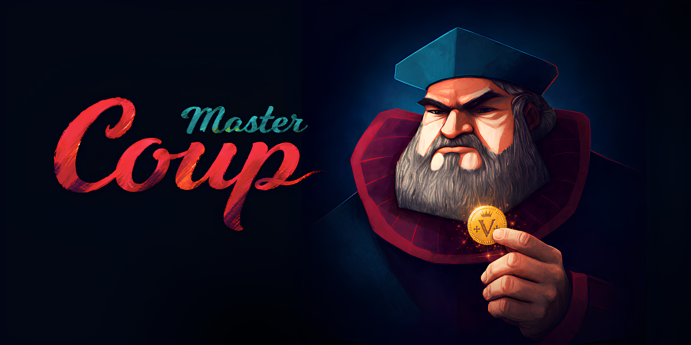
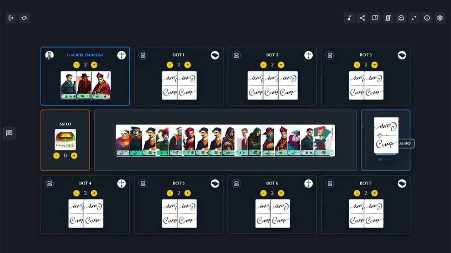

# Coup Master - Multiplayer Online Beta v0.9

 

<p align="center">
  
</p>

## 📖 Sobre o Projeto

**Coup Master** é um jogo multiplayer **sandbox** inspirado em jogos de blefe e estratégia política. 
O modo casual reproduz a experiência manual de uma mesa real, onde os próprios jogadores gerenciam ações, moedas e interações. O projeto também oferece os modos experimentais Ranqueado e Sala Personalizada, com regras automatizadas e bots de IA.

O projeto é uma iniciativa indie, gratuita e sem fins lucrativos.

O sistema é sincronizado em tempo real via Firebase Realtime Database, utilizando uma arquitetura modular orientada a eventos,
com foco em escalabilidade e consistência de estado.


🔗 **Jogue agora:** [https://coupmaster.com.br](https://coupmaster.com.br)

---

## 🖼️ Preview

<p align="center">
  
</p>

---

## 🧪 Demo Técnica

- Ambiente: Produção (GitHub Pages)
- Banco de Dados: Firebase Realtime Database
- Autenticação: Google OAuth 2.0 e visitante anônimo
- Sincronização: Event-driven via listeners em tempo real
- Chat: mensagens em tempo real da sala com atalhos rápidos
- PWA: manifest + service worker para instalação e cache de assets locais
- Idiomas: sistema i18n com dicionários JSON para `pt-BR` e `en-US`

> O PWA melhora instalação, abertura em modo standalone e cache do shell. O multiplayer continua exigindo conexão com Firebase.

---

## ✨ Novidades e Marcos do Projeto

### v0.9 — Modos Automatizados e Evolução da Mesa

A Beta v0.9 reúne as principais novidades desde a v0.5 e prepara o projeto para o lançamento da versão 1.0. Ranqueado e Sala Personalizada continuam experimentais.

- **Modo Ranqueado experimental:** Partidas com turnos, ações, bloqueios, contestações e perdas de influência controlados pelo sistema, além de bots de IA. Rating e classificação competitiva permanecem suspensos enquanto não houver validação autoritativa dos resultados.
- **Sala Personalizada experimental:** Mesa automatizada para jogar com amigos e bots, com controles do anfitrião na sala de espera e sem gerar pontos ranqueados.
- **Variante de personagens por partida:** Ranqueado e Sala Personalizada sorteiam Embaixador ou Inquisidor; o guia e as ações disponíveis acompanham o personagem escolhido.
- **Guias dinâmicos:** Ações de personagens geradas conforme o baralho e regras alternativas renderizadas em texto, com suporte a português e inglês.
- **Interação da mesa casual:** Preview ampliado por botão direito, cartas sobrepostas em pilha horizontal e ações rápidas ao clicar no nome de um jogador. O perfil é acessado pela foto.

### 🌑 v0.5 — Lei e Desordem (DLC 3)

* **Novas Influências:** Adição de 6 personagens inéditos com mecânicas avançadas: Pistoleiro, Magnata, Estrategista, Ladrão, Vigarista e Xerife.
* **Integração ao Baralho:** Personagens disponíveis na configuração e nos presets do casual.

### 👻 v0.3 — Modo Espectador Fantasma

* **Visão de Jogo:** Jogadores eliminados (0 cartas) agora podem solicitar permissão para assistir a mão de outros jogadores ativos.
* **Sistema de Convites:** Envio de notificações em tempo real para o alvo, que pode aceitar ou negar ser espectado.
* **Feedback Visual:** Jogadores sendo assistidos recebem um brilho azul sutil em seus avatares.
* **Mecânica Híbrida:** O modo espectador é visual e não bloqueia ações técnicas, garantindo que o fluxo da mesa sandbox nunca trave.

---

## 🚀 Funcionalidades Principais

* **Sandbox Total:** Gestão manual de moedas, vidas, trocas de cartas e o prêmio do Asilo.
* **Login com Google ou visitante:** Identificação automática com Nome/Foto via Google ou UID anônimo temporário pelo Firebase Auth.
* **Persistência de Slot:** Reconexão inteligente que reserva seu lugar na mesa através do seu UID único.
* **Baralho Configurável:** O anfitrião do casual controla a quantidade de cada personagem, incluindo personagens das expansões, com presets de composição.
* **Suporte para até 8 Jogadores no Casual:** Os modos automatizados possuem até 6 lugares, com slots dinâmicos em telas menores.
* **Modo Espectador Fantasma:** Permite que jogadores com zero cartas na mão solicitem visão da mão de outros jogadores ativos.
* **Sistema de Notificações em Tempo Real:** Mecânica de "aceitar ou negar" para solicitações de espectador e alertas de interação.
* **Religião na Mesa Casual:** Identificação visual das facções Católica e Protestante, com controle de visibilidade nas configurações.
* **Feedback Visual de Espectador:** Destaque com brilho azul suave e borda no avatar do jogador que está sendo assistido.
* **Interface Responsiva e Adaptável:** Ocultação automática do botão de espectador para jogadores que possuem cartas na mão.
* **Sistema de Salas por Código:** Criação, entrada e compartilhamento de salas por códigos de 4 caracteres.
* **Modo Ranqueado Beta:** Tela e fluxo próprios para contas Google, sem host, com matchmaking simulado que preenche a mesa com bots IA de personalidade sorteada antes da partida. Turnos, custos, alvos, contestações, bloqueios, perdas de influência e tempos de resposta são controlados pelo sistema. Rating e leaderboard continuam suspensos até existir validação autoritativa antifraude.
* **Sala Personalizada:** Fluxo paralelo criado a partir do ranqueado automatizado, usando `mode = "personalized"` e `personalizedState` para permitir evoluir salas com amigos e bots sem alterar os arquivos do ranqueado.
* **Variante por partida:** Ranqueado e Sala Personalizada sorteiam Embaixador ou Inquisidor (50% cada). O baralho usa apenas o escolhido, com ações e bloqueios correspondentes; o personagem ausente fica oculto no guia, com os demais centralizados.
* **Idioma Alternativo:** Interface preparada para alternar entre Português do Brasil e Inglês, com preferência salva localmente e dicionários em JSON.
* **Carregamento sem Flicker de Idioma:** Telas de loading e páginas legais respeitam o idioma salvo desde a primeira renderização para evitar piscadas temporárias em português quando o usuário usa inglês.
* **Controle de Áudio Integrado:** Música de fundo e efeitos sonoros sincronizados para ações como compra de cartas, moedas e impacto.
* **Gestão de Bots:** Bots de teste no casual são peças de teste da mesa, sem jogar autonomamente. Ranqueado e Sala Personalizada possuem bots de IA para partidas automatizadas.
* **Modais de Referência Rápida:** Guias de ações de personagens e regras alternativas renderizados dinamicamente em formato de carta.
* **Preview de Cartas:** Visualização ampliada pelo botão direito no desktop, respeitando a visibilidade da carta.
* **Pilha Horizontal de Cartas:** Sobreposição das cartas para aproveitar o espaço da mesa, sem angulação de leque na disposição padrão.
* **Ações Rápidas no Casual:** Acesso pelo nome do jogador a taxar, extorquir, assassinar e golpe de Estado, conforme as opções disponíveis para o alvo.
* **Perfil do Jogador:** Acesso pela foto, separado das ações rápidas.
* **Feedback e Sugestões:** Formulário integrado às mesas para relatar problemas e enviar ideias.

---

## 🛠️ Tecnologias

- **Frontend:** HTML5, CSS3 (Flexbox/Grid), Vanilla JavaScript (ES Modules)
- **Arquitetura:** Modular com separação de responsabilidades
- **Internacionalização:** Dicionários JSON em `lang/` com serviço i18n client-side
- **Backend (BaaS):** Firebase Realtime Database
- **Autenticação:** Firebase Authentication (Google Provider + Anonymous Provider)
- **Hospedagem:** GitHub Pages

---

## 🎮 Como Jogar

1. **Acesso:** Faça login com sua conta Google ou entre como visitante.
2. **Modo:** Escolha Casual para uma mesa livre ou um dos modos automatizados experimentais. O ranqueado exige conta Google.
3. **Sala:** Crie uma sala ou entre pelo código compartilhado por um amigo.
4. **No casual:** O anfitrião configura o baralho pela engrenagem. Compre cartas pelo baralho, arraste-as entre as áreas e use os contadores para gerenciar moedas.
5. **Consulta e interação:** Abra os guias pela barra de controles. No desktop, use o botão direito para ampliar uma carta. Clique na foto para abrir um perfil ou no nome para acessar ações rápidas.
6. **Espectador casual:** Ao ficar sem cartas, solicite pelo botão de espectador a permissão para assistir à mão de outro jogador.
7. **Nos modos automatizados:** Aguarde a preparação da sala e siga as ações e respostas disponíveis na interface. Esses modos ainda são experimentais e podem apresentar falhas ou não registrar resultados e conquistas corretamente.

---

## 🏗️ Arquitetura

O projeto segue uma arquitetura modular com separação clara de responsabilidades:

- **js/firebase/firebase.js** → Inicialização e infraestrutura (Auth + Database)
- **js/gamemode/game-modes.js** → Contrato compartilhado dos modos Casual, Ranqueado e Sala Personalizada
- **js/core/rules.js** → Constantes e manipulação estrutural do baralho
- **js/core/gameState.js** → Gerenciamento de estado e transações Firebase
- **js/i18n/initial-language.js** → Define o idioma inicial antes da primeira pintura visível da interface
- **js/i18n/language-service.js** → Carrega dicionários JSON, aplica traduções e sincroniza seletores de idioma
- **js/gamemode/casual/audio-service.js** → Audio casual, BGM, volume e sincronizacao de efeitos
- **js/gamemode/casual/card-preview.js** → Preview ampliado de cartas e flip do modal
- **js/gamemode/casual/modal-service.js** → Helpers compartilhados de abertura e fechamento de modais
- **js/gamemode/casual/chat-service.js** → Chat casual em tempo real, atalhos rapidos e aviso de mensagens
- **js/gamemode/casual/board-status.js** → Contadores do tabuleiro casual e copia do codigo da sala
- **js/gamemode/casual/visual-effects.js** → Efeito Balatro, leques de cartas e overlap visual
- **js/gamemode/casual/admin-controls.js** → Controles do anfitrião, remoção de jogadores, bots, reinício e baralho
- **js/gamemode/casual/rules-guides.js** → Guias de acoes/personagens, regras alternativas e flip cards
- **js/gamemode/casual/spectator-service.js** → Botao, modal e lista segura de alvos do espectador
- **js/gamemode/casual/quick-actions.js** → Perfil rapido, estatisticas ranqueadas e acoes rapidas do casual
- **js/gamemode/casual/settings-service.js** → Preferencias locais, compatibilidade de arraste e visibilidade de religiao
- **js/gamemode/casual/room-ui.js** → Sair da sala, fullscreen, feedback e configuracoes simples
- **js/gamemode/casual/asylum-controls.js** → Duplo clique, botoes de moedas e tooltip do asilo
- **js/gamemode/casual/tutorial-service.js** → Tutorial inicial e persistencia tutorialSeen
- **js/gamemode/casual/deck-presets.js** → Presets de composicao do baralho casual e duelo
- **js/gamemode/casual/drag-drop.js** → Arraste por Pointer Events ativado por padrão, implementação HTML5 legada e áreas de destino
- **js/gamemode/casual/render-cards.js** → Renderizacao de cartas, assets, tooltips e frente/verso
- **js/gamemode/casual/render-players.js** → Renderizacao dos slots, avatares, maos e badges do casual
- **js/gamemode/casual/table-render.js** → Renderizacao da area central, cemiterio/freeCards e status
- **js/gamemode/casual/board-renderer.js** → Coordenador principal do modo casual
- **js/lobby/lobby-manager.js** → Autenticação, criação e gerenciamento de salas
- **js/gamemode/ranked/ranked-engine.js** → Motor de turnos, contestações, bloqueios e eliminações
- **js/gamemode/ranked/ranked-game.js** → Presença, transações e integração Firebase do ranqueado
- **js/gamemode/ranked/ranked-renderer.js** → Interface e chat do ranqueado
- **js/gamemode/personalized/** → Regras, motor, integração e renderização próprios da Sala Personalizada
- **js/ui/feedback-form.js** → Formulário de feedback compartilhado

Essa divisão garante escalabilidade, manutenibilidade e separação entre lógica de domínio e camada de apresentação.

O projeto segue princípios de:
- Separação de responsabilidades (SRP)
- Modularização por domínio
- Controle de estado centralizado
- Arquitetura baseada em eventos (listeners do Firebase)

---

## 📁 Estrutura de Pastas do Projeto

O projeto adota uma arquitetura modular baseada em responsabilidades bem definidas, separando os recursos estáticos (assets), as folhas de estilo (CSS) e o núcleo lógico do jogo (JS).

```text

Coup-Master/
├── 📂 assets/                  # Recursos de mídia estáticos
│   ├── 📂 img/                 # Banco de imagens global
│   │   ├── 📂 cards/           # Texturas das cartas divididas por expansões
│   │   │   ├── 📂 base/        # Cartas do Jogo Base (Duque, Capitão, etc.)
│   │   │   ├── 📂 promo/       # Cartas promocionais e extras
│   │   │   ├── 📂 dlc1/        # Influências da Revolução
│   │   │   ├── 📂 dlc2/        # Lei e Desordem (nome técnico histórico da pasta)
│   │   │   └── 📂 religion/    # Religiões e imagens do Asilo
│   │   ├── 📂 icons/           # Ícones SVG e UI do tabuleiro
│   │   ├── 📂 logo/            # Identidade visual e favicons do projeto
│   │   └── 📂 marketing/       # Banners e screenshots de divulgação
│   └── 📂 sounds/              # Trilha sonora Opus (bgm.webm) e efeitos (vfx)
├── 📂 css/                     # Estilização e folhas de estilo
│   ├── lobby.css               # Design da interface do menu e salas
│   ├── legal.css               # Layout das páginas legais públicas
│   ├── casual-mode.css         # Layout do tabuleiro 2D e responsividade mobile
│   └── ranked-mode.css         # Layout dedicado do modo ranqueado
├── 📂 js/                      # Núcleo lógico do ecossistema JavaScript
│   ├── 📂 core/                # Estado do jogo e regras globais
│   │   ├── gameState.js        # Sincronização do estado da partida em tempo real
│   │   └── rules.js            # Definição matemática de cartas e baralhos
│   ├── 📂 firebase/            # Infraestrutura Firebase
│   │   └── firebase.js         # Inicialização e conexões com o banco de dados
│   ├── 📂 i18n/                # Sistema de idioma client-side
│   │   ├── initial-language.js # Define idioma inicial antes da renderização
│   │   └── language-service.js # Carrega JSONs e aplica traduções na UI
│   ├── 📂 gamemode/            # Lógicas específicas por modo de jogo
│   │   ├── 📂 casual/          # Scripts dedicados à mesa clássica casual
│   │   │   ├── audio-service.js # Audio casual e sincronizacao SFX
│   │   │   ├── card-preview.js # Preview ampliado de cartas
│   │   │   ├── modal-service.js # Helpers compartilhados de modais
│   │   │   ├── chat-service.js # Chat casual em tempo real
│   │   │   ├── board-status.js # Contadores e codigo da sala
│   │   │   ├── visual-effects.js # Efeito Balatro e leques
│   │   │   ├── admin-controls.js # Controles de host do casual
│   │   │   ├── rules-guides.js # Guias de regras e flip cards
│   │   │   ├── spectator-service.js # Fluxo de espectador casual
│   │   │   ├── quick-actions.js # Perfil rapido e acoes rapidas
│   │   │   ├── settings-service.js # Preferencias locais do casual
│   │   │   ├── room-ui.js # UI simples da sala casual
│   │   │   ├── asylum-controls.js # Controles do asilo casual
│   │   │   ├── tutorial-service.js # Tutorial inicial do casual
│   │   │   ├── deck-presets.js # Presets de baralho casual
│   │   │   ├── drag-drop.js # Pointer Events padrão e arraste HTML5 legado
│   │   │   ├── render-cards.js # Renderizacao de cartas
│   │   │   ├── render-players.js # Renderizacao dos jogadores
│   │   │   ├── table-render.js # Renderizacao da area central
│   │   │   └── board-renderer.js # Coordenador principal da mesa casual
│   │   ├── 📂 ranked/          # Scripts dedicados ao modo ranqueado
│   │   │   ├── ranked-rules.js
│   │   │   ├── ranked-engine.js
│   │   │   ├── ranked-renderer.js
│   │   │   └── ranked-game.js
│   │   └── 📂 personalized/    # Clone inicial do ranqueado para Sala Personalizada
│   │       ├── personalized-rules.js
│   │       ├── personalized-engine.js
│   │       ├── personalized-engine.test.js
│   │       ├── personalized-renderer.js
│   │       └── personalized-game.js
│   ├── 📂 lobby/
│   │   └── lobby-manager.js    # Fluxo de criação e entrada em salas
│   └── 📂 ui/
│       ├── background-audio-guard.js
│       ├── feedback-form.js
│       └── selection-lock.js
├── 📂 lang/                    # Dicionários de tradução
│   ├── pt-BR.json              # Texto base em português do Brasil
│   └── en-US.json              # Tradução em inglês
├── 📂 lab/                     # Laboratórios HTML isolados para testes visuais
│   ├── loading-lab.html        # Testes de tela de carregamento
│   ├── lab-cards.html          # Testes de efeito Balatro/perspectiva
│   ├── card-physics.html       # Testes de física de cartas
│   ├── card-physics-balatro.html # Combinação de física e perspectiva
│   ├── rules-flipbook.html     # Protótipo de manual em formato livro
│   ├── guide-generator-lab.html # Ajustes dos guias de personagens
│   ├── alternative-rules-translation-lab.html # Ajustes das regras alternativas
│   ├── npc-tutorial-lab.html   # Protótipo de tutorial com NPC
│   └── landing.html            # Landing experimental
├── 📄 index.html               # Tabuleiro principal do jogo em modo normal 2D
├── 📄 login.html               # Tela de autenticação Google/visitante
├── 📄 lobby.html               # Perfil autenticado, criação e entrada em salas
├── 📂 ranked/                  # Sala de espera e mesa ranqueada
├── 📂 personalized/            # Sala de espera e mesa personalizada
├── 📂 legal/
│   ├── privacy.html            # Política de Privacidade
│   └── terms.html              # Termos de Serviço
├── 📄 manifest.webmanifest     # Configuração do PWA
├── 📄 sw.js                    # Service worker e cache
├── 📂 docs/
│   ├── 📄 modo-casual.md       # Design e funcionamento da mesa casual sandbox
│   ├── 📄 modo-ranqueado.md    # Design e regras do modo ranqueado
│   ├── 📄 modo-personalizado.md # Design e regras da Sala Personalizada
│   ├── 📄 modo-duelo.md        # Documentação do Modo Duelo
│   ├── 📄 modo-roguelike.md    # Proposta de modo roguelike
│   └── 📄 modo-treinamento.md  # Planejamento do modo offline contra IA
└── 📄 README.md                # Documentação técnica do projeto

```

### 🔍 Descrição dos Principais Diretórios

* **`assets/img/cards/`**: Organizado estrategicamente em subpastas (`base`, `promo`, `dlc1`, `dlc2`) para permitir que o renderer de cartas (`render-cards.js`) monte dinamicamente as URLs das texturas com base no tipo e na expansão configurada nos presets de baralho.
* **`js/core/`**: Funciona como o motor lógico invisível do jogo. O `gameState.js` escuta e injeta alterações diretamente no Firebase, garantindo que o jogo funcione como um sandbox em tempo real.
* **`js/firebase/`**: Centraliza a inicialização do Firebase e expõe `window.db` e `window.auth` para os demais scripts.
* **`js/i18n/` e `lang/`**: Mantêm o sistema de idioma alternativo. `initial-language.js` aplica o idioma salvo cedo para reduzir flicker, enquanto `language-service.js` carrega `pt-BR.json` e `en-US.json`, traduz atributos `data-i18n*` e atualiza seletores de idioma.
* **`js/gamemode/casual/`**: Concentra a mesa casual. `board-renderer.js` atua como coordenador principal, chamando setup dos modulos e preservando `renderAll`, `setupUI` e `setupAutoScroll` para `gameState.js`. `audio-service.js` centraliza BGM/efeitos, `card-preview.js` cuida do preview ampliado, `modal-service.js` padroniza modais, `chat-service.js` controla o chat em tempo real, `board-status.js` atualiza contadores e codigo da sala, `visual-effects.js` centraliza efeito Balatro e leques, `admin-controls.js` controla a UI de host, `rules-guides.js` gerencia guias de acoes/personagens e regras alternativas, `spectator-service.js` controla o fluxo de espectador, `quick-actions.js` gerencia perfil rapido e acoes rapidas, `settings-service.js` centraliza preferencias locais, `room-ui.js` agrupa sair da sala, fullscreen, feedback e configuracoes simples, `asylum-controls.js` centraliza duplo clique, botoes e tooltip do asilo, `tutorial-service.js` controla o tutorial inicial e `tutorialSeen`, `deck-presets.js` concentra presets de baralho, `drag-drop.js` centraliza o arraste legado e compativel, `render-cards.js` monta as cartas visuais, `render-players.js` renderiza os slots de jogadores e `table-render.js` renderiza a area central do tabuleiro.
* **`js/gamemode/ranked/`**: Concentra o fluxo automatizado do modo ranqueado, incluindo regras, máquina de estados, renderização e integração Firebase.
* **`js/gamemode/personalized/`**: Mantém a primeira cópia isolada da Sala Personalizada, permitindo evoluir convites, bots e controles próprios sem renomear o ranqueado atual.
* **`js/ui/`**: Centraliza utilitarios de interface compartilhados, incluindo protecao de audio em background e bloqueio de selecao.
* **`lab/`**: Guarda protótipos visuais independentes, como laboratórios de loading, física de cartas, efeito Balatro, landing experimental e manual flipbook.
* **Pontos de entrada (`.html`)**: Login, lobby e casual ficam na raiz. `ranked/` e `personalized/` mantêm as páginas dos modos automatizados; as salas são acessadas por parâmetros como `?room=CODE`.

## 📄 Documentos Legais

O projeto possui páginas públicas para a **Política de Privacidade** (`legal/privacy.html`) e os **Termos de Serviço** (`legal/terms.html`). Os links ficam no rodapé de `login.html` e `lobby.html`, fora das telas de partida e da sala de espera ranqueada, para manter o jogo limpo e ainda permitir consulta antes da entrada em salas.

Esses textos são uma base operacional para o beta do Coup Master e devem passar por revisão jurídica antes de uso comercial ou coleta ampliada de dados.

---

## 🌐 Internacionalização

O Coup Master possui suporte inicial a idiomas com dicionários JSON:

- `lang/pt-BR.json`: idioma base do projeto.
- `lang/en-US.json`: tradução em inglês.
- `js/i18n/initial-language.js`: roda cedo no `<head>` para aplicar o idioma salvo antes da primeira renderização.
- `js/i18n/language-service.js`: carrega os dicionários, aplica textos por atributos `data-i18n*` e sincroniza os seletores de idioma.

A preferência do usuário fica salva em `localStorage` na chave `coupMasterLanguage`. O seletor de idioma aparece no lobby e dentro das configurações das mesas casual, ranqueada e personalizada.

Ao adicionar texto novo na interface, prefira criar uma chave nos dois arquivos de `lang/` e ligar o elemento com `data-i18n`, `data-i18n-placeholder`, `data-i18n-title`, `data-i18n-aria-label`, `data-i18n-alt`, `data-i18n-value` ou `data-i18n-content`. Telas de carregamento e páginas legais usam bloqueios visuais temporários para evitar flicker de idioma enquanto o JSON é carregado.

## 🛠️ Instalação e Configuração

### 1️⃣ Prepare o ambiente local

Clone o repositório ou extraia sua cópia local. O projeto é estático, sem etapa de build ou instalação de pacotes npm. Abra a pasta em um servidor HTTP local, por exemplo com Live Server ou, se Python estiver instalado:

```powershell
python -m http.server 8000
```

Acesse `http://localhost:8000/login.html` após configurar o Firebase. Abrir diretamente por `file://` não substitui o servidor HTTP para os módulos e dicionários de tradução.

### 2️⃣ Crie o Projeto no Firebase

1. Acesse o [Firebase Console](https://console.firebase.google.com/)
2. Clique em **Criar Projeto**
3. Adicione um **App Web (</>)**
4. Copie as credenciais do objeto `firebaseConfig`

---

### 3️⃣ Configure a Autenticação (Obrigatório)

Para que o login e a reserva de slots funcionem:

1. No Firebase Console, vá em **Build > Authentication**
2. Acesse a aba **Sign-in method**
3. Ative os provedores **Google** e **Anônimo**
4. Vá em **Settings > Authorized domains**
5. Adicione:
   - `seu-usuario.github.io`
   - `127.0.0.1` (para testes locais)

---

### 4️⃣ Configure o Realtime Database

1. Vá em **Build** > **Realtime Database** e crie uma instância.
2. Na aba **Regras**, consulte o exemplo de configuração do beta abaixo.

> Este exemplo contém escrita ampla para usuários autenticados em `salas/$roomCode`. Essa permissão também libera seus descendentes; as condições mais específicas de baralho e jogadores não restringem uma permissão já concedida no pai. O exemplo precisa de revisão antes de ser tratado como configuração de produção.

```json
{
  "rules": {
    "users": {
      ".read": "auth != null",
      "$uid": {
        ".write": "auth != null && auth.uid === $uid"
      }
    },
    "rankedStats": {
      ".read": "auth != null",
      "$uid": {
        ".write": "auth != null && auth.uid === $uid"
      }
    },
    "rankedResults": {
      ".read": "auth != null",
      "$resultKey": {
        ".write": "auth != null && !data.exists()"
      }
    },
    "salas": {
      "$roomCode": {
        ".read": "auth != null",
        ".write": "auth != null",

        "gameState": {
          "lastSFX": { ".write": "auth != null" },
          "asylumScore": { ".write": "auth != null" },
          "freeCards": { ".write": "auth != null" },

          "deck": { ".write": "auth.uid === data.parent().parent().child('hostUID').val()" },
          "deckConfig": { ".write": "auth.uid === data.parent().parent().child('hostUID').val()" },

          "players": {
            "$playerId": {
              ".write": "auth != null && (!data.exists() || data.child('uid').val() === auth.uid || auth.uid === data.parent().parent().parent().child('hostUID').val() || (!data.hasChild('uid') && newData.child('uid').val() === auth.uid))"
            }
          }
        }
      }
    }
  }
}
```

Isso garante que apenas usuários autenticados possam acessar as salas e que o lobby consiga ler as estatísticas do modo ranqueado.

Os caminhos `rankedStats/{uid}` e `rankedResults/{resultKey}` são obrigatórios para o perfil ranqueado:

- `rankedResults/{resultKey}` guarda o resultado imutável de cada partida finalizada.
- `rankedStats/{uid}` guarda vitórias, derrotas, sequências, pontuação, ações e progresso de conquistas do jogador.
- `rankedStats/{uid}/countedRooms/{resultKey}` impede que a mesma partida seja contabilizada mais de uma vez no perfil.

> Enquanto o resultado e as estatísticas forem gravados pelo cliente, esses dados servem para beta, histórico local do jogador e testes de produto. Para ranking competitivo confiável, a validação do resultado deve migrar futuramente para um backend autoritativo ou Cloud Functions.

---

### 5️⃣ Vincule o Código ao Firebase

Atualize as credenciais no seu projeto  
(ex: `js/firebase/firebase.js`):

```javascript
const firebaseConfig = {
  apiKey: "SUA_API_KEY",
  authDomain: "seu-projeto.firebaseapp.com",
  databaseURL: "https://seu-projeto-default-rtdb.firebaseio.com",
  projectId: "seu-projeto",
  storageBucket: "seu-projeto.appspot.com",
  messagingSenderId: "...",
  appId: "..."
};
```

## 🛠️ Manutenção do Banco de Dados (Realtime Database)

O projeto utiliza Firebase Realtime Database. A manutenção operacional das salas deve considerar o procedimento manual abaixo.

Quando for necessário remover salas antigas, confirme que não há partidas em andamento nos registros selecionados e faça um backup antes da exclusão.

### 🧹 Procedimento de Limpeza Manual

Caso o banco de dados apresente lentidão devido ao excesso de salas, limpe **somente** o nó `salas`.

> [!CAUTION]
> **Nunca importe um JSON vazio na raiz do Realtime Database.** A raiz também guarda `rankedStats` e `rankedResults`; apagar a raiz remove estatísticas, conquistas e histórico ranqueado dos jogadores.

Opção recomendada pelo console:

1. Acesse o [Console do Firebase](https://console.firebase.google.com/).
2. No menu lateral, vá em **Realtime Database**.
3. Abra o nó **`salas`**.
4. Use o menu de ações do próprio nó **`salas`** e remova esse nó.
5. Mantenha intactos os nós **`rankedStats`** e **`rankedResults`**.

Opção usando importação:

1. Acesse o [Console do Firebase](https://console.firebase.google.com/).
2. No menu lateral, vá em **Realtime Database**.
3. Clique especificamente no nó **`salas`** para que ele seja o caminho selecionado.
4. Com **`salas`** selecionado, clique nos **três pontos (⋮)** da visualização de dados.
5. Selecione **"Importar JSON"**.
6. Escolha o arquivo **`limpeza-salas.json`** localizado na raiz deste repositório.
7. Confirme a importação.

Esse procedimento substitui apenas `salas` por `{}`. As conquistas ficam preservadas porque permanecem em `rankedStats`, e os resultados ranqueados permanecem em `rankedResults`.

---

## 🧠 Desafios Técnicos

- Sincronização de estado em tempo real entre múltiplos jogadores
- Controle de concorrência em ações simultâneas
- Reconexão persistente via UID
- Gerenciamento de sala com slots reservados
- Renderização dinâmica com feedback visual em tempo real


## 📚 Aprendizados

Durante o desenvolvimento deste projeto, foram aplicados conceitos como:

- Sincronização de estado distribuído
- Tratamento de concorrência
- Arquitetura modular em JavaScript
- Design de sistemas multiplayer em tempo real
- Gerenciamento de autenticação e persistência com Firebase

## 🖱️ Compatibilidade e Arraste

O modo casual usa **Pointer Events ativado por padrão** para arrastar cartas com mouse, toque e caneta. Esse fluxo, originalmente apresentado como modo de compatibilidade, passou a ser a experiência padrão da mesa, oferecendo maior controle sobre o movimento e as animações.

A implementação nativa HTML5 de drag and drop ainda existe no código legado. O controle para alternar entre os fluxos não é exibido às contas comuns; não é necessário ativar a compatibilidade manualmente para jogar.

O projeto também carrega `css/compat.css` nas telas principais para reduzir interferências de alto contraste forçado e recoloração automática em navegadores móveis.

## 🚀 Próximas Atualizações (Roadmap)

### Entregas já disponíveis

- [x] **Preview ampliado de cartas:** Acesso por botão direito no desktop.
- [x] **Pilha visual de cartas:** Sobreposição horizontal para aproveitar o espaço da mesa.
- [x] **Expansões de conteúdo:** Integração de personagens e da expansão Lei e Desordem ao casual.
- [x] **Modo espectador:** Solicitação e autorização para acompanhar a mão de outro jogador no casual.
- [x] **Modos automatizados experimentais:** Ranqueado e Sala Personalizada com bots de IA.

### Próximas entregas

- [ ] **Tutorial guiado:** Evoluir o protótipo com NPC para ensinar uma partida aos novos jogadores.
- [ ] **Regras alternativas sincronizadas:** Integrar seleção e sorteio ao estado da sala e aos guias de todos os jogadores.
- [ ] **Consolidação dos modos experimentais:** Refinar regras, reconexão, interface e registro de resultados.
- [ ] **Lançamento 1.0:** Definir escopo, realizar playtests e preparar tutorial e material de divulgação.
- [ ] **Importação de baralhos:** Carregar composições por JSON personalizado.
- [ ] **Coup Workshop:** Ferramenta para criação, edição e exportação de cartas personalizadas.
- [ ] **Personalização de temas:** Troca de nomes, áreas, estilos e efeitos sonoros.

---

## 📄 Licença

Este projeto é de código aberto sob a licença [MIT](LICENSE).
