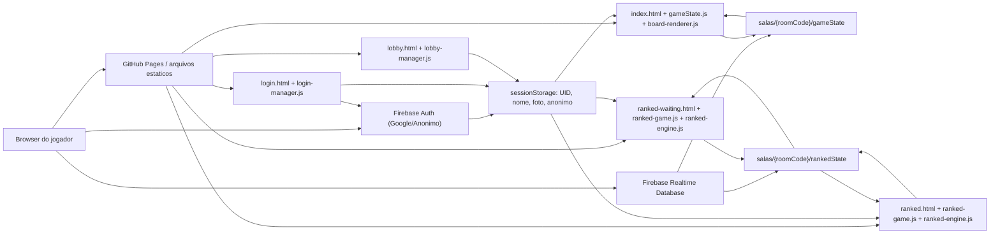
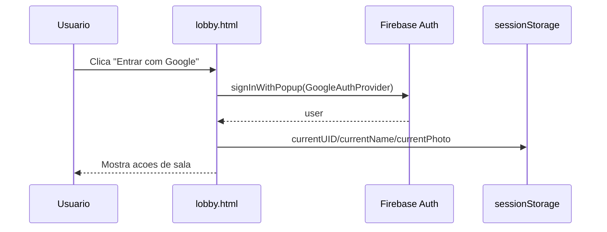
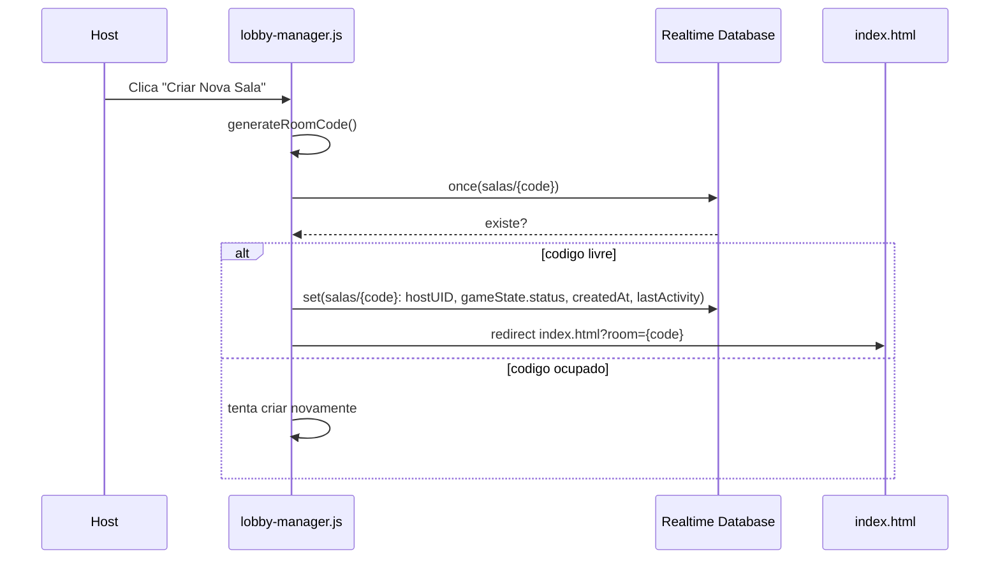

# Coup Master - Technical Design Document

Documento gerado a partir da analise do estado atual do repositorio em 2026-06-24.

Branch analisada: `new-css`

Commit analisado: `452e095` (`atualização nas regras de personagem`)

## 1. Sumario Executivo

O Coup Master e um jogo multiplayer online, em beta, inspirado em jogos de blefe e estrategia politica. A proposta atual e reproduzir uma mesa fisica em formato sandbox: os jogadores continuam responsaveis por declarar acoes, desafiar, aplicar regras sociais e administrar boa parte do fluxo da partida. O software oferece a sala, o tabuleiro compartilhado, cartas, moedas, expansoes, interface visual, audio e sincronizacao em tempo real.

O projeto e um aplicativo estatico hospedavel em GitHub Pages. Nao existe etapa de build, empacotador, servidor proprio, backend customizado, TypeScript, framework frontend ou gerenciador de pacotes versionado. Toda a execucao acontece no navegador, usando HTML, CSS, JavaScript vanilla e Firebase Realtime Database/Auth via scripts CDN.

O backend efetivo e o Firebase:

- Firebase Authentication com Google Provider ou login anonimo identifica os usuarios.
- Firebase Realtime Database guarda salas, estado da partida, jogadores, cartas, notificacoes e eventos de som.
- As regras de seguranca do Firebase sao uma dependencia critica do produto, mas atualmente aparecem apenas no README, nao como arquivo versionado de infraestrutura.

O estado tecnico atual e funcional para uma beta, mas ainda altamente acoplado. A maior parte da regra de interface ja foi separada em modulos menores no modo casual: audio, preview de cartas, modais, guias de regras, UI simples da sala, controles do asilo, tutorial inicial, preferencias locais, presets de deck, renderizacao de cartas, renderizacao de jogadores e area central da mesa. O `board-renderer.js` permanece como coordenador principal, preservando `renderAll`, `setupUI` e `setupAutoScroll` para integracao com `gameState.js`. A sincronizacao e mutacao de jogo ficam concentradas em `js/core/gameState.js`. Essa simplicidade reduz friccao para editar rapido, mas ainda exige cuidado por causa do estado global compartilhado.

## 2. Objetivos do Produto

### 2.1 Objetivo Principal

Permitir que grupos joguem Coup online em uma sala privada, com sincronizacao em tempo real, usando uma mesa digital manual.

### 2.2 Objetivos Secundarios

- Permitir login com Google.
- Permitir login anonimo como visitante.
- Permitir criacao e entrada em salas por codigo curto.
- Preservar slot de jogador por UID.
- Sincronizar mao, deck, cemiterio, moedas, religiao, asilo, bots e estado de conexao.
- Permitir host/admin com controles privilegiados.
- Permitir configuracao de deck com jogo base, cartas promocionais e DLCs.
- Permitir modo espectador fantasma mediante autorizacao.
- Permitir chat textual em tempo real. No modo casual ha mensagens rapidas; no ranqueado o chat fica livre, sem atalhos de blefe.
- Oferecer ajudas visuais de regras e cartas de referencia.
- Entregar experiencia visual expressiva com fundo animado, efeito VHS, parallax e animacao de cartas.
- Rodar diretamente em navegador sem instalacao.

### 2.3 Nao Objetivos Atuais

O codigo atual nao tenta automatizar integralmente as regras oficiais de Coup. O sistema nao valida todas as condicoes de desafio, bloqueio, eliminacao, influencia, obrigatoriedade de golpe, troca de cartas ou ordem formal de turnos. Algumas acoes rapidas alteram moedas, mas a mesa continua sendo sandbox.

Tambem nao ha, no estado atual:

- matchmaking publico;
- turn manager;
- historico completo de eventos;
- replay;
- backend server-side proprio;
- testes automatizados;
- pipeline de build;
- deploy automatizado versionado;
- Firebase Emulator configurado no repositorio.

## 3. Arquitetura de Alto Nivel



O frontend tem sete paginas principais:

- `login.html`: tela dedicada de autenticacao com Google ou visitante anonimo.
- `lobby.html`: perfil autenticado, criacao e entrada em salas.
- `index.html`: tabuleiro do modo casual.
- `ranked-waiting.html`: sala de espera/prontidao do modo ranqueado.
- `ranked.html`: mesa dedicada ao modo ranqueado automatizado.
- `personalized-waiting.html`: sala de espera da Sala Personalizada, criada como clone isolado do fluxo ranqueado.
- `personalized.html`: mesa ativa da Sala Personalizada, usando a mesma base automatizada sem renomear o ranqueado.
- `privacy.html`: Politica de Privacidade publica, acessivel antes do login e do lobby.
- `terms.html`: Termos de Servico publicos, acessiveis antes do login e do lobby.

Os scripts sao carregados como arquivos globais com `defer`. Eles dependem da ordem no HTML, nao de imports ES Modules.

Ordem no tabuleiro:

1. Firebase CDN: `firebase-app.js`, `firebase-auth.js`, `firebase-database.js`.
2. `js/firebase/firebase.js`: inicializa Firebase e expoe `window.db` e `window.auth`.
3. `js/pwa/pwa.js`: registra o service worker quando o navegador oferece suporte.
4. `js/core/rules.js`: define tipos de carta e utilitarios globais.
5. `js/core/gameState.js`: conecta sala, Firebase, estado e mutacoes.
6. `js/gamemode/casual/board-renderer.js`: coordena `renderAll`, `setupUI`, `setupAutoScroll` e setup dos modulos casuais.

Ordem no ranqueado:

1. Firebase CDN e `js/firebase/firebase.js`.
2. `js/pwa/pwa.js` e `js/gamemode/game-modes.js`.
3. `js/gamemode/ranked/ranked-rules.js`: contrato imutavel de acoes, personagens e tempos.
4. `js/gamemode/ranked/ranked-engine.js`: transicoes puras da partida.
5. `js/gamemode/ranked/ranked-renderer.js`: DOM responsivo, respostas, mao, log e chat.
6. `js/gamemode/ranked/ranked-game.js`: autenticacao, sala, presenca, transacoes e deadlines.
7. `js/gamemode/personalized/personalized-*.js`: clone inicial da base ranqueada para Sala Personalizada, com `personalizedState` proprio.

Ordem no lobby:

1. Firebase CDN.
2. `js/firebase/firebase.js`.
3. `js/pwa/pwa.js`.
4. `js/lobby/lobby-manager.js`.

Ordem no login:

1. Firebase CDN.
2. `js/firebase/firebase.js`.
3. `js/pwa/pwa.js`.
4. `js/login/login-manager.js`.

## 4. Estrutura do Repositorio

```text
Coup-Master/
  assets/
    fonts/
    img/
      cards/
        base/
        dlc1/
        dlc2/
        promo/
        religion/
      guides/
      icons/
      logo/
    sounds/
      soundtrack/
      vfx/
  css/
    ads.css
    lobby.css
    casual-mode.css
    ranked-mode.css
  docs/
    GDD.md
    ROADMAP.md
    TDD.md
    manual-regras.md
    modo-duelo.md
    modo-personalizado.md
    modo-ranqueado.md
    modo-roguelike.md
  js/
    core/
      gameState.js
      rules.js
    firebase/
      firebase.js
    login/
      login-manager.js
    gamemode/
      game-modes.js
      casual/
        audio-service.js
        card-preview.js
        modal-service.js
        chat-service.js
        board-status.js
        visual-effects.js
        admin-controls.js
        rules-guides.js
        spectator-service.js
        quick-actions.js
        settings-service.js
        room-ui.js
        asylum-controls.js
        tutorial-service.js
        deck-presets.js
        drag-drop.js
        render-cards.js
        render-players.js
        table-render.js
        board-renderer.js
      ranked/
        ranked-engine.js
        ranked-engine.test.js
        ranked-game.js
        ranked-renderer.js
        ranked-rules.js
    lobby/
      lobby-manager.js
    pwa/
      pwa.js
    ui/
      ad-slots.js
      background-audio-guard.js
      selection-lock.js
  lab/
    lab-cards.html
  marketing/
    banners/
    screenshots/
  AGENTS.md
  .nojekyll
  README.md
  index.html
  login.html
  lobby.html
  privacy.html
  terms.html
  ranked-waiting.html
  ranked.html
  manifest.webmanifest
  robots.txt
  sitemap.xml
  sw.js
  limpeza.json
```

Observacao: a pasta existente no filesystem esta como `docs` em minusculo. Em Windows isso equivale ao pedido de `Docs`, mas em Git/plataformas case-sensitive recomenda-se padronizar o nome antes de depender de casing.

## 5. Tecnologias e Dependencias

### 5.1 Frontend

- HTML5 estatico.
- CSS3, Grid, Flexbox, animacoes e media queries.
- JavaScript vanilla em escopo global.
- Nenhum framework frontend.
- Nenhum bundler.
- Nenhum transpilador.

### 5.2 Backend/BaaS

- Firebase Auth v8.10.0 via CDN.
- Firebase Realtime Database v8.10.0 via CDN.

### 5.3 Fontes e Assets Externos

- Google Fonts: `Cinzel`.
- Fonte local: `Tilda Script`.
- Material Symbols via Google Fonts no tabuleiro, aparentemente para icone `info`.
- Tally embed para feedback/bug report.
- Google AdSense para monetizacao do banner responsivo na sala de espera ranqueada.
- YouTube embed comentado no lobby.

### 5.4 Estado de Tooling

Nao ha `package.json`. Portanto, nao ha scripts oficiais de:

- build;
- test;
- lint;
- format;
- start/dev server;
- deploy.

A verificacao local atualmente possivel sem adicionar tooling e:

```powershell
node --check js\firebase\firebase.js
node --check js\gamemode\game-modes.js
node --check js\core\rules.js
node --check js\core\gameState.js
node --check js\lobby\lobby-manager.js
node --check js\gamemode\casual\audio-service.js
node --check js\gamemode\casual\card-preview.js
node --check js\gamemode\casual\modal-service.js
node --check js\gamemode\casual\chat-service.js
node --check js\gamemode\casual\board-status.js
node --check js\gamemode\casual\visual-effects.js
node --check js\gamemode\casual\admin-controls.js
node --check js\gamemode\casual\rules-guides.js
node --check js\gamemode\casual\spectator-service.js
node --check js\gamemode\casual\quick-actions.js
node --check js\gamemode\casual\settings-service.js
node --check js\gamemode\casual\room-ui.js
node --check js\gamemode\casual\asylum-controls.js
node --check js\gamemode\casual\tutorial-service.js
node --check js\gamemode\casual\deck-presets.js
node --check js\gamemode\casual\drag-drop.js
node --check js\gamemode\casual\render-cards.js
node --check js\gamemode\casual\render-players.js
node --check js\gamemode\casual\table-render.js
node --check js\gamemode\casual\board-renderer.js
node --check js\gamemode\ranked\ranked-rules.js
node --check js\gamemode\ranked\ranked-engine.js
node --check js\gamemode\ranked\ranked-renderer.js
node --check js\gamemode\ranked\ranked-game.js
node js\gamemode\ranked\ranked-engine.test.js
```

Todos os arquivos JS passavam em `node --check` no momento desta analise.

### 5.5 PWA

O projeto agora possui uma camada PWA sem alterar sua arquitetura estatica:

- `manifest.webmanifest`: define nome, descricao, `start_url` para `login.html`, `scope` relativo, `display: standalone`, cores de tema e icones 192x192/512x512.
- `js/pwa/pwa.js`: registra `sw.js` apos o carregamento da pagina, somente quando `navigator.serviceWorker` existe.
- `sw.js`: cria cache versionado do shell principal, HTMLs, CSS, JS local, fontes e icones criticos.
- `index.html`, `ranked-waiting.html`, `ranked.html`, `login.html` e `lobby.html`: expoem manifesto, `theme-color`, metatags mobile/apple e registrador PWA.

Estrategia do service worker:

- navegacoes usam network-first com fallback para `login.html` em cache;
- assets locais usam stale-while-revalidate;
- requisicoes externas, incluindo Firebase CDN/Auth/Realtime Database, nao sao interceptadas;
- multiplayer offline nao e objetivo, pois salas, autenticacao e sincronizacao dependem de rede e Firebase.

### 5.6 Monetizacao e AdSense

O projeto possui uma integracao pontual com Google AdSense, mantendo a arquitetura estatica e sem adicionar dependencias de build.

Estado atual:

- existe um unico slot preparado de anuncio: banner responsivo na sala de espera ranqueada (`ranked-waiting.html`), atualmente oculto/desativado ate a aprovacao do AdSense;
- `ranked-waiting.html` carrega `css/ads.css`, o snippet oficial do AdSense no `<head>` e `js/ui/ad-slots.js`;
- `js/ui/ad-slots.js` centraliza `ADSENSE_ENABLED = false`, `ADSENSE_CLIENT = "ca-pub-1234567890123456"` como exemplo documental e `AD_SLOTS.rankedWaiting = "1234567890"` como exemplo documental;
- `css/ads.css` define o visual do container, label `Publicidade`, placeholder, estado oculto/desativado e comportamento responsivo;
- lobby, mesa casual, mesa ranqueada ativa e resultado final ranqueado nao exibem anuncios.

O helper `js/ui/ad-slots.js` procura elementos `.coup-ad-slot[data-ad-slot-key]`, mantem o slot oculto quando `ADSENSE_ENABLED` esta `false`, cria o `<ins class="adsbygoogle">` quando a configuracao esta ativa e usa placeholder quando falta configuracao. Como `ranked-waiting.html` ja declara o script oficial no `<head>` com `id="coup-adsense-script"`, o helper evita injetar o script novamente.

Observacao operacional:

O projeto esta hospedado como GitHub Pages de repositorio em `https://gabrielbarbosa0.github.io/Coup-Master/`, mas o AdSense valida o site raiz `gabrielbarbosa0.github.io`. Para revisao do Google, existe a necessidade operacional de manter o repositorio raiz `gabrielbarbosa0.github.io` publicado com o snippet de verificacao do AdSense.

Restricoes de produto:

- nao posicionar anuncios sobre cartas, botoes de turno, botoes de confirmacao, modais de decisao ou areas de interacao frequente;
- evitar anuncios na mesa ativa para nao induzir clique acidental durante a partida;
- antes de expandir monetizacao, revisar politicas do AdSense e UX mobile.

## 6. Pontos de Entrada HTML

### 6.1 `login.html`

Responsabilidades:

- Define metadados SEO/Open Graph da tela de entrada.
- Carrega favicon/logo, manifesto PWA e metatags mobile.
- Carrega Google Font `Cinzel`.
- Precarrega `assets/fonts/tilda-script-bold.woff2`.
- Carrega SDK Firebase v8.
- Carrega `css/lobby.css`.
- Renderiza botoes de autenticacao: Google e visitante anonimo.
- Renderiza botao de instalacao PWA quando o navegador dispara `beforeinstallprompt`.
- Renderiza modal de erro.
- Renderiza loader simplificado com fundo solido e card central.
- Carrega `firebase.js`, `pwa/pwa.js` e `login-manager.js`.
- Persiste `currentUID`, `currentName`, `currentPhoto` e `currentIsAnonymous` em `sessionStorage`.
- Redireciona usuario autenticado para `lobby.html`.

Fluxo de UI:

1. Usuario abre login.
2. Firebase inicializa.
3. `login-manager.js` observa `auth.onAuthStateChanged`.
4. Usuario escolhe "Entrar com Google" ou "Entrar como visitante".
5. Google usa `signInWithPopup(new firebase.auth.GoogleAuthProvider())`.
6. Visitante usa `auth.signInAnonymously()`.
7. Apos autenticar, dados seguros de exibicao sao gravados no `sessionStorage` e a tela redireciona para `lobby.html`.
8. O botao "Instalar Coup Master" fica oculto quando o PWA ja esta instalado ou quando o navegador ainda nao disponibilizou o prompt de instalacao.

Observacao: o nome base do visitante e `Visitante`. Ao entrar em uma sala, `gameState.js` atribui nomes sequenciais por sala, como `Visitante 1`, `Visitante 2` e assim por diante.

### 6.2 `lobby.html`

Responsabilidades:

- Define metadados SEO e Open Graph do lobby.
- Carrega favicon/logo.
- Carrega Google Font `Cinzel`.
- Precarrega `assets/fonts/tilda-script-bold.woff2`.
- Carrega SDK Firebase v8.
- Carrega `css/lobby.css`.
- Renderiza bloco de usuario logado.
- Renderiza input de codigo de sala e botoes de entrar/criar sala.
- Renderiza modal de erro.
- Renderiza loader simplificado com fundo solido e card central.
- Carrega `firebase.js`, `pwa/pwa.js` e `lobby-manager.js`.
- Renderiza loader de fontes.

Fluxo de UI:

1. Usuario autenticado abre lobby.
2. Firebase inicializa.
3. `lobby-manager.js` observa `auth.onAuthStateChanged`.
4. Se nao logado, redireciona para `login.html`.
5. Se logado, mostra foto, nome, botao sair e acoes de sala.
6. Criar sala gera codigo aleatorio de 4 caracteres.
7. Entrar sala valida existencia no Realtime Database.

Pontos tecnicos importantes:

- O bloco `communityBtn` e `communityModal` esta comentado no HTML, mas o JS ainda tenta localiza-los com guards.
- O loader `font-loader` aparece depois do `</body>`, o que e HTML invalido, embora o navegador costume corrigir.
- Ha uma referencia comentada a `img/info.svg`; como esta comentada, nao afeta runtime, mas a pasta `img/` nao existe.

### 6.3 `index.html`

Responsabilidades:

- Define metadados SEO/Open Graph do jogo principal.
- Carrega favicon/logo.
- Carrega Google Font `Cinzel`.
- Carrega Material Symbols.
- Carrega `css/casual-mode.css`.
- Define loading overlay inicial.
- Define toolbar superior com saida, reset e controles globais.
- Define tabuleiro com 8 areas fixas de jogadores, sempre visiveis.
- Usa a Mesa 2.0 como layout principal, preservando os ids consumidos pelo JavaScript legado.
- Em desktop e tablet, organiza quatro jogadores, uma linha central com asilo/cemiterio/baralho, outros quatro jogadores e rodape de status.
- Em mobile, organiza os oito slots em duas colunas, seguidos pelo cemiterio, asilo/baralho e rodape de status.
- Representa lugares desocupados com estado visual `Vazio`.
- Mantem cartas da mao sobrepostas e cartas do cemiterio anguladas para simular componentes fisicos.
- Exibe o codigo da sala e os totais de baralho, cemiterio e asilo no rodape `.table-status`.
- Define modais de regras, regras alternativas, preview de carta, configuracao de deck, configuracoes gerais, reset, feedback, espectador, kick, sala cheia, tutorial, acoes rapidas e duelo.
- Define loading overlay simplificado da mesa.
- Define audios de musica e efeitos.
- Carrega Firebase e scripts do jogo.

Fluxo de UI:

1. Usuario chega com query string `?room=CODE`.
2. Scripts globais inicializam Firebase, regras, estado e renderizacao.
3. `gameState.js` valida `roomCode` e credenciais em `sessionStorage`.
4. Se faltar sala ou UID, redireciona para `lobby.html`.
5. Se autenticado, entra ou reentra na sala via transacao.
6. Listener realtime atualiza `localGameState` e chama `renderAll()`.
7. O tabuleiro reconstroi cartas e jogadores a cada alteracao relevante.

Pontos tecnicos importantes:

- `og:image` aponta para `assets/img/ico-coup-master.png`, mas o arquivo real esta em `assets/img/logo/ico-coup-master.png`.
- O HTML possui ids usados diretamente por JS global; renomear ids quebra comportamento.
- A pasta `lab/` concentra experimentos visuais isolados; o runtime principal nao importa seus arquivos.

### 6.4 `lab/lab-cards.html`

Responsabilidades:

- Servir como laboratorio visual estatico para calibrar efeitos de perspectiva, hover, brilho, escala e composicao de cartas.
- Permitir testes com uma, duas e tres cartas sem entrar em uma sala real.
- Expor controles dinamicos para copiar parametros visuais antes de aplicar no modo casual ou ranqueado.

Pontos tecnicos importantes:

- A pagina nao participa do fluxo de produto, lobby, Firebase, PWA ou partidas reais.
- Deve continuar isolada em `lab/` para evitar dependencia acidental do runtime principal.
- Mudancas aprovadas nesse laboratorio precisam ser aplicadas explicitamente nos CSS/JS dos modos de jogo.

## 7. Scripts Globais e Contratos entre Arquivos

### 7.1 `js/firebase/firebase.js`

Responsabilidades:

- Define `firebaseConfig`.
- Inicializa Firebase se `firebase.apps.length` estiver vazio.
- Expoe `window.db = firebase.database()`.
- Expoe `window.auth = firebase.auth()`.

Contratos:

- Deve rodar depois dos scripts CDN do Firebase.
- Deve rodar antes de qualquer arquivo que use `db`, `auth` ou `firebase`.

Observacoes:

- As chaves Web do Firebase estao no repositorio. Isso e normal em apps Firebase Web, desde que as Security Rules estejam corretas.
- O codigo alerta o usuario se `apiKey` estiver ausente.
- Logs de inicializacao ainda aparecem em producao.

### 7.2 `js/core/rules.js`

Responsabilidades:

- Define `CARD_TYPES`.
- Define configuracao padrao do deck.
- Cria decks a partir de configuracoes.
- Embaralha arrays de cartas.
- Localiza carta por ID em todo o estado.
- Remove carta de sua localizacao atual.

Principais funcoes:

- `createDefaultDeckConfig()`
- `createDeck(config)`
- `shuffle(array)`
- `findCardById(state, id)`
- `removeCardFromLocation(state, cardId)`

Contrato de carta:

```js
{
  id: "c1",
  type: "duque",
  color: "#ff66c4",
  owner: null,
  visible: false,
  location: "deck"
}
```

O `id` e gerado localmente a cada reset/criacao do deck. Ele e unico dentro do deck atual, mas nao e globalmente unico entre salas ou resets.

### 7.3 `js/gamemode/game-modes.js`

Responsabilidades:

- Centralizar os identificadores `casual` e `ranked`.
- Normalizar modos ausentes ou desconhecidos para `casual`.
- Ler o modo tanto de `room.mode` quanto do legado opcional `room.gameState.mode`.
- Informar rotulo de interface e elegibilidade para o ranqueado.
- Expor o contrato global imutavel `window.CoupGameModes` para lobby e mesa.

O modulo permanece em JavaScript vanilla e nao introduz TypeScript, bundler ou dependencia externa.

### 7.4 `js/core/gameState.js`

Responsabilidades:

- Ler `room` da URL.
- Ler usuario atual do `sessionStorage`.
- Redirecionar se faltar sala ou usuario.
- Criar referencia `gameStateRef`.
- Manter variaveis globais locais:
  - `localGameState`
  - `myPlayerId`
  - `isDrawingCard`
  - `lastSoundTimestamp`
  - `hostUID`
  - `isAdmin`
  - `currentGameMode`
  - `window.pendingKickPid`
- Consultar o modo persistido na raiz da sala antes de entrar na partida.
- Bloquear acesso anonimo a salas ranqueadas mesmo em navegacao direta.
- Gerenciar entrada/reentrada na sala.
- Gerenciar listeners do Firebase.
- Aplicar mutacoes de deck, cartas, moedas, religiao, bots e kick.
- Sincronizar efeitos sonoros via RTDB.
- Atualizar `lastActivity`.

Principais grupos de funcoes:

- Espectador:
  - `requestSpectate(targetPid)`
  - `setupNotificationListener()`
- Economia/asilo:
  - `withdrawAsylumCoins()`
  - `updateScore(pid, amount, silent)`
  - `updateAsylumScore(amount)`
- Audio:
  - `playSound(id)`
  - `triggerSound(soundId)`
- Deck/cartas:
  - `resetTable(newConfig)`
  - `drawCard(targetPid)`
  - `returnCardToDeck(cardId)`
  - `moveCard(cardId, targetLocation, targetPlayerId)`
  - `burnTopCard()`
- Religiao:
  - `toggleReligion(pid)`
- Bots/kick:
  - `addBot()`
  - `confirmKickAction()`
- Conexao:
  - `setupDisconnectHandler(pid)`
  - `joinGame()`
  - `setupKickListener(pid)`
  - `initializeGame()`
  - `updateRoomActivity()`

Contrato importante:

`gameState.js` chama funcoes globais definidas por scripts do modo casual, como `renderAll`, `setupUI`, `setupDropzones` e `setupAutoScroll`. `setupDropzones` hoje e preservado por `drag-drop.js`; as demais continuam coordenadas pelo renderer. Essas chamadas sao protegidas por `typeof`, mas a ordem continua importante para a experiencia. Como todos usam `defer`, eles executam em ordem de declaracao no HTML.

### 7.5 `js/lobby/lobby-manager.js`

Responsabilidades:

- Controlar login/logout Google.
- Atualizar UI do lobby conforme autenticacao.
- Persistir `currentUID`, `currentName`, `currentPhoto` e `currentRoomMode` em `sessionStorage`.
- Controlar o seletor de modo Casual/Ranqueado.
- Desabilitar criacao e entrada ranqueada para visitantes anonimos.
- Gerar codigo de sala.
- Criar sala no RTDB.
- Validar existencia de sala antes de entrar.
- Controlar modal de erro.
- Controlar loader de fonte.
- Tentar limpar salas inativas.

Fluxo de criacao de sala:

1. `generateRoomCode()` gera 4 caracteres base36 maiusculos.
2. JS verifica se `salas/{newCode}` existe.
3. Se existir, chama novamente o handler de criar sala.
4. Se nao existir, escreve:

```js
{
  hostUID: currentUID,
  mode: selectedMode,
  gameState: {
    status: "waiting",
    createdAt: firebase.database.ServerValue.TIMESTAMP
  },
  lastActivity: Date.now()
}
```

5. Persiste `currentRoomMode` na sessao.
6. Redireciona para `index.html?room={newCode}`.

Observacao importante: a sala nasce com `gameState.status` e `gameState.createdAt`, mas sem `players`. A inicializacao completa do estado acontece depois em `joinGame()` no tabuleiro.

### 7.6 `js/gamemode/casual/board-renderer.js`

Responsabilidades:

- Permanecer com o nome historico `board-renderer.js`, sem renomear para evitar ruptura em referencias e commits.
- Coordenar os modulos do modo casual sem concentrar a regra interna deles.
- Preservar as funcoes globais esperadas por `gameState.js`: `renderAll`, `setupUI` e `setupAutoScroll`.
- Configurar servicos de renderizacao, interacao e cabecalho.
- Injetar dependencias para `chat-service.js`, `admin-controls.js`, `room-ui.js`, `asylum-controls.js`, `rules-guides.js`, `tutorial-service.js`, `drag-drop.js`, `render-cards.js`, `render-players.js`, `table-render.js`, `quick-actions.js`, `card-preview.js`, `settings-service.js`, `board-status.js`, `visual-effects.js` e `deck-presets.js`.
- Executar `renderAll()` como fluxo fino: modo da sala, controles admin, espectador, limpeza, jogadores e mesa central.
- Executar `setupUI()` como fluxo fino: chat, admin, sala, audio, asilo, deck, guias/tutorial e controles de moeda dos jogadores.
- Manter `clearDOM()` apenas como limpeza coordenada de maos, area central, slots e destaque local.

Esse arquivo ainda e ponto sensivel por depender de variaveis globais definidas em `gameState.js` e por coordenar muitos modulos via `window.*`, mas deixou de concentrar criacao visual de cartas, area central, preview, chat, guias, asilo, sala, tutorial, presets, quick actions e drag/drop.

### 7.7 `js/gamemode/casual/audio-service.js`

Responsabilidades:

- Centralizar volume padrao de efeitos e BGM do modo casual.
- Ler e persistir `sfxVolume` em `localStorage`.
- Aplicar volume em todos os audios `audio-*`.
- Tocar efeitos locais por `playSound(id)` via wrapper de compatibilidade.
- Sincronizar efeitos globais escrevendo `gameState.lastSFX` via `triggerSound(soundId)`.
- Configurar botao de musica, slider de BGM e slider de efeitos no modal de configuracoes.
- Integrar com `window.CoupAudioGuard` para impedir reinicio indevido da musica de fundo.

Contrato:

- Expoe `window.CoupCasualAudio`.
- `gameState.js` preserva os wrappers globais `setSfxVolume`, `playSound` e `triggerSound` para compatibilidade com chamadas existentes.
- `board-renderer.js` chama `window.CoupCasualAudio.setupBackgroundMusicControls()` durante `setupUI()`.

### 7.8 `js/gamemode/casual/card-preview.js`

Responsabilidades:

- Centralizar o preview ampliado de cartas do modo casual.
- Capturar `contextmenu` no desktop para abrir o modal ao clicar com botao direito em uma carta visivel.
- Ignorar `touch` e `pen` para preservar o fluxo de arraste em dispositivos moveis/tablet.
- Configurar imagem frontal do preview usando `getCardFolder(card.type)` injetado por `render-cards.js`.
- Resetar o flip para a frente ao abrir o modal.
- Fechar o modal pelo botao `closePreviewBtn`.
- Alternar frente/verso no clique do `previewFlipCard`.
- Tocar `card-slide` apenas no flip do preview, nao na abertura por botao direito.

Contrato:

- Expoe `window.CoupCardPreview`.
- `board-renderer.js` injeta dependencias com `setup({ getState, findCardById, getCardFolder, shouldShowBack, playSound })`, usando helpers vindos de `window.CoupRenderCards`.
- O bloqueio de menu de contexto em desktop foi preservado para manter o comportamento anterior.

### 7.9 `js/gamemode/casual/modal-service.js`

Responsabilidades:

- Centralizar helpers simples de modais do modo casual.
- Abrir overlays com `display: flex` e remover `hidden`.
- Fechar overlays com `display: none`.
- Consultar visibilidade real via `getComputedStyle`.
- Padronizar bindings simples de abrir/fechar por botao quando aplicavel.
- Expor utilitario de texto para mensagens curtas.

Contrato:

- Expoe `window.CoupModal`.
- `gameState.js` usa o servico em modais de espectador e sala cheia.
- `chat-service.js` usa o servico para abrir e fechar o chat; `quick-actions.js` usa o servico para abrir e fechar o perfil rapido; `admin-controls.js` usa o servico para kick, reset, sala cheia e configuracao de deck; `rules-guides.js` usa o servico para guias e regras alternativas; `room-ui.js` usa o servico para feedback e configuracoes; `tutorial-service.js` usa o servico para o tutorial inicial; `deck-presets.js` usa o servico para duelo.
- O servico nao muda estrutura HTML nem estilos dos modais; apenas centraliza as operacoes repetidas de exibicao.

### 7.10 `js/gamemode/casual/chat-service.js`

Responsabilidades:

- Centralizar o chat em tempo real do modo casual.
- Manter mensagens recentes da sala e renderizar `chatMessagesList`.
- Enviar mensagens manuais e mensagens rapidas para `salas/{roomCode}/chatMessages`.
- Preservar limite de 240 caracteres por mensagem.
- Montar botoes de mensagens rapidas sem handlers inline.
- Abrir e fechar `chatModal` usando `CoupModal`.
- Controlar foco do input, estado visual `is-chat-open` e alerta `chat-btn-has-unread`.
- Ocultar o botao flutuante do chat quando outro modal bloqueante esta aberto.
- Tocar `pop` apenas quando chega mensagem de outro jogador enquanto o chat esta fechado.
- Renderizar mensagens com `document.createElement` e `textContent`.

Contrato:

- Expoe `window.CoupChat`.
- Preserva o wrapper global `setupRoomChat` para compatibilidade com codigo legado.
- `board-renderer.js` injeta `localGameState`, `roomCode`, `currentUser`, `myPlayerId`, Firebase Database, Firebase API e `playSound`.
- O servico acessa Firebase apenas no caminho de chat da sala atual.
- O servico nao altera regras de jogo, moedas, cartas ou jogadores.

### 7.11 `js/gamemode/casual/board-status.js`

Responsabilidades:

- Centralizar os contadores visuais do tabuleiro casual.
- Atualizar quantidade de cartas no baralho.
- Atualizar quantidade de cartas no cemiterio.
- Atualizar moedas do asilo.
- Sincronizar os totais duplicados do rodape `.table-status`, quando esse rodape existir no HTML.
- Exibir o codigo da sala em `roomCodeDisplay`, quando o elemento existir.
- Configurar a copia do codigo da sala pelo botao `roomCodeBtn`.
- Aplicar feedback visual temporario `.copied` em `roomHeader` apos copiar.
- Tocar `pop` ao copiar o codigo com sucesso.
- Fazer fallback com `alert` quando a Clipboard API nao estiver disponivel ou falhar.

Contrato:

- Expoe `window.CoupBoardStatus`.
- `table-render.js` chama `renderStatus({ state, roomCode })` durante `renderTable()`.
- `board-renderer.js` injeta `roomCode` e `playSound` em `setup(...)`.
- O servico tolera elementos ausentes porque o rodape `.table-status` pode estar comentado no HTML.
- O servico nao acessa Firebase e nao altera estado de jogo.

### 7.12 `js/gamemode/casual/visual-effects.js`

Responsabilidades:

- Centralizar efeitos visuais de cartas do modo casual.
- Calcular overlap adaptativo dos leques de mao e cemiterio.
- Atualizar `--hand-overlap` e `--graveyard-overlap`.
- Aplicar rotacao e deslocamento base dos slots da mao.
- Agendar recálculo dos leques com `requestAnimationFrame`.
- Recalcular leques no `resize` da janela.
- Aplicar e limpar o efeito Balatro/tilt em cartas e no deck.
- Resetar variaveis CSS `--tilt-x`, `--tilt-y`, `--glow-x` e `--glow-y`.
- Remover `.is-tilting` e `.is-active-card` quando o hover/drag termina.

Contrato:

- Expoe `window.CoupVisualEffects`.
- Preserva wrappers globais `updateHandFanLayout`, `updateGraveyardFanLayout`, `scheduleCardFanLayout`, `resetBalatroElement` e `attachBalatroEffect`.
- `table-render.js` fornece o container de cartas do cemiterio por `getGraveyardCardsElement`.
- `render-players.js` recebe `updateHandFanLayout` para organizar as maos renderizadas.
- `render-cards.js` recebe `attachBalatroEffect` para aplicar o hover 3D nas cartas criadas.
- `drag-drop.js` recebe `resetBalatroElement` para limpar tilt durante o arraste compativel.
- O servico nao altera estado de jogo e nao acessa Firebase.

### 7.13 `js/gamemode/casual/admin-controls.js`

Responsabilidades:

- Centralizar controles administrativos visuais do modo casual.
- Aplicar travas visuais de host em `resetBtn`, `addBotBtn`, `openDeckConfigBtn`, `applyDeckConfigBtn` e inputs de configuracao de deck.
- Ocultar adicionar bot quando o usuario nao e host ou quando a sala esta em modo ranqueado.
- Bloquear aplicacao de deck para nao-host e para modo ranqueado.
- Configurar abertura e fechamento do modal de confirmacao de reset.
- Configurar abertura e fechamento do modal de kick.
- Expor `window.kickPlayer(pid)` para a acao de remocao vinda do perfil rapido.
- Configurar o botao de adicionar bot chamando `addBot()`.
- Configurar o fechamento de `fullRoomModal`.
- Sincronizar inputs do modal de deck com `localGameState.deckConfig`.
- Ler inputs do modal de deck, normalizar valores entre 0 e 10 e chamar `resetTable(newConfig)`.

Contrato:

- Expoe `window.CoupAdminControls`.
- `board-renderer.js` chama `renderAdminControls({ isAdmin, isRankedMode })` durante `renderAll()`.
- `board-renderer.js` injeta `localGameState`, `myPlayerId`, `currentGameMode`, estado de host, `playSound`, `showError`, `resetTable`, `addBot` e `confirmKickAction`.
- `quick-actions.js` continua chamando `window.kickPlayer(pid)`, agora definido pelo servico.
- As validacoes client-side permanecem apenas UX; `gameState.js` e regras Firebase continuam sendo a fronteira de seguranca real.
- O servico nao acessa Firebase diretamente.

### 7.14 `js/gamemode/casual/rules-guides.js`

Responsabilidades:

- Centralizar os guias de acoes/personagens do modo casual.
- Calcular a fila de imagens dos guias com base em `deckConfig`.
- Alternar entre guia base e guia alternativo quando ha cartas da Revolucao.
- Adicionar guias extras para cartas promocionais, Revolucao e Sombras do Asilo.
- Controlar abertura e fechamento de `infoModal`.
- Controlar abertura e fechamento de `altRulesModal`.
- Manter o estado de flip dos guias sem deixar variaveis soltas no renderer.
- Tocar feedback sonoro de clique e troca de carta usando `playSound` injetado.

Contrato:

- Expoe `window.CoupRulesGuides`.
- Expoe `calculateRuleImages(deckConfig?)` para testes manuais e compatibilidade.
- `board-renderer.js` chama `setup({ getDeckConfig, playSound })` durante `setupUI()`.
- Usa `window.CoupModal` para abrir e fechar modais.
- O servico nao acessa Firebase e nao altera estado de jogo.

### 7.15 `js/gamemode/casual/spectator-service.js`

Responsabilidades:

- Centralizar o fluxo de espectador do modo casual.
- Manter o botao `spectatorBtn` visivel como no comportamento atual.
- Abrir e fechar `spectatorModal`.
- Montar a lista de jogadores disponiveis para assistir.
- Ignorar o proprio jogador local na lista.
- Exibir estado vazio quando nao ha alvos disponiveis.
- Solicitar permissao chamando `requestSpectate(targetPid)`.
- Criar os itens da lista com `document.createElement` e `textContent`, evitando `innerHTML` com dados de jogador.

Contrato:

- Expoe `window.CoupSpectator`.
- `board-renderer.js` chama `renderSpectatorControls({ players, myPlayerId, maxPlayers, requestSpectate, playSound })` durante `renderAll()`.
- O servico nao acessa Firebase diretamente; a escrita da notificacao continua em `requestSpectate`.
- A regra visual de sempre exibir o botao de espectador foi preservada.

### 7.16 `js/gamemode/casual/quick-actions.js`

Responsabilidades:

- Centralizar o modal de perfil rapido do modo casual.
- Manter o alvo atual das acoes rapidas sem expor estado interno ao renderer.
- Carregar estatisticas ranqueadas em `rankedStats/{uid}` quando o jogador possui UID.
- Renderizar avatar, nome, status, partidas, vitorias, derrotas, taxa de vitoria e pontuacao ranqueada.
- Controlar o botao de expulsao de jogador quando o usuario local e host.
- Executar acoes rapidas casuais que alteram moedas: golpe, extorsao, assassinato e taxa.
- Tocar feedback sonoro local/global reaproveitando `playSound`, `triggerSound` e `updateScore` injetados.
- Fechar o modal e limpar o alvo atual depois de acoes processadas.

Contrato:

- Expoe `window.CoupQuickActions`.
- Preserva wrappers globais `openQuickActions(pid)` e `executeAction(type)` porque `index.html` ainda usa handlers inline.
- `board-renderer.js` injeta `localGameState`, `myPlayerId`, estado de host, Firebase Database, `updateScore`, `triggerSound` e `playSound`.
- A acao de remocao usa `window.kickPlayer(pid)` definido por `admin-controls.js`.
- `render-players.js` apenas chama `openQuickActions(pid)` quando avatar ou nome sao acionados.
- O servico nao renderiza slots de jogadores nem altera a mao diretamente.

### 7.17 `js/gamemode/casual/settings-service.js`

Responsabilidades:

- Centralizar preferencias locais do modo casual.
- Ler e persistir booleanos em `localStorage`.
- Controlar o estado do modo de compatibilidade de arraste (`coupMasterSamsungDragEnabled`).
- Atualizar o botao `toggleSamsungDragBtn`, `aria-pressed`, estado visual e texto.
- Aplicar `body.samsung-drag-enabled` e alternar `draggable` em cartas/deck sem mudar a logica de drag/drop.
- Controlar a preferencia local de visibilidade de religiao (`hideReligion`).
- Aplicar `body.hide-religion` e atualizar o texto do botao `toggleReligionBtn`.

Contrato:

- Expoe `window.CoupCasualSettings`.
- Preserva wrappers globais `isSamsungDragModeEnabled`, `updateSamsungDragButton`, `refreshSamsungDragMode` e `setSamsungDragMode` para compatibilidade com o renderer.
- `board-renderer.js` chama `setupSamsungDragPreference({ playSound })` e `setupReligionVisibilityPreference({ playSound })`.
- O modo de compatibilidade permanece baseado em Pointer Events e continua ativado por padrao quando nao ha preferencia salva.

### 7.18 `js/gamemode/casual/room-ui.js`

Responsabilidades:

- Centralizar handlers simples da sala casual que nao sao regra de jogo.
- Controlar o botao de sair da sala e voltar para `lobby.html`.
- Remover `currentRoomMode` do `sessionStorage` ao sair da sala.
- Controlar fullscreen pelo botao `fullscreenBtn`.
- Abrir e fechar `feedbackModal`.
- Fechar `settingsModal` quando o feedback e aberto.
- Abrir e fechar `settingsModal`.
- Atualizar o estado visual do botao de compatibilidade antes de abrir as configuracoes.
- Tocar feedback sonoro local usando `playSound` injetado.

Contrato:

- Expoe `window.CoupRoomUI`.
- `board-renderer.js` chama `setup({ playSound, beforeOpenSettings })` durante `setupUI()`.
- Usa `window.CoupModal` para abrir e fechar modais.
- Nao acessa Firebase, nao altera cartas, moedas, jogadores ou deck.
- Preferencias internas das configuracoes continuam em `settings-service.js`.

### 7.19 `js/gamemode/casual/asylum-controls.js`

Responsabilidades:

- Centralizar controles visuais do asilo no modo casual.
- Aplicar tooltip `Asilo` na imagem do asilo.
- Configurar duplo clique na imagem para sacar moedas do asilo.
- Configurar botao `asylum-plus` para adicionar uma moeda ao asilo.
- Configurar botao `asylum-minus` para remover uma moeda do asilo.
- Chamar `withdrawAsylumCoins()` e `updateAsylumScore(amount)` por injecao, sem acessar Firebase diretamente.

Contrato:

- Expoe `window.CoupAsylumControls`.
- `board-renderer.js` chama `setup({ updateAsylumScore, withdrawAsylumCoins, attachElementTooltip })` durante `setupUI()`.
- Usa `attachElementTooltip` vindo de `render-cards.js` para preservar o tooltip visual existente.
- Nao altera a renderizacao dos contadores; `board-status.js` continua atualizando `asylum-score` e `table-asylum-score`.
- Nao altera as mutacoes reais; `gameState.js` continua sendo responsavel por `updateAsylumScore` e `withdrawAsylumCoins`.

### 7.20 `js/gamemode/casual/tutorial-service.js`

Responsabilidades:

- Centralizar o tutorial inicial do modo casual.
- Abrir `tutorialModal` quando `sessionStorage.tutorialSeen` ainda nao existe.
- Fechar o tutorial pelos botoes `closeTutorialBtn` e `startPlayBtn`.
- Persistir `tutorialSeen = true` ao fechar o tutorial.
- Falhar de forma silenciosa se `sessionStorage` estiver indisponivel.

Contrato:

- Expoe `window.CoupTutorial`.
- `board-renderer.js` chama `setup()` durante `setupUI()`.
- Usa `window.CoupModal` para abrir e fechar o modal.
- Nao acessa Firebase, nao altera estado de jogo e nao toca em regras de sala.

### 7.21 `js/gamemode/casual/deck-presets.js`

Responsabilidades:

- Centralizar presets de composicao do baralho casual.
- Preencher inputs do modal de configuracao de deck em lote.
- Manter grupos de cartas do jogo base, promocionais, DLC 1, DLC 2 e duelo.
- Aplicar presets `standard`, `base_promo`, `base_dlc1`, `base_dlc2`, `caos`, `duel`, `test` e `clear`.
- Controlar a abertura e fechamento do modal de duelo usado pelo preset `duel`.
- Tocar feedback sonoro dos presets usando o `playSound` injetado pelo renderer.

Contrato:

- Expoe `window.CoupDeckPresets`.
- Preserva wrappers globais `applyDeckPreset`, `confirmDuelPreset` e `closeDuelModal` porque `index.html` ainda usa handlers inline.
- `board-renderer.js` chama `window.CoupDeckPresets.setup({ playSound })`.
- O servico altera apenas os inputs do modal; a aplicacao real do deck continua passando por `resetTable(newConfig)`.

### 7.22 `js/gamemode/casual/drag-drop.js`

Responsabilidades:

- Centralizar o drag/drop do modo casual sem remover o fluxo legado.
- Manter o drag and drop HTML5 nativo para cartas e deck.
- Configurar dropzones do deck, jogadores e cemiterio.
- Mover cartas via `moveCard(cardId, targetLocation, targetPlayerId)`.
- Comprar cartas via `drawCard(targetPid?)`.
- Queimar carta do topo via `burnTopCard()`.
- Manter o fallback de compatibilidade por Pointer Events quando `coupMasterSamsungDragEnabled` esta ativo.
- Criar e limpar o clone visual `.compatible-drag-ghost`.
- Expor `attachCompatiblePointerDrag(element, dragData)` para `render-cards.js`.

Contrato:

- Expoe `window.CoupDragDrop`.
- Preserva o wrapper global `setupDropzones` chamado por `gameState.js`.
- Preserva o wrapper global `attachCompatiblePointerDrag` para compatibilidade com codigo legado.
- `board-renderer.js` injeta elementos DOM, mutacoes de jogo, `isSamsungDragModeEnabled`, `refreshSamsungDragMode`, `resetBalatroElement` vindo de `window.CoupVisualEffects` e `hideCardTooltip`.
- O modulo nao remove o legado HTML5; ele apenas move a configuracao para uma fronteira menor.

### 7.23 `js/gamemode/casual/render-players.js`

Responsabilidades:

- Renderizar os slots de jogadores do modo casual.
- Aplicar visibilidade progressiva dos slots mobile.
- Preencher estados de slot vazio.
- Criar cabecalho visual com avatar e nome.
- Configurar abertura de acoes rapidas pelo avatar/nome usando a funcao injetada por `quick-actions.js`.
- Renderizar badge de religiao e acionar `toggleReligion(pid)`.
- Renderizar cartas da mao usando `createCardElement(card)` injetado por `render-cards.js`.
- Atualizar moedas, jogador local e destaque de espectador.

Contrato:

- Expoe `window.CoupRenderPlayers`.
- `board-renderer.js` injeta `players`, `myPlayerId`, `MAX_PLAYERS`, `createCardElement` vindo de `window.CoupRenderCards`, `updateHandFanLayout` vindo de `window.CoupVisualEffects`, `toggleReligion` e `openQuickActions`.
- O servico nao acessa Firebase nem muta estado de jogo diretamente.
- A limpeza das maos antes da renderizacao continua em `clearDOM()`.

### 7.24 `js/gamemode/casual/render-cards.js`

Responsabilidades:

- Criar elementos `div.card` do modo casual.
- Decidir frente/verso com base em localizacao, dono e permissao de espectador.
- Mapear tipo de carta para pasta de asset (`base`, `promo`, `dlc1`, `dlc2`).
- Centralizar nomes exibidos nos tooltips das cartas.
- Criar e posicionar o tooltip flutuante de cartas e elementos do tabuleiro.
- Aplicar listeners HTML5 de `dragstart` e `dragend` nas cartas.
- Manter o duplo clique para devolver carta ao deck com animacao.
- Injetar efeito Balatro recebido de `visual-effects.js` e Pointer Events de compatibilidade recebido de `drag-drop.js`.

Contrato:

- Expoe `window.CoupRenderCards`.
- Preserva wrappers globais `createCardElement`, `getCardFolder`, `shouldShowBack`, `attachElementTooltip`, `hideCardTooltip` e `getCardDisplayName` para compatibilidade com codigo legado.
- `board-renderer.js` injeta `getState`, `getMyPlayerId`, `getDeckElement`, `returnCardToDeck`, `isSamsungDragModeEnabled`, `window.CoupVisualEffects.attachBalatroEffect` e `window.CoupDragDrop.attachCompatiblePointerDrag`.
- `card-preview.js` recebe `getCardFolder` e `shouldShowBack` vindos de `window.CoupRenderCards`.

### 7.25 `js/gamemode/casual/table-render.js`

Responsabilidades:

- Centralizar a renderizacao da area central do tabuleiro casual.
- Expor acesso aos elementos `deck`, `graveyardArea` e `.graveyard-cards`.
- Limpar cartas renderizadas no cemiterio por `clearTable()`.
- Renderizar `gameState.freeCards` como cartas pequenas no cemiterio.
- Aplicar a classe `graveyard-card` nas cartas abertas da area central.
- Acionar `updateGraveyardFanLayout()` depois de renderizar o cemiterio.
- Chamar `board-status.js` para atualizar contadores do deck, cemiterio e asilo.

Contrato:

- Expoe `window.CoupTableRender`.
- `board-renderer.js` chama `setup({ createCardElement, updateGraveyardFanLayout, renderStatus })` durante a carga do renderer.
- `board-renderer.js` usa `getDeckElement()` e `getGraveyardArea()` para injetar DOM em `drag-drop.js` e `render-cards.js`.
- `visual-effects.js` recebe `getGraveyardCardsElement()` para calcular o leque do cemiterio.
- O modulo nao acessa Firebase e nao move cartas; ele apenas traduz `freeCards` em DOM.

## 8. Modelo de Dados no Firebase

### 8.1 Estrutura de Sala

```json
{
  "salas": {
    "ABCD": {
      "hostUID": "firebase-auth-uid",
      "mode": "casual",
      "lastActivity": 1710000000000,
      "notifications": {
        "target-user-uid": {
          "fromName": "Nome",
          "fromPid": 2,
          "type": "SPECTATE_REQUEST",
          "timestamp": 1710000000000
        }
      },
      "gameState": {
        "status": "waiting",
        "createdAt": 1710000000000,
        "deck": [],
        "grave": [],
        "freeCards": [],
        "asylumScore": 0,
        "deckConfig": {},
        "lastSFX": {
          "id": "coin",
          "timestamp": 1710000000000
        },
        "players": {
          "1": {}
        }
      }
    }
  }
}
```

`mode` aceita `casual`, `ranked` ou `personalized`. Salas antigas sem esse campo sao interpretadas como casuais.

A Sala Personalizada foi separada sem renomear o modo ranqueado:

- `mode = "ranked"` continua apontando para `ranked-waiting.html`, `ranked.html` e `salas/{roomCode}/rankedState`;
- `mode = "personalized"` aponta para `personalized-waiting.html`, `personalized.html` e `salas/{roomCode}/personalizedState`;
- durante `waiting`, o criador da Sala Personalizada (`hostUID`) pode remover jogadores humanos ou bots por modal de confirmacao;
- os ids/classes internos `rank*` podem existir no clone enquanto a camada visual ainda reutiliza o renderer e o CSS do ranqueado.

O campo `status` existe no dado inicial da sala, mas nao e usado como estado de maquina no fluxo atual.

O campo `grave` existe no estado inicial e reset, mas o cemiterio visual usa `freeCards`. No codigo atual, "cemiterio" e "area livre" sao semanticamente misturados.

O modo ranqueado tambem grava agregados fora da sala:

- `rankedResults/{resultKey}`: resultado imutavel client-side de uma partida finalizada. O `resultKey` combina codigo da sala e `matchId`, permitindo reiniciar a partida na mesma sala sem sobrescrever resultados anteriores.
- `rankedResults/{resultKey}` tambem inclui `performanceScore` e `performanceBreakdown` por jogador. Essa pontuacao de desempenho soma vitoria/derrota, acoes executadas, golpes, assassinatos, roubos, moedas roubadas, bloqueios aceitos, desafios vencidos/perdidos, blefes revelados, influencias preservadas e eliminacao.
- `rankedStats/{uid}`: estatisticas acumuladas do jogador exibidas no modal de perfil do lobby, incluindo jogos, vitorias, derrotas, taxa de vitoria, sequencias, score ranqueado, pontos de desempenho acumulados, melhor/pior placar de partida, desafios, assassinatos, golpes, roubos e progresso inicial de conquistas.
- `rankedStats/{uid}/countedRooms/{resultKey}`: marcador por jogador para impedir que a mesma partida ranqueada seja contabilizada mais de uma vez no perfil, mesmo que a tela final seja reaberta ou varios clientes tentem persistir o resultado.

Dependencia operacional importante: as Security Rules precisam liberar leitura autenticada de `rankedStats` e `rankedResults`, escrita do proprio usuario em `rankedStats/{uid}` e criacao de resultados em `rankedResults/{resultKey}`. Sem esses caminhos nas regras, a partida pode finalizar e aparecer dentro de `salas/{roomCode}/rankedState`, mas o perfil do lobby permanece sem jogos, vitorias, derrotas e conquistas porque as escritas/leitura dos agregados sao bloqueadas pelo Realtime Database.

Esses agregados ainda sao escritos por clientes autenticados. Eles servem como fundacao de produto para perfil e classificacao, mas nao devem ser tratados como rating competitivo confiavel sem Security Rules mais restritivas e/ou backend autoritativo.

### 8.2 `gameState.deck`

Array de cartas ocultas no baralho.

```json
[
  {
    "id": "c1",
    "type": "duque",
    "color": "#ff66c4",
    "owner": null,
    "visible": false,
    "location": "deck"
  }
]
```

### 8.3 `gameState.freeCards`

Array de cartas visiveis no centro/cemiterio.

```json
[
  {
    "id": "c2",
    "type": "assassino",
    "color": "#545454",
    "owner": null,
    "visible": true,
    "location": "free"
  }
]
```

### 8.4 `gameState.players`

Objeto com chaves numericas de `1` a `8`.

```json
{
  "1": {
    "online": true,
    "uid": "firebase-auth-uid",
    "name": "Jogador",
    "photo": "https://...",
    "hand": [],
    "score": 2,
    "religion": "catolico",
    "spectators": {
      "3": "Nome do espectador"
    }
  }
}
```

Campos:

- `online`: booleano de presenca.
- `uid`: UID Firebase ou `bot-{timestamp}` para bots.
- `name`: nome de exibicao.
- `photo`: URL de avatar.
- `hand`: cartas na mao do jogador.
- `score`: moedas.
- `religion`: `catolico` ou `protestante`.
- `spectators`: mapa opcional de `pid -> nome` para permissoes de visualizacao.

### 8.5 `gameState.deckConfig`

Objeto com quantidade de cada tipo de carta:

```json
{
  "duque": 5,
  "capitao": 5,
  "assassino": 5,
  "embaixador": 5,
  "condessa": 5,
  "inquisidor": 5,
  "benfeitor": 0,
  "bufao": 0,
  "burgues": 0,
  "burocrata": 0,
  "vigilante": 0,
  "mercenario": 0,
  "bispo": 0,
  "tesoureiro": 0,
  "diplomata": 0,
  "marionetista": 0,
  "pistoleiro": 0,
  "magnata": 0,
  "estrategista": 0,
  "ladrao": 0,
  "vigarista": 0,
  "xerife": 0
}
```

### 8.6 `gameState.lastSFX`

Evento simples para sincronizar audio:

```json
{
  "id": "card-slide",
  "timestamp": 1710000000000
}
```

Cada cliente compara `timestamp` com `lastSoundTimestamp`. Se for mais recente, toca `audio-{id}` localmente.

### 8.7 `notifications`

Usado atualmente para pedidos de espectador:

```json
{
  "fromName": "Alice",
  "fromPid": 4,
  "type": "SPECTATE_REQUEST",
  "timestamp": 1710000000000
}
```

O listener do alvo remove a notificacao apos processa-la.

## 9. Estado Local no Navegador

### 9.1 `sessionStorage`

Usado para dados de usuario e tutorial.

Chaves:

- `currentUID`
- `currentName`
- `currentPhoto`
- `tutorialSeen`: controlado por `tutorial-service.js`

Fluxo:

- O lobby escreve dados do usuario autenticado em `sessionStorage`.
- O tabuleiro le esses dados antes de entrar na sala.
- Se `roomCode` ou `currentUID` estiver ausente, o tabuleiro redireciona para o lobby.

Risco:

`sessionStorage` nao e uma fonte de autenticacao segura. A validacao real precisa vir do Firebase Auth e das Security Rules. O estado atual usa `auth.onAuthStateChanged`, mas tambem confia nos dados previamente gravados no lobby.

### 9.2 `localStorage`

Usado para preferencias visuais locais:

- `hideReligion`
- `sfxVolume`
- `coupMasterSamsungDragEnabled`

Essas preferencias nao sao sincronizadas entre jogadores.

## 10. Fluxos de Produto

### 10.1 Login



### 10.2 Criacao de Sala



### 10.3 Entrada/Reentrada na Sala


### 10.4 Sincronizacao de Estado

O listener principal fica em `gameStateRef.on('value')`.

Fluxo:

1. Firebase envia snapshot inteiro de `gameState`.
2. Codigo verifica `lastSFX`.
3. Codigo verifica se o usuario foi expulso do slot atual.
4. Atualiza `localGameState`.
5. Chama `renderAll()`.

Consequencia:

Toda alteracao em `gameState` tende a disparar renderizacao completa do tabuleiro. Isso simplifica coerencia visual, mas pode ser caro conforme numero de cartas, efeitos e dispositivos moveis.

### 10.5 Reset da Mesa

Somente permitido ao host no cliente:

1. Usuario host abre modal de reset.
2. Confirma.
3. `resetTable(newConfig?)` checa `isAdmin`.
4. Atualiza `lastActivity`.
5. Dispara som `8-bit-start`.
6. Gera deck novo com `createDeck`.
7. Preserva `online`, `uid`, `name`, `photo`.
8. Limpa maos.
9. Reseta `score` para 2.
10. Alterna religiao por paridade de slot.
11. Escreve estado inteiro em `gameStateRef.set(initialState)`.

Observacao:

`spectators` nao e preservado no reset, o que e coerente se cada partida reinicia permissoes de espectador.

### 10.6 Compra de Carta

Possibilidades:

- Clique no deck compra para o jogador local.
- Arrastar deck para uma area de jogador compra para aquele jogador.

Implementacao:

1. `drawCard(targetPid?)`.
2. Checa `isDrawingCard`.
3. Dispara `card-slide`.
4. Atualiza `lastActivity`.
5. Transacao em `gameState`.
6. `pop()` remove topo do deck.
7. Carta recebe:
   - `owner = playerToReceive`
   - `location = "player-{pid}"`
   - `visible = false`
8. Carta e inserida em `players[pid].hand`.

### 10.7 Movimento de Cartas

`moveCard(cardId, targetLocation, targetPlayerId?)` aceita:

- `targetLocation === "player"`: move carta para mao de jogador.
- `targetLocation === "free"`: move carta para area visivel/cemiterio.
- `targetLocation === "deck"`: devolve para deck e embaralha.

A funcao sempre:

- atualiza `lastActivity`;
- emite som conforme destino;
- roda transacao no `gameState`;
- encontra carta por ID;
- remove a carta de todas as localizacoes conhecidas;
- reinsere no destino.

### 10.8 Queimar/Revelar Carta do Topo

Arrastar o deck para a area livre aciona `burnTopCard()`:

1. Dispara `card-slide`.
2. Transacao no `gameState`.
3. `pop()` do deck.
4. Carta vai para `freeCards` com `visible = true`.

### 10.9 Devolver Carta ao Deck

Duplo clique em uma carta chama `returnCardToDeck(card.id)`:

1. Dispara `shuffle`.
2. Transacao no `gameState`.
3. Encontra carta.
4. Remove de sua localizacao.
5. Define `owner = null`, `location = "deck"`, `visible = false`.
6. Insere no deck.
7. Embaralha.

### 10.10 Moedas

Jogadores:

- Botao `+` chama `updateScore(pid, 1)`.
- Botao `-` chama `updateScore(pid, -1)`.
- Saldo minimo e 0.

Asilo:

- `asylum-controls.js` configura o botao `+` para chamar `updateAsylumScore(1)`.
- `asylum-controls.js` configura o botao `-` para chamar `updateAsylumScore(-1)`.
- `asylum-controls.js` configura duplo clique na imagem do asilo para chamar `withdrawAsylumCoins()`.

Observacao tecnica:

`updateScore` e `updateAsylumScore` usam `once('value')` seguido de `set`. Isso nao e atomico e pode perder atualizacoes concorrentes se dois jogadores alterarem moedas ao mesmo tempo. Para economia compartilhada, o ideal e usar `transaction`.

### 10.11 Religiao

Cada jogador tem `religion`:

- `catolico`
- `protestante`

Ao iniciar/resetar, slots impares recebem `catolico` e pares recebem `protestante`.

Clique no badge de religiao chama `toggleReligion(pid)`, que usa transacao atomica no campo `religion`.

A visibilidade local dos badges pode ser ocultada via configuracao `hideReligion`, salva em `localStorage`.

### 10.12 Modo Espectador Fantasma

Fluxo:

1. Jogador abre modal de espectador.
2. Escolhe um alvo.
3. `requestSpectate(targetPid)` escreve notificacao em `salas/{roomCode}/notifications/{targetUID}`.
4. Solicitante ve modal de espera.
5. Alvo recebe notificacao via `setupNotificationListener`.
6. Alvo aceita ou recusa.
7. Se aceitar, escreve `players/{myPlayerId}/spectators/{fromPid} = fromName`.
8. O solicitante passa a ver as cartas do alvo porque `shouldShowBack(card)` consulta `owner.spectators[myPlayerId]`.

Pontos importantes:

- A permissao de espectador e por slot (`pid`), nao por UID.
- Se um slot for liberado e reutilizado, permissoes antigas podem ser um risco caso nao sejam limpas em todos os fluxos.
- `resetTable` limpa `spectators` porque recria os players.
- O README diz que o botao aparece apenas para jogadores sem cartas, mas o codigo atual força `display:flex` sempre que o modal existe.

### 10.13 Acoes Rapidas

O clique no nome do jogador abre o modal de acoes rapidas.

Acoes:

- `coup`: exige 7 moedas do jogador local, deduz 7, dispara `unity-sword`.
- `steal`: exige alvo com pelo menos 2 moedas, tira 2 do alvo e adiciona 2 ao jogador local.
- `assassinate`: exige 3 moedas do jogador local, deduz 3, dispara `ninja-star`.
- `tax`: adiciona 3 moedas ao jogador local.
- `Remover jogador`: aparece apenas para o host ao selecionar outro jogador ocupado e abre o modal de confirmacao de remocao.

Essas acoes alteram moedas e audio, mas nao automatizam perda/revelacao de influencia.

### 10.14 Bots

Somente host ve a linha de adicionar bot.

Fluxo:

1. `addBot()` procura primeiro slot sem `uid` e sem `online`.
2. Conta bots existentes por nome iniciado com `BOT`.
3. Escreve jogador com:
   - `online = true`
   - `uid = "bot-{Date.now()}"`
   - `name = "BOT N"`
   - `photo = "assets/img/icons/robot.svg"`
   - `hand = []`
   - `score = 2`
   - religiao por paridade do slot.

Se a sala estiver cheia, abre modal `fullRoomModal`.

Observacao:

Bot nao executa IA de jogo. E um slot artificial para teste/mesa.

### 10.15 Kick/Remocao de Jogador

Os slots nao exibem botao permanente de remocao. Somente o host ve a acao `Remover jogador` ao clicar no nome de outro jogador ocupado.

Fluxo:

1. O host clica no nome do jogador e abre as acoes rapidas.
2. A acao de remocao fecha as acoes rapidas e chama `window.kickPlayer(pid)`.
3. `window.kickPlayer(pid)` valida host, alvo ocupado e impede auto-remocao.
4. O PID e guardado em `window.pendingKickPid` e o modal de confirmacao e aberto.
5. Confirmar chama `confirmKickAction()`, que repete as validacoes de host e auto-remocao.
6. Transacao:
   - devolve cartas da mao ao deck;
   - reseta `owner`, `location`, `visible`;
   - embaralha deck;
   - reseta slot para vazio;
   - score volta para 2;
   - religiao volta por paridade.
7. Listener de expulsao no cliente removido detecta UID divergente e redireciona.

Observacao:

Existe `setupKickListener(pid)`, mas a chamada esta comentada. A expulsao ativa acontece dentro do listener principal de `gameState`.

### 10.16 Modo Ranqueado Beta

O lobby permite escolher o modo apenas ao criar uma sala. Ao entrar por codigo, sempre prevalece o modo persistido na sala.

Regras atuais:

- requer autenticacao Google; visitante anonimo nao cria nem entra;
- persiste `mode = "ranked"` na raiz e usa `rankedState` separado do sandbox casual;
- redireciona primeiro para `ranked-waiting.html`, sem carregar `gameState.js` ou `board-renderer.js`;
- nao possui host, administrador, reset manual ou configuracao de baralho;
- simula matchmaking na sala de espera: `ranked-game.js` avanca `rankedState.matchmaking` por transacao e `ranked-engine.js` preenche a mesa com bots IA ate o alvo de seis jogadores;
- os bots entram gradualmente com nome e personalidade sorteados, aparecem como IA, usam intervalos aleatorios de 1 a 2 segundos e recebem horario proprio de prontidao assim que entram, permitindo bots prontos enquanto outros ainda estao chegando;
- desenha seis lugares na sala de espera e, com matchmaking ativo, so inicia quando a mesa esta cheia e todos marcam pronto;
- exibe QR Code de convite na sala de espera, apontando para `ranked-waiting.html?room={codigo}`;
- renderiza um banner responsivo AdSense abaixo da lista de jogadores, antes da partida ativa;
- antes de iniciar, agenda uma contagem de 5 segundos para evitar que a sala comece instantaneamente por clique impulsivo em "Estou pronto";
- ao sair da espera, cria deck, distribui influencias iniciais sem permitir Embaixador na mao inicial e entra em `starter-draw`, uma fase curta de sorteio visual em overlay que define aleatoriamente quem abre a partida;
- quando o estado sai de `waiting`, `ranked-waiting.html` redireciona para `ranked.html`, que renderiza apenas a mesa ativa, as acoes e o registro oficial;
- em desktop, `ranked.html` organiza a mesa em uma coluna principal com slots e acoes, e uma lateral persistente com chat e registro oficial; em telas menores, chat e registro viram modais centrais acionados por botoes flutuantes na lateral direita;
- ao finalizar, a mesa abre o resultado em modal padronizado, com melhor jogador, pontuacao por participante, detalhamento expansivel, acao para voltar ao lobby e acao para reiniciar a partida na mesma sala;
- usa cinco copias de Duque, Capitao, Assassino, Condessa, Embaixador e Inquisidor;
- Embaixadores permanecem no baralho inicial, mas so podem aparecer depois por compra, troca ou efeitos posteriores;
- obriga Golpe de Estado quando o jogador possui 10 moedas ou mais;
- oferece Renda, Ajuda Externa, Golpe, Taxar, Extorquir, Assassinar, duas trocas e Investigar;
- abre janelas temporizadas para contestar a declaracao, bloquear quando permitido e contestar o bloqueio;
- troca automaticamente a carta comprovada por outra do baralho;
- exige que o perdedor escolha a influencia revelada;
- avanca por timeout: turno vira Renda, resposta vira passe e escolhas obrigatorias recebem fallback;
- detecta eliminacao e encerra quando resta um jogador.

Jogadores IA no ranqueado:

- sao adicionados automaticamente pelo matchmaking simulado durante `waiting`;
- ocupam um slot real de `rankedState.players`, com `ai = true`, `connected = true` e `ready` inicialmente falso ate o fluxo automatico confirmar prontidao;
- recebem nome e personalidade aleatorios do motor ranqueado;
- possuem personalidade normalizada em porcentagens de `0` a `100`;
- `vengefulness` aumenta a chance de mirar jogadores que prejudicaram o bot, usando `grudges` acumulados por alvo;
- `honesty` reduz a chance de blefes em declaracoes e bloqueios;
- `skepticism` aumenta a chance de contestar declaracoes/bloqueios e muda a tolerancia a riscos como Ajuda Externa contra Duque provavel;
- `ranked-engine.js` gera valores aleatorios e marca `personalityHidden = false` quando o matchmaking cria a personalidade explicitamente;
- `ranked-game.js` roda um driver client-side simples que toma decisoes por transacao durante turno, resposta, contestacao de bloqueio, perda de influencia, troca e investigacao;
- cada decisao automatica espera uma pequena janela de leitura antes de executar, para que logs e mensagens da rodada nao avancem instantaneamente.

Maquina de estados:

```text
waiting -> starter-draw -> turn -> response -> block-challenge
                                  |              |
                                  +-> influence-loss <-+
                                  +-> exchange
                                  +-> examine
                                  +-> turn -> ... -> finished
```

Todas as mutacoes de jogo passam por `transaction()` em `salas/{roomCode}/rankedState`. Qualquer cliente conectado pode solicitar o avanco de um deadline expirado; a transacao relê o estado atual e somente uma resolucao vence. Isso elimina a necessidade de um host para conduzir o fluxo.

Schema resumido:

```js
rankedState: {
  status: "waiting" | "active" | "finished",
  phase: "waiting" | "starter-draw" | "turn" | "response" | "block-challenge" |
    "influence-loss" | "exchange" | "examine" | "finished",
  players: {
    "<uid>": {
      seat, ready, connected, coins, influences, eliminated,
      ai, personality, personalityHidden, grudges
    }
  },
  turnOrder: ["<uid>"],
  turnIndex: 0,
  turnNumber: 1,
  deck: [],
  discard: [],
  pendingAction: null,
  pendingLoss: null,
  pendingExchange: null,
  pendingExamine: null,
  starterDraw: { candidates: ["<uid>"], winnerUid: "<uid>", startedAt: 0, endsAt: 0 },
  matchStats: {},
  readyCountdownStartedAt: null,
  deadline: 0,
  winnerUid: null,
  startedAt: 0,
  finishedAt: 0,
  log: []
}
```

Integridade e limite desta fase:

- a UI e o motor nao concedem permissoes administrativas a nenhum jogador;
- `ranked-game.js` usa o UID entregue pelo Firebase Auth, nao o nome salvo no `sessionStorage`;
- transacoes reduzem conflitos acidentais, mas nao substituem validacao autoritativa;
- as influencias secretas ficam no Realtime Database e podem ser inspecionadas por um cliente modificado;
- sem Security Rules especificas e backend confiavel, um cliente malicioso ainda pode escrever estado invalido;
- vitorias, derrotas e estatisticas ranqueadas sao persistidas pelo proprio cliente do jogador em `rankedStats/{uid}`; `rankedResults/{resultKey}` guarda o resultado da partida e `countedRooms` evita duplicidade por usuario, mas isso ainda nao representa rating competitivo confiavel;
- matchmaking publico real e leaderboard mundial ainda nao foram implementados; o fluxo atual e uma simulacao ranqueada com bots IA client-side.

Antes de ativar pontuacao competitiva real, mover validacao, resultado oficial e informacao secreta para Cloud Functions, servidor proprio ou outro componente autoritativo, alem de versionar regras do Firebase.

## 11. Renderizacao do Tabuleiro

### 11.1 `renderAll()`

`renderAll()` e a funcao central da UI do jogo.

Responsabilidades:

1. Validar que existe `state.players`.
2. Manter duas faixas fixas de quatro slots de jogador.
3. Alternar cada slot entre os estados ocupado e `Vazio`.
4. Aplicar travas visuais de admin:
   - reset;
   - adicionar bot;
   - inputs de deck;
   - botao de aplicar deck.
5. Configurar modal de espectador.
6. Limpar DOM dinamico.
7. Delegar renderizacao dos slots para `window.CoupRenderPlayers.renderPlayers(...)`.
8. Delegar renderizacao da area central para `window.CoupTableRender.renderTable(...)`.
9. Atualizar os contadores locais do deck, cemiterio e asilo via `board-status.js`.
10. Sincronizar o rodape compacto com codigo da sala, cartas no baralho, cartas no cemiterio e moedas no asilo.

`render-players.js` ficou responsavel por manter slots vazios, marcar jogador local, atualizar avatar/nome, renderizar badges de religiao, cartas da mao, moedas, destaque de espectador e a visibilidade progressiva dos slots mobile.

`chat-service.js` ficou responsavel pelo chat flutuante do casual, incluindo listener Firebase, envio, mensagens rapidas, renderizacao segura e alerta de mensagens nao lidas.

`board-status.js` ficou responsavel pelos contadores do tabuleiro e pela copia do codigo da sala, incluindo suporte ao rodape `.table-status` quando ele estiver ativo no HTML.

`table-render.js` ficou responsavel por renderizar `freeCards` no cemiterio, limpar a area central e coordenar o fan do cemiterio com os contadores do tabuleiro.

`visual-effects.js` ficou responsavel pelo efeito Balatro/tilt, pelo reset visual usado no drag compativel e pelo calculo de overlap dos leques de mao e cemiterio.

`admin-controls.js` ficou responsavel pelas travas visuais de host e pelos modais/handlers de reset, kick, bot e configuracao de deck, mantendo as mutacoes reais em `gameState.js`.

`quick-actions.js` ficou responsavel pelo perfil rapido acionado no avatar/nome, incluindo carregamento de estatisticas ranqueadas, alvo atual, botao de expulsao e execucao das acoes rapidas casuais.

O codigo da sala deixou de ocupar um cabecalho exclusivo. O rodape `.table-status`, inspirado no prototipo `teste/mesa-2.0`, esta preparado para exibir codigo da sala e contadores quando estiver ativo no HTML; a copia continua centralizada pelo botao `#roomCodeBtn`.

### 11.2 Limpeza de DOM

`clearDOM()`:

- limpa todos os elementos `[data-hand]`;
- chama `CoupTableRender.clearTable()` para limpar `.card` dentro de `.graveyard-cards`;
- remove todos os `.slot`;
- remove classe `.local-player`.

Essa estrategia evita duplicacao visual, mas recria muitos elementos em cada update.

### 11.3 Criacao de Carta

`js/gamemode/casual/render-cards.js` concentra a criacao visual das cartas.

`createCardElement(card)`:

- cria `div.card`;
- seta `draggable = true`;
- seta `dataset.cardId`;
- escolhe frente/verso com `shouldShowBack`;
- define `backgroundImage`;
- adiciona listeners de dragstart/dragend;
- adiciona duplo clique para devolver ao deck;
- aplica efeito Balatro/tilt.

#### 11.3.1 Modo compativel de arraste

`js/gamemode/casual/drag-drop.js` centraliza o arraste do modo casual.

O modo casual mantem o drag and drop HTML5 nativo como base historica do arraste. Esse fluxo preserva a pre-visualizacao nativa da carta, a opacidade durante o arraste e o comportamento esperado em navegadores que implementam bem a API.

Para dispositivos e navegadores com suporte inconsistente, especialmente Samsung Internet em celulares, existe uma opcao manual no modal de configuracoes:

- botao `Compatibilidade` (`#toggleSamsungDragBtn`);
- estado salvo em `localStorage` com a chave `coupMasterSamsungDragEnabled`;
- padrao ativado quando nao ha preferencia salva;
- quando ativo, adiciona `body.samsung-drag-enabled`;
- desativa `draggable` das cartas e do deck para evitar conflito com o HTML5 drag nativo;
- usa Pointer Events para criar um clone visual `.compatible-drag-ghost` centralizado no dedo/mouse, preservando tamanho e estilos calculados da carta original;
- identifica o destino real com `document.elementFromPoint()`;
- destaca o alvo atual com `.compatible-drop-hover`;
- suporta mover cartas para jogador, cemiterio ou deck;
- suporta toque/arraste do deck para comprar carta ou queimar carta no cemiterio;
- mantem o duplo clique das cartas funcionando, porque o fallback so ativa o clone visual apos movimento real do ponteiro.

Esse modo e uma camada de compatibilidade sobre o fluxo legado, nao um substituto completo do fluxo principal. Qualquer melhoria futura de drag/drop deve preservar o HTML5 drag como comportamento existente e alterar o fallback apenas quando a opcao estiver ativa.

#### 11.3.2 Leques adaptativos da mao e do cemiterio

`visual-effects.js` concentra a matematica compartilhada em `calculateAdaptiveFanOverlap()`. `updateHandFanLayout()` e `updateGraveyardFanLayout()` aplicam o resultado em cada superficie:

- mede a largura de layout da carta com `offsetWidth`, sem deixar a rotacao visual alterar o calculo;
- mede a largura disponivel no slot do jogador ou no container `.graveyard-cards`;
- mantem uma sobreposicao base de `12px` no desktop e `8px` no mobile;
- usa no cemiterio uma base de `20px` no desktop e `10px` no mobile;
- aumenta progressivamente a sobreposicao pela raiz quadrada da quantidade excedente;
- calcula a sobreposicao minima necessaria para o leque caber no container;
- preserva uma faixa visivel de pelo menos `max(3px, 5.5% da largura da carta)` para cada carta continuar acessivel;
- grava o resultado negativo em `--hand-overlap` ou `--graveyard-overlap`;
- mantem `flex-wrap: nowrap`, portanto as cartas nunca descem para outra linha;
- recalcula imediatamente durante `renderAll()` e novamente em redimensionamentos via `requestAnimationFrame`;
- conserva `.is-active-card` e o efeito Balatro, permitindo que qualquer carta do leque venha inteira para frente no hover.
- preserva no cemiterio as rotacoes e deslocamentos alternados definidos por `nth-of-type`.

### 11.4 Visibilidade de Carta

`shouldShowBack(card)` vive em `render-cards.js` e recebe estado/jogador local por injecao do `board-renderer`.

`shouldShowBack(card)`:

- carta no deck: verso.
- carta em `free`: frente.
- carta em mao:
  - se dono e jogador local: frente;
  - se jogador local esta autorizado como espectador do dono: frente;
  - caso contrario: verso.

### 11.5 Mapeamento de Asset de Carta

`getCardFolder(type)` vive em `render-cards.js`.

`getCardFolder(type)` retorna:

- `base`: assassino, capitao, condessa, duque, embaixador, inquisidor.
- `dlc1`: bispo, diplomata, marionetista, mercenario, tesoureiro, vigilante.
- `dlc2`: estrategista, ladrao, magnata, pistoleiro, vigarista, xerife.
- `promo`: benfeitor, bufao, burgues, burocrata.
- fallback: `base`.

## 12. Configuracao de Deck e Expansoes

### 12.1 Fonte de Verdade

A fonte de verdade para tipos de carta e `CARD_TYPES` em `rules.js`.

Adicionar uma carta exige atualizar varios lugares:

1. `CARD_TYPES`.
2. `createDefaultDeckConfig()`.
3. Asset PNG em `assets/img/cards/{pasta}/{tipo}.png`.
4. `getCardFolder(type)`.
5. Inputs do modal de configuracao em `index.html`.
6. Presets em `applyDeckPreset`.
7. Grupos usados por `CoupRulesGuides.calculateRuleImages()`.
8. README/TDD, se comportamento mudar.

### 12.2 Presets Existentes

Presets globais expostos por `window.applyDeckPreset(presetType)`:

- `standard`: 5 de cada carta base, 0 no restante.
- `base_promo`: base + promo com 5 de cada.
- `base_dlc1`: base + DLC 1 com 5 de cada.
- `base_dlc2`: base + DLC 2 com 5 de cada.
- `duel`: abre modal para escolher `embaixador` ou `inquisidor`; aplica 3 copias de quatro cartas base fixas + 3 da escolhida.
- `test`: 1 copia de todas as influencias.
- `caos`: 5 copias de todas as influencias.
- `clear`: 0 em todos os inputs.

### 12.3 Aplicacao da Configuracao

O host abre configuracao de deck, ajusta inputs e clica em aplicar.

`admin-controls.js` configura o clique em `applyDeckConfigBtn`:

1. Checa `isAdmin`.
2. Monta `newConfig` lendo `.card-config-item input`.
3. Faz parse inteiro.
4. Clamp entre 0 e 10.
5. Chama `resetTable(newConfig)`.
6. Fecha modal.

Aplicar configuracao sempre reseta a mesa.

## 13. Audio

### 13.1 Musica de Fundo

`index.html` inclui:

- `<audio id="bgmAudio" loop autoplay>`
- `assets/sounds/soundtrack/bgm.mp3`

`js/gamemode/casual/audio-service.js`:

- define volume inicial `0.1`;
- tenta tocar audio;
- se autoplay falhar, marca botao como `muted`;
- botao de musica alterna play/pause;
- slider ajusta volume.

### 13.2 Efeitos Sonoros Locais e Globais

Efeitos definidos em HTML:

- `coin`
- `bag-coins`
- `paper`
- `knife`
- `impact`
- `8-bit-start`
- `card-slide`
- `shuffle`
- `pop`
- `player-online`
- `ninja-star`
- `unity-sword`

`playSound(id)` toca localmente `audio-{id}`.

`triggerSound(soundId)` escreve em `gameState.lastSFX` para todos ouvirem.

As funcoes globais sao wrappers mantidos em `gameState.js`; a implementacao real fica em `window.CoupCasualAudio`.

Observacao:

O codigo chama `playSound('click')` em varios pontos, mas nao existe `<audio id="audio-click">`. Portanto, esses cliques sao silenciosos no estado atual.

## 14. Efeitos Visuais e Preferencias

### 14.1 Efeito Balatro/Tilt

`visual-effects.js` centraliza `attachBalatroEffect(element, isDeck)`:

- adiciona classe `balatro-effect`;
- no mousemove calcula inclinacao por posicao relativa;
- grava `--tilt-x`, `--tilt-y`, `--glow-x` e `--glow-y` no elemento;
- adiciona `.is-tilting` na carta e `.is-active-card` no slot pai;
- deixa o CSS compor perspectiva, escala, elevacao, rotacao base e brilho azul;
- eleva o `z-index` do slot ativo para a carta sobrepor as demais cartas da mao;
- zera a rotacao decorativa do cemiterio durante o hover sem perder a posicao angulada em repouso;
- remove classes e custom properties ao sair;
- preserva transformacoes proprias de `lifting` e `is-dragging` durante drag and drop;
- desativa inclinacao e escala em dispositivos de ponteiro coarse/touch;
- respeita `prefers-reduced-motion`.

### 14.2 Loading e fundo simplificado

O video de fundo foi removido. `login.html`, `lobby.html` e `index.html` usam fundo solido escuro e loaders com card central, titulo `Coup Master` e mensagem contextual.

Os modos transparente, VHS, parallax e flutuacao foram removidos do runtime.

## 15. CSS e Design System Atual

### 15.1 `css/casual-mode.css`

Responsavel pela tela de jogo:

- variaveis de cor;
- reset visual;
- esconder scrollbars;
- layout principal;
- tabuleiro e player grid;
- layout principal Mesa 2.0 sob o escopo `.game-table`;
- cartas, slots e deck;
- modais;
- configuracao de deck;
- settings;
- botoes;
- efeitos visuais restantes;
- responsividade;
- contador de deck;
- imagens de cartas e areas.

Tamanho atual: aproximadamente 1950 linhas. A limpeza da Mesa 2.0 removeu mais de 900 linhas de layout, componentes e media queries da mesa anterior.

Pontos importantes:

- Ha `@font-face` para `Tilda Script` com `woff2` e fallback `otf`.
- Configuracoes e Comandos do Mestre compartilham a largura responsiva de `standard-modal-content`.
- Muitos estilos inline existem no HTML, especialmente em modais e botoes.
- `.game-table` usa grid no desktop e tablet, e fluxo vertical no mobile.
- O breakpoint mobile termina em `700px`; o intermediario cobre `701px` a `1024px`; acima disso vale o layout desktop, com compactacao adicional ate `1200px`.
- As cartas usam `aspect-ratio: 2 / 3` e a custom property `--card-width`, compartilhada por mao e baralho.
- O cemiterio renderiza em `.graveyard-cards`, com overlap e rotacoes alternadas.
- No mobile, `decks-wrapper` volta a ser grid proprio e neutraliza os `grid-area` herdados do desktop.
- Regras da mesa ficam escopadas por `.game-table`; estilos globais remanescentes atendem reset, modais, configuracao e componentes compartilhados.
- O arquivo nao mantem mais os grids, jogadores, areas especiais, efeitos de carta ou breakpoints da mesa anterior.

### 15.2 `css/lobby.css`

Responsavel pela tela de lobby:

- layout central;
- fundo solido simplificado;
- loader;
- botao Google;
- dados do usuario;
- acoes de sala;
- modal de erro;
- modal de comunidade comentado;
- tipografia.

Tamanho atual: aproximadamente 546 linhas.

Pontos importantes:

- Existe um `@font-face` correto no inicio com `../assets/...`.
- Existe um segundo `@font-face` mais abaixo com `assets/fonts/...`, relativo ao CSS, que provavelmente aponta para caminho incorreto (`css/assets/...`).
- Tambem referencia `.woff` no inicio, arquivo nao encontrado no repositorio.

### 15.3 `css/compat.css`

Folha global carregada nas telas principais (`login.html`, `lobby.html`, `index.html`, `ranked-waiting.html`, `ranked.html`, `privacy.html` e `terms.html`).

Responsabilidades:

- aplicar `forced-color-adjust: none` de forma global para reduzir interferencias de navegadores/modos que forcam alto contraste;
- declarar `color-scheme: dark` no documento;
- remover highlight azul de toque com `-webkit-tap-highlight-color: transparent`;
- reforcar background e texto dentro de `@media (forced-colors: active)`;
- proteger controles, imagens, SVGs, canvas, videos e iframes contra recoloracao automatica.

Essa folha existe para preservar a identidade visual do Coup Master em navegadores que alteram cores agressivamente, com foco especial no Samsung Internet. Ela deve continuar pequena e global; ajustes especificos de layout pertencem aos CSSs de cada tela/modo.

### 15.4 `css/ads.css`

Folha compartilhada para slots de publicidade.

Responsabilidades:

- definir o container `.coup-ad-slot`;
- limitar largura em `min(100%, 728px)`;
- manter altura minima para banners responsivos;
- exibir label `Publicidade`;
- mostrar placeholder quando `js/ui/ad-slots.js` nao possui configuracao completa;
- ocultar slots marcados como `data-ad-status="disabled"` ou `data-ad-status="unfilled"`;
- ajustar altura e margem em telas pequenas.

No estado atual, essa folha e usada apenas por `ranked-waiting.html`.

## 16. Assets

### 16.1 Cartas

Pastas:

- `assets/img/cards/base`
- `assets/img/cards/promo`
- `assets/img/cards/dlc1`
- `assets/img/cards/dlc2`
- `assets/img/cards/religion`

O tipo de carta deve bater com o nome do arquivo PNG em minusculo.

Exemplo:

- tipo `duque` -> `assets/img/cards/base/duque.png`.
- tipo `vigarista` -> `assets/img/cards/dlc2/vigarista.png`.

### 16.2 Guias

Pasta: `assets/img/guides`

Arquivos usados:

- `front-actions.png`
- `front-actions-alternative.png`
- `back-actions.png`
- `dlc-actions.png`
- `dlc2-actions.png`
- `dlc3-actions.png`
- `alternative-rules1.png`
- `alternative-rules2.png`
- `alternative-rules3.png`
- `alternative-rules4.png`
- `alternative-rules5.png`

`CoupRulesGuides.calculateRuleImages()` escolhe quais cartas de regra mostrar com base em `deckConfig`.

### 16.3 Icones

Pasta: `assets/img/icons`

Usados para botoes, Google login, bots, religiao, configuracoes, visibilidade, tutorial e outros controles.

### 16.4 Midia Pesada

Maiores arquivos no estado analisado:

- `assets/sounds/soundtrack/bgm.mp3`: aproximadamente 40 MB.
- `marketing/screenshots/game-preview.gif`: aproximadamente 20 MB.

Impacto:

- Primeira visita pode ser pesada em mobile.
- Git pack esta grande, com historico em torno de centenas de MB.
- GitHub Pages entrega estatico, sem pipeline de compressao/otimizacao neste repositorio.

## 17. SEO, Indexacao e GitHub Pages

Arquivos relacionados:

- `robots.txt`
- `sitemap.xml`
- `google9b3b720af3a4d43a.html`
- metatags em `index.html` e `lobby.html`.

Estado atual:

- `robots.txt` aponta para sitemap.
- `robots.txt` permite `/index.html`, `/login.html`, `/lobby.html`, `/privacy.html`, `/terms.html` e `/img/`.
- `privacy.html` e `terms.html` estao no sitemap e sao linkados no rodape de `login.html` e `lobby.html`.
- O projeto real usa `assets/img`, nao `/img`.
- `sitemap.xml` referencia URLs em `/img/asilo.png` e `/img/dlc3-actions.jpg`, que nao correspondem aos assets reais.
- `index.html` tem `og:image` com caminho incorreto.
- `lobby.html` tem `og:image` correto para `assets/img/logo/ico-coup-master.png`.

Recomendacao:

Padronizar todos os metadados, robots e sitemap para `assets/img/...` ou criar aliases reais caso a intencao seja manter `/img`.

## 18. Segurança

### 18.1 Chaves Firebase

As chaves Web do Firebase estao no codigo. Em Firebase Web, isso e esperado: sao identificadores publicos, nao segredos de servidor.

A seguranca real deve depender de:

- Firebase Auth;
- Realtime Database Security Rules;
- validacoes de ownership/host;
- validacoes de schema.

### 18.2 Security Rules

As regras documentadas no README incluem:

- leitura para usuario autenticado;
- escrita em `users/{uid}` somente para o proprio UID;
- leitura autenticada em `rankedStats` e `rankedResults`;
- escrita em `rankedStats/{uid}` somente pelo proprio UID;
- criacao de `rankedResults/{resultKey}` por cliente autenticado quando o resultado ainda nao existe;
- leitura em salas para autenticados;
- escrita ampla em sala para autenticados;
- regras especificas para `lastSFX`, `asylumScore`, `freeCards`, `deck`, `deckConfig`, `players`.

Ponto critico:

Se `rankedStats` e `rankedResults` nao estiverem presentes nas rules reais do console Firebase, o modo ranqueado ainda consegue gravar `salas/{roomCode}/rankedState`, mas nao consegue persistir os agregados consumidos pelo modal de perfil no lobby. Esse foi o motivo do perfil aparecer sem estatisticas mesmo apos partidas finalizadas.

A regra `.write: "auth != null"` no nivel de `salas/$roomCode` e permissiva demais. Em Realtime Database Rules, permissoes mais altas podem permitir escrita mais ampla do que as restricoes desejadas em filhos. Isso precisa ser validado/corrigido antes de confiar em restricoes client-side.

Tambem nao existe arquivo versionado como:

- `firebase.json`
- `.firebaserc`
- `database.rules.json`

Sem isso, as regras reais de producao podem divergir do README.

### 18.3 Admin/Host

O host e definido por:

```text
salas/{roomCode}/hostUID
```

O cliente calcula:

```js
isAdmin = currentUser.uid === hostUID
```

Isso controla UI e algumas funcoes. Mas qualquer protecao real precisa existir nas Security Rules.

### 18.4 XSS e HTML Dinamico

O projeto ainda deve evitar `innerHTML` com dados externos. A lista de alvos do espectador foi corrigida em `spectator-service.js` e agora cria os elementos com `document.createElement` e `textContent`.

Ao adicionar novas interfaces com dados vindos de Firebase/Auth, prefira sempre `textContent` e atributos definidos diretamente em elementos criados por DOM API.

### 18.5 Codigos de Sala

Codigos tem 4 caracteres base36. Isso e conveniente, mas pequeno:

- Espaco teorico: 36^4 = 1.679.616 combinacoes.
- Nao ha senha.
- Qualquer usuario autenticado pode testar codigos.

Para beta privada isso pode ser aceitavel. Para escala maior, considerar codigos maiores, convites, rate limiting via rules/Cloud Functions ou sala com senha.

### 18.6 Operacoes Destrutivas

`cleanupOldRooms()` roda ao abrir o lobby:

1. Le todas as salas.
2. Remove salas com `lastActivity` mais antigo que 24h.

Isso depende de permissao de escrita no Firebase para remover salas. Em producao, regras precisam garantir que essa limpeza nao abra brecha para usuarios removerem salas ativas indevidamente.

## 19. Concorrencia e Consistencia

### 19.1 Operacoes Atomicas

Usam `transaction`:

- `drawCard`
- `returnCardToDeck`
- `moveCard`
- `burnTopCard`
- `toggleReligion`
- `confirmKickAction`
- `joinGame`

Essas sao boas escolhas porque lidam com estado compartilhado.

### 19.2 Operacoes Nao Atomicas

Usam `once` + `set`:

- `updateScore`
- `updateAsylumScore`
- `withdrawAsylumCoins` parcialmente

Risco:

Dois clientes alterando moedas simultaneamente podem sobrescrever resultado. Exemplo: dois jogadores clicam `+` quase juntos, ambos leem 2, ambos escrevem 3. Resultado esperado seria 4.

Recomendacao:

Trocar atualizacoes numericas por `transaction`.

### 19.3 Renderizacao Completa

Todo snapshot do `gameState` pode causar `renderAll()`. Isso e simples, mas:

- recria cartas;
- reanexa listeners;
- atualiza o estado visual dos oito slots fixos;
- atualiza DOM de todos os jogadores;
- pode ser custoso em salas grandes, mobile ou com muitos eventos de audio/moeda.

Melhorias futuras podem usar renderizacao incremental, diff por jogador/area ou separacao de listeners.

## 20. Performance

Principais gargalos provaveis:

1. Assets pesados de audio/video.
2. Re-render completo em cada alteracao do RTDB.
3. `requestAnimationFrame` continuo para flutuacao.
4. `requestAnimationFrame` continuo para parallax.
5. Efeitos CSS/transform em varias cartas.
6. Recriacao de listeners junto com DOM recriado.
7. Git historico muito pesado para clones.

Recomendacoes:

- Comprimir `bgm.mp3` ou trocar por versao mais curta/loopada.
- Carregar audio sob preferencia ou apos interacao.
- Avaliar lazy loading de guias e imagens grandes.
- Reduzir animacoes em mobile por padrao.
- Usar transacoes menores/listeners por area se o volume crescer.

## 21. Defeitos e Inconsistencias Conhecidas

Esta secao documenta achados do estado atual, nao necessariamente bugs fatais.

### 21.1 Caminhos Incorretos

- `index.html` `og:image` aponta para `assets/img/ico-coup-master.png`; arquivo real esta em `assets/img/logo/ico-coup-master.png`.
- `sitemap.xml` aponta para `/img/asilo.png` e `/img/dlc3-actions.jpg`; estrutura real usa `assets/img/...`.
- Segundo `@font-face` em `css/lobby.css` usa `assets/fonts/...` relativo ao CSS, provavelmente incorreto.

### 21.2 HTML Invalido

- `lobby.html`: `font-loader` aparece depois do `</body>`.

### 21.3 IDs Esperados pelo JS Ausentes no HTML

O JS busca:

- `grave-count`
- `shuffleBtn`

Esses IDs nao foram encontrados no HTML atual. Como as referencias nao parecem centrais no fluxo atual, isso nao quebra tudo, mas indica recurso removido ou incompleto.

### 21.4 Audio Click Ausente

Chamadas `playSound('click')` existem em muitos handlers, mas nao ha `audio-click`.

### 21.5 Duplicidade de Handlers

`toggleVideoBgBtn.onclick` e `toggleTransparentBtn.onclick` sao definidos duas vezes. A segunda definicao vence.

### 21.6 README Desatualizado

README menciona arquivos que nao existem no layout atual:

- `ui.js`
- `lobby.js`
- `auth-manager.js`

O codigo real usa:

- `js/gamemode/casual/board-renderer.js`
- `js/lobby/lobby-manager.js`
- `js/core/gameState.js`

### 21.7 Espectador Sempre Visivel

O botao de espectador permanece sempre visivel no modo casual. Esse comportamento foi preservado em `spectator-service.js`, mas a regra de produto ainda pode ser revista se a intencao for ocultar o botao enquanto o jogador tem cartas.

### 21.8 Security Rules Nao Versionadas

Nao ha arquivo de regras Firebase no repositorio. README e insuficiente como fonte operacional de seguranca.

### 21.9 Dados Externos em `innerHTML`

A lista de espectadores foi migrada para DOM seguro em `spectator-service.js`. Ainda vale manter auditoria para evitar novos usos de `innerHTML` com dados externos em outras telas.

### 21.10 Logs de Producao

Ha varios `console.log`, `console.warn` e `console.error` operacionais. Eles ajudam no beta, mas nao ha flag de debug.

## 22. Testes e Validacao

### 22.1 Validacao Atual

Como nao ha suite automatizada, a validacao atual minima e:

```powershell
node --check js\firebase\firebase.js
node --check js\gamemode\game-modes.js
node --check js\core\rules.js
node --check js\core\gameState.js
node --check js\lobby\lobby-manager.js
node --check js\gamemode\casual\audio-service.js
node --check js\gamemode\casual\card-preview.js
node --check js\gamemode\casual\modal-service.js
node --check js\gamemode\casual\chat-service.js
node --check js\gamemode\casual\board-status.js
node --check js\gamemode\casual\visual-effects.js
node --check js\gamemode\casual\admin-controls.js
node --check js\gamemode\casual\rules-guides.js
node --check js\gamemode\casual\spectator-service.js
node --check js\gamemode\casual\quick-actions.js
node --check js\gamemode\casual\settings-service.js
node --check js\gamemode\casual\room-ui.js
node --check js\gamemode\casual\asylum-controls.js
node --check js\gamemode\casual\tutorial-service.js
node --check js\gamemode\casual\deck-presets.js
node --check js\gamemode\casual\drag-drop.js
node --check js\gamemode\casual\render-cards.js
node --check js\gamemode\casual\render-players.js
node --check js\gamemode\casual\table-render.js
node --check js\gamemode\casual\board-renderer.js
node --check js\gamemode\ranked\ranked-rules.js
node --check js\gamemode\ranked\ranked-engine.js
node --check js\gamemode\ranked\ranked-renderer.js
node --check js\gamemode\ranked\ranked-game.js
node js\gamemode\ranked\ranked-engine.test.js
```

### 22.2 Validacao Manual Recomendada

Para cada mudanca relevante:

1. Abrir lobby localmente por servidor estatico, nao por `file://`.
2. Fazer login Google.
3. Criar sala.
4. Confirmar que host entra no slot 1.
5. Abrir segunda sessao/janela e entrar na mesma sala.
6. Testar compra de carta para si.
7. Testar arrastar deck para outro jogador.
8. Testar arrastar carta para cemiterio/free area.
9. Testar devolver carta ao deck por duplo clique.
10. Testar moedas de jogador.
11. Testar moedas do asilo e saque por duplo clique.
12. Testar alternar religiao.
13. Testar reset como host.
14. Testar que nao-host nao ve/nao consegue aplicar controles de host.
15. Testar adicionar bot.
16. Testar remover jogador/bot.
17. Testar pedido de espectador.
18. Testar preview de carta com botao direito.
19. Testar modais de regras e regras alternativas.
20. Testar configuracao de deck e presets.
21. Testar responsividade em mobile/tablet.

### 22.3 Testes Automatizados Desejaveis

Sem mudar arquitetura imediatamente, e possivel adicionar:

- testes unitarios de `rules.js` com Node;
- testes de transicoes puras extraindo manipulacao de estado de `gameState.js`;
- testes de validacao de schema de deck/player;
- teste estatico para referencias de assets;
- teste HTML para ids esperados;
- Playwright para smoke de lobby/tabuleiro com mocks ou Firebase Emulator.

### 22.4 Firebase Emulator

Recomendado criar no futuro:

- `firebase.json`
- `.firebaserc`
- `database.rules.json`
- testes de rules;
- ambiente de desenvolvimento isolado.

## 23. Guia de Evolucao Arquitetural

### 23.1 Curto Prazo

Prioridades de menor risco:

1. Corrigir caminhos quebrados de assets/SEO.
2. Corrigir HTML invalido.
3. Adicionar `audio-click` ou remover chamadas.
4. Corrigir visibilidade do botao de espectador conforme regra desejada.
5. Transformar updates de moedas em transacoes.
6. Versionar regras Firebase.
7. Atualizar README para refletir arquivos reais.

### 23.2 Medio Prazo

Refatoracoes recomendadas:

- Separar `board-renderer.js` em:
  - `render-players.js`
  - `render-cards.js`
  - `drag-drop.js`
  - `modal-service.js`
  - `chat-service.js`
  - `board-status.js`
  - `visual-effects.js`
  - `admin-controls.js`
  - `rules-guides.js`
  - `quick-actions.js`
  - `settings-service.js`
  - `room-ui.js`
  - `asylum-controls.js`
  - `tutorial-service.js`
  - `deck-presets.js`
  - `table-render.js`
- Separar estado/mutacoes em servico:
  - `roomService`
  - `gameStateService`
  - `audioService`
- Centralizar constantes:
  - tipos de carta;
  - grupos de expansao;
  - caminhos de assets;
  - ids de audio;
  - chaves de localStorage.
- Introduzir validacao de dados antes de escrever no Firebase.
- Remover inline handlers do HTML e registrar tudo por JS.

### 23.3 Longo Prazo

Possibilidades:

- Migrar para ES Modules mantendo app estatico.
- Adicionar Vite apenas se houver beneficio real.
- Usar Firebase Emulator em desenvolvimento.
- Criar camada de rules testada.
- Implementar historico de eventos.
- Implementar turn manager opcional.
- Implementar modo "sandbox" e modo "assistido" separados.
- Otimizar renderizacao incremental.
- Compactar assets e historico Git com estrategia consciente.

## 24. Guia de Mudancas Comuns

### 24.1 Adicionar Nova Carta

Checklist:

1. Criar PNG da carta na pasta correta em `assets/img/cards/...`.
2. Adicionar entrada em `CARD_TYPES`.
3. Adicionar chave em `createDefaultDeckConfig()`.
4. Atualizar `getCardFolder()`.
5. Adicionar input no modal de configuracao em `index.html`.
6. Atualizar presets em `applyDeckPreset`.
7. Atualizar `calculateRuleImages()` em `rules-guides.js` se a carta pertence a um grupo que muda os guias.
8. Atualizar README/TDD se for carta publica.
9. Rodar `node --check`.
10. Testar criar deck com a carta e renderizar frente/verso.

### 24.2 Adicionar Novo Efeito Sonoro

Checklist:

1. Adicionar arquivo em `assets/sounds/vfx`.
2. Adicionar `<audio id="audio-{id}" src="..."></audio>` em `index.html`.
3. Chamar `playSound('{id}')` para som local ou `triggerSound('{id}')` para som sincronizado.
4. Verificar que todos os clientes conseguem carregar o arquivo.

### 24.3 Adicionar Nova Preferencia Visual

Checklist:

1. Criar botao no modal de settings.
2. Criar chave de `localStorage`.
3. Criar funcao `apply...State`.
4. Atualizar classe no `body` ou elemento alvo.
5. Atualizar CSS correspondente.
6. Garantir estado padrao coerente.
7. Evitar duplicar handler `onclick`.

### 24.4 Alterar Fluxo de Sala

Checklist:

1. Revisar `lobby-manager.js`.
2. Revisar `joinGame()` em `gameState.js`.
3. Revisar schema de `salas/{roomCode}`.
4. Revisar regras Firebase.
5. Testar criacao, reentrada, sala cheia, reload e desconexao.

### 24.5 Alterar Permissoes de Host

Checklist:

1. Atualizar UI em `renderAll()`.
2. Atualizar checagem client-side na funcao de mutacao.
3. Atualizar Security Rules.
4. Testar usuario host e nao-host.
5. Testar manipulacao direta no console/cliente para garantir que rules bloqueiam.

## 25. Invariantes do Sistema

Estas invariantes devem ser preservadas:

- Uma sala deve ter no maximo 8 slots.
- Cada slot deve ter no maximo um `uid`.
- Um usuario real deve reentrar no mesmo slot se seu UID ja existir.
- Carta deve existir em apenas um lugar por vez:
  - `deck`,
  - `freeCards`,
  - `players[n].hand`.
- Carta no deck deve ter `owner = null`, `visible = false`, `location = "deck"`.
- Carta em mao deve ter `owner = pid`, `visible = false`, `location = "player-{pid}"`.
- Carta em `freeCards` deve ter `owner = null`, `visible = true`, `location = "free"`.
- Score de jogador e asilo nunca devem ficar abaixo de 0.
- Host deve ser definido por `hostUID`.
- Controles administrativos nao devem depender apenas de UI; regras de banco devem reforcar.

## 26. Inventario de Arquivos Funcionais

| Arquivo | Papel | Risco |
|---|---|---|
| `index.html` | Estrutura do tabuleiro, modais, audio e scripts | Alto: ids sao contrato com JS |
| `ranked-waiting.html` | Sala de espera/prontidao do modo ranqueado | Alto: ids sao contrato com o renderer |
| `ranked.html` | Estrutura da mesa ranqueada ativa e scripts dedicados | Alto: ids sao contrato com o renderer |
| `lobby.html` | Login e entrada/criacao de salas | Medio |
| `js/firebase/firebase.js` | Inicializacao Firebase global | Alto: ordem e config |
| `js/core/rules.js` | Tipos de cartas e utilitarios de deck | Alto: fonte de verdade parcial |
| `js/core/gameState.js` | Mutacoes e sincronizacao Firebase | Muito alto |
| `js/lobby/lobby-manager.js` | Auth/lobby/salas/limpeza | Alto |
| `js/gamemode/casual/audio-service.js` | Audio casual, BGM, volume e sincronizacao SFX | Medio |
| `js/gamemode/casual/card-preview.js` | Preview ampliado de cartas e flip do modal | Medio |
| `js/gamemode/casual/modal-service.js` | Helpers compartilhados de abertura, fechamento e visibilidade de modais | Medio |
| `js/gamemode/casual/chat-service.js` | Chat casual em tempo real, mensagens rapidas e alerta de nao lidas | Medio |
| `js/gamemode/casual/board-status.js` | Contadores do tabuleiro casual e copia do codigo da sala | Baixo/medio |
| `js/gamemode/casual/visual-effects.js` | Efeito Balatro/tilt, leques de cartas e overlap visual | Medio |
| `js/gamemode/casual/admin-controls.js` | Travas visuais e modais de host do casual | Medio |
| `js/gamemode/casual/rules-guides.js` | Guias de acoes/personagens, regras alternativas e flip cards | Medio |
| `js/gamemode/casual/spectator-service.js` | Botao, modal e lista segura de alvos do espectador casual | Medio |
| `js/gamemode/casual/quick-actions.js` | Perfil rapido, estatisticas ranqueadas e acoes rapidas casuais | Medio |
| `js/gamemode/casual/settings-service.js` | Preferencias locais do casual, compatibilidade de arraste e visibilidade de religiao | Medio |
| `js/gamemode/casual/room-ui.js` | Sair da sala, fullscreen, feedback e configuracoes simples | Baixo/medio |
| `js/gamemode/casual/asylum-controls.js` | Duplo clique, botoes de moedas e tooltip do asilo casual | Baixo/medio |
| `js/gamemode/casual/tutorial-service.js` | Tutorial inicial do casual e persistencia tutorialSeen | Baixo/medio |
| `js/gamemode/casual/deck-presets.js` | Presets de composicao do baralho casual e duelo | Medio |
| `js/gamemode/casual/drag-drop.js` | Drag/drop HTML5 legado, fallback Pointer Events e dropzones do casual | Alto |
| `js/gamemode/casual/render-cards.js` | Renderizacao visual de cartas, assets, tooltip e frente/verso | Alto |
| `js/gamemode/casual/render-players.js` | Renderizacao dos slots, maos, moedas, avatares e badges do casual | Alto |
| `js/gamemode/casual/table-render.js` | Renderizacao da area central, cemiterio/freeCards e status | Medio/alto |
| `js/gamemode/casual/board-renderer.js` | Coordenador principal do casual e wrappers globais de UI | Alto |
| `js/gamemode/ranked/ranked-rules.js` | Contratos de personagens, acoes e tempos | Alto |
| `js/gamemode/ranked/ranked-engine.js` | Maquina de estados e resolucao das regras | Muito alto |
| `js/gamemode/ranked/ranked-game.js` | Coordenacao Firebase e presenca ranqueada | Muito alto |
| `js/gamemode/ranked/ranked-renderer.js` | DOM, respostas, log, mao e chat ranqueados | Alto |
| `js/ui/ad-slots.js` | Configuracao e renderizacao dos slots AdSense | Medio: depende de politica externa e dominio aprovado |
| `css/casual-mode.css` | Layout e visual do jogo | Medio/alto |
| `css/lobby.css` | Layout e visual do lobby | Medio |
| `css/ads.css` | Visual do banner responsivo de anuncio | Baixo/medio |
| `robots.txt` | Crawling | Baixo/medio |
| `sitemap.xml` | SEO/indexacao | Baixo/medio |
| `limpeza.json` | JSON vazio para limpeza manual | Alto se usado no lugar errado |

## 27. Decisoes Tecnicas Observadas

### 27.1 App Estatico

Beneficios:

- Deploy simples.
- Baixa barreira de contribuicao.
- Funciona em GitHub Pages.
- Sem build quebrando.

Custos:

- Sem isolamento de modulos.
- Ordem de script vira contrato.
- Dificil testar automaticamente.
- Globais podem conflitar.

### 27.2 Firebase Realtime Database

Beneficios:

- Sincronizacao simples e em tempo real.
- Transacoes client-side disponiveis.
- Auth integrado.

Custos:

- Security Rules sao criticas.
- Modelagem denormalizada pode ficar pesada.
- Listeners em arvore grande podem renderizar demais.
- Sem servidor confiavel para logica privilegiada.

### 27.3 Sandbox Manual

Beneficios:

- Flexivel.
- Permite regras alternativas e expansoes.
- Menor necessidade de codificar cada regra do Coup.

Custos:

- O software nao impede todos os erros de jogo.
- Experiencia depende de jogadores conhecerem regras.
- Bugs de moedas/cartas podem ser corrigidos manualmente, mas tambem podem passar despercebidos.

## 28. Plano de Hardening Recomendado

1. Criar `database.rules.json` e validar regras reais.
2. Remover `.write` ampla no nivel da sala ou restringir por filhos.
3. Criar Firebase Emulator config.
4. Trocar updates numericos por transacoes.
5. Auditar `innerHTML` remanescente e evitar dados de usuario interpolados em HTML.
6. Corrigir HTML invalido.
7. Corrigir caminhos de assets e SEO.
8. Reduzir tamanho de audio/video.
9. Criar teste estatico de referencias locais.
10. Extrair funcoes puras de estado para testes.
11. Dividir `board-renderer.js`.
12. Atualizar README.

## 29. Comandos Uteis

Validar sintaxe JS:

```powershell
node --check js\firebase\firebase.js
node --check js\gamemode\game-modes.js
node --check js\core\rules.js
node --check js\core\gameState.js
node --check js\lobby\lobby-manager.js
node --check js\gamemode\casual\audio-service.js
node --check js\gamemode\casual\card-preview.js
node --check js\gamemode\casual\modal-service.js
node --check js\gamemode\casual\chat-service.js
node --check js\gamemode\casual\board-status.js
node --check js\gamemode\casual\visual-effects.js
node --check js\gamemode\casual\admin-controls.js
node --check js\gamemode\casual\rules-guides.js
node --check js\gamemode\casual\spectator-service.js
node --check js\gamemode\casual\quick-actions.js
node --check js\gamemode\casual\settings-service.js
node --check js\gamemode\casual\room-ui.js
node --check js\gamemode\casual\asylum-controls.js
node --check js\gamemode\casual\tutorial-service.js
node --check js\gamemode\casual\deck-presets.js
node --check js\gamemode\casual\drag-drop.js
node --check js\gamemode\casual\render-cards.js
node --check js\gamemode\casual\render-players.js
node --check js\gamemode\casual\table-render.js
node --check js\gamemode\casual\board-renderer.js
node --check js\gamemode\ranked\ranked-rules.js
node --check js\gamemode\ranked\ranked-engine.js
node --check js\gamemode\ranked\ranked-renderer.js
node --check js\gamemode\ranked\ranked-game.js
node js\gamemode\ranked\ranked-engine.test.js
```

Listar arquivos:

```powershell
rg --files
```

Encontrar referencias de Firebase:

```powershell
rg -n "db\.ref|transaction|onAuthStateChanged|sessionStorage|localStorage" js
```

Servidor local estatico simples:

```powershell
python -m http.server 8000
```

Depois abrir:

```text
http://localhost:8000/lobby.html
```

Observacao: para login Google local, o dominio/porta precisa ser permitido no Firebase Auth.

## 30. Conclusao

O Coup Master esta em um ponto saudavel para beta experimental: a experiencia principal existe, ha multiplayer realtime, host, deck configuravel, expansoes, audio, efeitos e fluxo de sala. O codigo e direto e facil de seguir em pequenos trechos, mas o acoplamento global, ausencia de rules versionadas e falta de testes criam risco alto para evolucao.

O proximo passo tecnico mais importante nao e trocar de stack. E consolidar seguranca, corrigir inconsistencias documentadas, transformar mutacoes concorrentes em transacoes, otimizar assets e modularizar aos poucos. Isso preserva a velocidade do projeto sem perder o controle da mesa.
