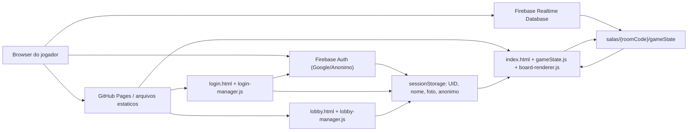
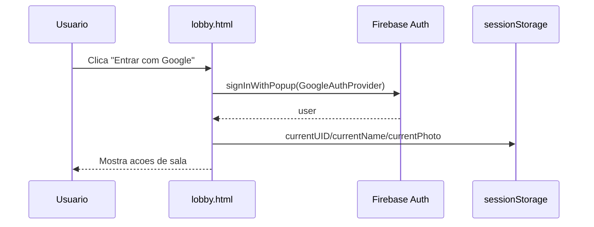
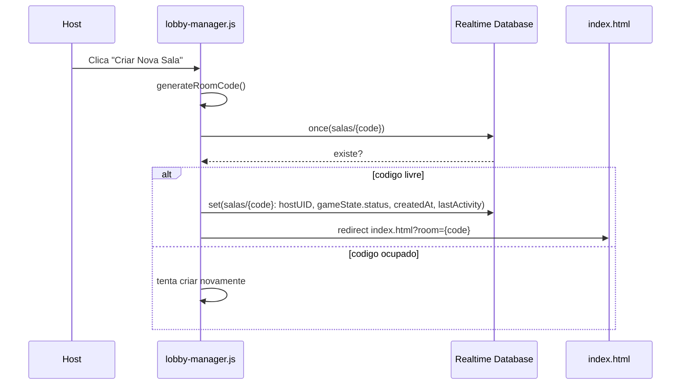
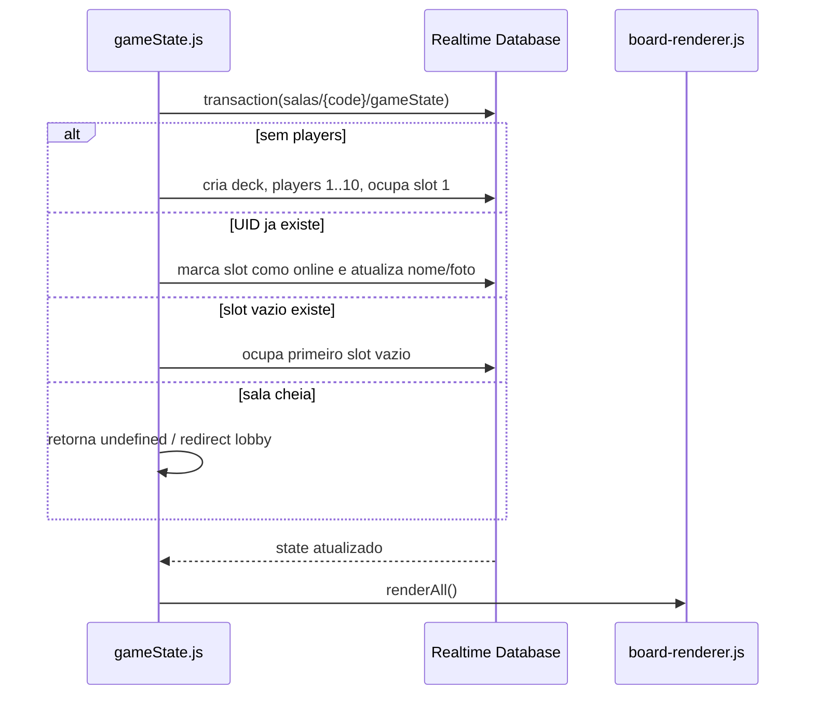

# Coup Master - Technical Design Document

Documento gerado a partir da analise do estado atual do repositorio em 2026-06-24.

Branch analisada: `new-css`

Commit analisado: `452e095` (`atualização nas regras de personagem`)

## 1. Sumario Executivo

O Coup Master e um jogo multiplayer online, em beta, inspirado em jogos de blefe e estrategia politica. A proposta atual e reproduzir uma mesa fisica em formato sandbox: os jogadores continuam responsaveis por declarar acoes, desafiar, aplicar regras sociais e administrar boa parte do fluxo da partida. O software oferece a sala, o tabuleiro compartilhado, cartas, moedas, expansoes, interface visual, audio e sincronizacao em tempo real.

O projeto e um aplicativo estatico hospedavel em GitHub Pages. Nao existe etapa de build, empacotador, servidor proprio, backend customizado, TypeScript, framework frontend ou gerenciador de pacotes versionado. Toda a execucao acontece no navegador, usando HTML, CSS, JavaScript vanilla e Firebase Realtime Database/Auth via scripts CDN.

O backend efetivo e o Firebase:

- Firebase Authentication com Google Provider ou login anonimo identifica os usuarios.
- Firebase Realtime Database guarda salas, estado da partida, jogadores, cartas, notificacoes e eventos de som.
- As regras de seguranca do Firebase sao uma dependencia critica do produto, mas atualmente aparecem apenas no README, nao como arquivo versionado de infraestrutura.

O estado tecnico atual e funcional para uma beta, mas altamente acoplado. A maior parte da regra de interface, renderizacao, efeitos visuais, modais, presets e interacoes vive em um unico arquivo grande: `js/gamemode/casual/board-renderer.js`. A sincronizacao e mutacao de jogo ficam concentradas em `js/core/gameState.js`. Essa simplicidade reduz friccao para editar rapido, mas aumenta risco de regressao em qualquer alteracao media.

## 2. Objetivos do Produto

### 2.1 Objetivo Principal

Permitir que grupos joguem Coup online em uma sala privada, com sincronizacao em tempo real, usando uma mesa digital manual.

### 2.2 Objetivos Secundarios

- Permitir login com Google.
- Permitir login anonimo como visitante.
- Permitir criacao e entrada em salas por codigo curto.
- Preservar slot de jogador por UID.
- Sincronizar mao, deck, cemiterio, moedas, religiao, asilo, bots e estado de conexao.
- Permitir host/admin com controles privilegiados.
- Permitir configuracao de deck com jogo base, cartas promocionais e DLCs.
- Permitir modo espectador fantasma mediante autorizacao.
- Oferecer ajudas visuais de regras e cartas de referencia.
- Entregar experiencia visual expressiva com fundo animado, efeito VHS, parallax e animacao de cartas.
- Rodar diretamente em navegador sem instalacao.

### 2.3 Nao Objetivos Atuais

O codigo atual nao tenta automatizar integralmente as regras oficiais de Coup. O sistema nao valida todas as condicoes de desafio, bloqueio, eliminacao, influencia, obrigatoriedade de golpe, troca de cartas ou ordem formal de turnos. Algumas acoes rapidas alteram moedas, mas a mesa continua sendo sandbox.

Tambem nao ha, no estado atual:

- matchmaking publico;
- chat interno;
- turn manager;
- historico completo de eventos;
- replay;
- backend server-side proprio;
- testes automatizados;
- pipeline de build;
- deploy automatizado versionado;
- Firebase Emulator configurado no repositorio.

## 3. Arquitetura de Alto Nivel



O frontend tem tres paginas principais:

- `login.html`: tela dedicada de autenticacao com Google ou visitante anonimo.
- `lobby.html`: perfil autenticado, criacao e entrada em salas.
- `index.html`: tabuleiro principal da partida.

Os scripts sao carregados como arquivos globais com `defer`. Eles dependem da ordem no HTML, nao de imports ES Modules.

Ordem no tabuleiro:

1. Firebase CDN: `firebase-app.js`, `firebase-auth.js`, `firebase-database.js`.
2. `js/firebase/firebase.js`: inicializa Firebase e expoe `window.db` e `window.auth`.
3. `js/pwa.js`: registra o service worker quando o navegador oferece suporte.
4. `js/core/rules.js`: define tipos de carta e utilitarios globais.
5. `js/core/gameState.js`: conecta sala, Firebase, estado e mutacoes.
6. `js/gamemode/casual/board-renderer.js`: renderiza DOM e configura interacoes.

Ordem no lobby:

1. Firebase CDN.
2. `js/firebase/firebase.js`.
3. `js/pwa.js`.
4. `js/lobby/lobby-manager.js`.

Ordem no login:

1. Firebase CDN.
2. `js/firebase/firebase.js`.
3. `js/pwa.js`.
4. `js/login/login-manager.js`.

## 4. Estrutura do Repositorio

```text
Coup-Master/
  assets/
    fonts/
    img/
      cards/
        base/
        dlc1/
        dlc2/
        promo/
        religion/
      guides/
      icons/
      logo/
    sounds/
      soundtrack/
      vfx/
    video/
  css/
    lobby.css
    main.css
  docs/
    TDD.md
  js/
    core/
      gameState.js
      rules.js
    firebase/
      firebase.js
    login/
      login-manager.js
    gamemode/
      casual/
        board-renderer.js
    lobby/
      lobby-manager.js
    pwa.js
  marketing/
    banners/
    screenshots/
  AGENTS.md
  README.md
  index.html
  login.html
  lobby.html
  manifest.webmanifest
  robots.txt
  sitemap.xml
  sw.js
  limpeza.json
```

Observacao: a pasta existente no filesystem esta como `docs` em minusculo. Em Windows isso equivale ao pedido de `Docs`, mas em Git/plataformas case-sensitive recomenda-se padronizar o nome antes de depender de casing.

## 5. Tecnologias e Dependencias

### 5.1 Frontend

- HTML5 estatico.
- CSS3, Grid, Flexbox, animacoes e media queries.
- JavaScript vanilla em escopo global.
- Nenhum framework frontend.
- Nenhum bundler.
- Nenhum transpilador.

### 5.2 Backend/BaaS

- Firebase Auth v8.10.0 via CDN.
- Firebase Realtime Database v8.10.0 via CDN.

### 5.3 Fontes e Assets Externos

- Google Fonts: `Cinzel`.
- Fonte local: `Tilda Script`.
- Material Symbols via Google Fonts no tabuleiro, aparentemente para icone `info`.
- Tally embed para feedback/bug report.
- YouTube embed comentado no lobby.

### 5.4 Estado de Tooling

Nao ha `package.json`. Portanto, nao ha scripts oficiais de:

- build;
- test;
- lint;
- format;
- start/dev server;
- deploy.

A verificacao local atualmente possivel sem adicionar tooling e:

```powershell
node --check js\firebase\firebase.js
node --check js\core\rules.js
node --check js\core\gameState.js
node --check js\lobby\lobby-manager.js
node --check js\gamemode\casual\board-renderer.js
```

Todos os arquivos JS passavam em `node --check` no momento desta analise.

### 5.5 PWA

O projeto agora possui uma camada PWA sem alterar sua arquitetura estatica:

- `manifest.webmanifest`: define nome, descricao, `start_url` para `login.html`, `scope` relativo, `display: standalone`, cores de tema e icones 192x192/512x512.
- `js/pwa.js`: registra `sw.js` apos o carregamento da pagina, somente quando `navigator.serviceWorker` existe.
- `sw.js`: cria cache versionado do shell principal, HTMLs, CSS, JS local, fontes e icones criticos.
- `index.html`, `login.html` e `lobby.html`: expõem manifesto, `theme-color`, metatags mobile/apple e registrador PWA.

Estrategia do service worker:

- navegacoes usam network-first com fallback para `login.html` em cache;
- assets locais usam stale-while-revalidate;
- requisicoes externas, incluindo Firebase CDN/Auth/Realtime Database, nao sao interceptadas;
- multiplayer offline nao e objetivo, pois salas, autenticacao e sincronizacao dependem de rede e Firebase.

## 6. Pontos de Entrada HTML

### 6.1 `login.html`

Responsabilidades:

- Define metadados SEO/Open Graph da tela de entrada.
- Carrega favicon/logo, manifesto PWA e metatags mobile.
- Carrega Google Font `Cinzel`.
- Precarrega `assets/fonts/tilda-script-bold.woff2`.
- Carrega SDK Firebase v8.
- Carrega `css/lobby.css`.
- Renderiza botoes de autenticacao: Google e visitante anonimo.
- Renderiza botao de instalacao PWA quando o navegador dispara `beforeinstallprompt`.
- Renderiza modal de erro.
- Renderiza video de fundo `assets/video/background-smoke.mp4`.
- Carrega `firebase.js`, `pwa.js` e `login-manager.js`.
- Persiste `currentUID`, `currentName`, `currentPhoto` e `currentIsAnonymous` em `sessionStorage`.
- Redireciona usuario autenticado para `lobby.html`.

Fluxo de UI:

1. Usuario abre login.
2. Firebase inicializa.
3. `login-manager.js` observa `auth.onAuthStateChanged`.
4. Usuario escolhe "Entrar com Google" ou "Entrar como visitante".
5. Google usa `signInWithPopup(new firebase.auth.GoogleAuthProvider())`.
6. Visitante usa `auth.signInAnonymously()`.
7. Apos autenticar, dados seguros de exibicao sao gravados no `sessionStorage` e a tela redireciona para `lobby.html`.
8. O botao "Instalar Coup Master" fica oculto quando o PWA ja esta instalado ou quando o navegador ainda nao disponibilizou o prompt de instalacao.

Observacao: o nome base do visitante e `Visitante`. Ao entrar em uma sala, `gameState.js` atribui nomes sequenciais por sala, como `Visitante 1`, `Visitante 2` e assim por diante.

### 6.2 `lobby.html`

Responsabilidades:

- Define metadados SEO e Open Graph do lobby.
- Carrega favicon/logo.
- Carrega Google Font `Cinzel`.
- Precarrega `assets/fonts/tilda-script-bold.woff2`.
- Carrega SDK Firebase v8.
- Carrega `css/lobby.css`.
- Renderiza bloco de usuario logado.
- Renderiza input de codigo de sala e botoes de entrar/criar sala.
- Renderiza modal de erro.
- Renderiza video de fundo `assets/video/background-smoke.mp4`.
- Carrega `firebase.js`, `pwa.js` e `lobby-manager.js`.
- Renderiza loader de fontes.

Fluxo de UI:

1. Usuario autenticado abre lobby.
2. Firebase inicializa.
3. `lobby-manager.js` observa `auth.onAuthStateChanged`.
4. Se nao logado, redireciona para `login.html`.
5. Se logado, mostra foto, nome, botao sair e acoes de sala.
6. Criar sala gera codigo aleatorio de 4 caracteres.
7. Entrar sala valida existencia no Realtime Database.

Pontos tecnicos importantes:

- O bloco `communityBtn` e `communityModal` esta comentado no HTML, mas o JS ainda tenta localiza-los com guards.
- O loader `font-loader` aparece depois do `</body>`, o que e HTML invalido, embora o navegador costume corrigir.
- Ha uma referencia comentada a `img/info.svg`; como esta comentada, nao afeta runtime, mas a pasta `img/` nao existe.

### 6.3 `index.html`

Responsabilidades:

- Define metadados SEO/Open Graph do jogo principal.
- Carrega favicon/logo.
- Carrega Google Font `Cinzel`.
- Carrega Material Symbols.
- Carrega `css/main.css`.
- Define loading overlay inicial.
- Define header da sala com codigo copiavel.
- Define tabuleiro com 10 areas fixas de jogadores.
- Define area central: cemiterio/free area, asilo, deck e contador.
- Define modais de regras, regras alternativas, preview de carta, configuracao de deck, configuracoes gerais, reset, feedback, espectador, kick, sala cheia, tutorial, acoes rapidas e duelo.
- Define video de fundo.
- Define audios de musica e efeitos.
- Carrega Firebase e scripts do jogo.

Fluxo de UI:

1. Usuario chega com query string `?room=CODE`.
2. Scripts globais inicializam Firebase, regras, estado e renderizacao.
3. `gameState.js` valida `roomCode` e credenciais em `sessionStorage`.
4. Se faltar sala ou UID, redireciona para `lobby.html`.
5. Se autenticado, entra ou reentra na sala via transacao.
6. Listener realtime atualiza `localGameState` e chama `renderAll()`.
7. O tabuleiro reconstroi cartas e jogadores a cada alteracao relevante.

Pontos tecnicos importantes:

- O elemento do contador de deck tem HTML invalido: `<span id="deck-count">` e fecha com `</div>`.
- `og:image` aponta para `assets/img/ico-coup-master.png`, mas o arquivo real esta em `assets/img/logo/ico-coup-master.png`.
- O HTML possui ids usados diretamente por JS global; renomear ids quebra comportamento.

## 7. Scripts Globais e Contratos entre Arquivos

### 7.1 `js/firebase/firebase.js`

Responsabilidades:

- Define `firebaseConfig`.
- Inicializa Firebase se `firebase.apps.length` estiver vazio.
- Expoe `window.db = firebase.database()`.
- Expoe `window.auth = firebase.auth()`.

Contratos:

- Deve rodar depois dos scripts CDN do Firebase.
- Deve rodar antes de qualquer arquivo que use `db`, `auth` ou `firebase`.

Observacoes:

- As chaves Web do Firebase estao no repositorio. Isso e normal em apps Firebase Web, desde que as Security Rules estejam corretas.
- O codigo alerta o usuario se `apiKey` estiver ausente.
- Logs de inicializacao ainda aparecem em producao.

### 7.2 `js/core/rules.js`

Responsabilidades:

- Define `CARD_TYPES`.
- Define configuracao padrao do deck.
- Cria decks a partir de configuracoes.
- Embaralha arrays de cartas.
- Localiza carta por ID em todo o estado.
- Remove carta de sua localizacao atual.

Principais funcoes:

- `createDefaultDeckConfig()`
- `createDeck(config)`
- `shuffle(array)`
- `findCardById(state, id)`
- `removeCardFromLocation(state, cardId)`

Contrato de carta:

```js
{
  id: "c1",
  type: "duque",
  color: "#ff66c4",
  owner: null,
  visible: false,
  location: "deck"
}
```

O `id` e gerado localmente a cada reset/criacao do deck. Ele e unico dentro do deck atual, mas nao e globalmente unico entre salas ou resets.

### 7.3 `js/core/gameState.js`

Responsabilidades:

- Ler `room` da URL.
- Ler usuario atual do `sessionStorage`.
- Redirecionar se faltar sala ou usuario.
- Criar referencia `gameStateRef`.
- Manter variaveis globais locais:
  - `localGameState`
  - `myPlayerId`
  - `isDrawingCard`
  - `lastSoundTimestamp`
  - `hostUID`
  - `isAdmin`
  - `window.pendingKickPid`
- Gerenciar entrada/reentrada na sala.
- Gerenciar listeners do Firebase.
- Aplicar mutacoes de deck, cartas, moedas, religiao, bots e kick.
- Sincronizar efeitos sonoros via RTDB.
- Atualizar `lastActivity`.

Principais grupos de funcoes:

- Espectador:
  - `requestSpectate(targetPid)`
  - `setupNotificationListener()`
- Economia/asilo:
  - `withdrawAsylumCoins()`
  - `updateScore(pid, amount, silent)`
  - `updateAsylumScore(amount)`
- Audio:
  - `playSound(id)`
  - `triggerSound(soundId)`
- Deck/cartas:
  - `resetTable(newConfig)`
  - `drawCard(targetPid)`
  - `returnCardToDeck(cardId)`
  - `moveCard(cardId, targetLocation, targetPlayerId)`
  - `burnTopCard()`
- Religiao:
  - `toggleReligion(pid)`
- Bots/kick:
  - `addBot()`
  - `confirmKickAction()`
- Conexao:
  - `setupDisconnectHandler(pid)`
  - `joinGame()`
  - `setupKickListener(pid)`
  - `initializeGame()`
  - `updateRoomActivity()`

Contrato importante:

`gameState.js` chama funcoes que sao definidas posteriormente em `board-renderer.js`, como `renderAll`, `setupUI`, `setupDropzones` e `setupAutoScroll`. Essas chamadas sao protegidas por `typeof`, mas a ordem continua importante para a experiencia. Como ambos usam `defer`, eles executam em ordem de declaracao no HTML.

### 7.4 `js/lobby/lobby-manager.js`

Responsabilidades:

- Controlar login/logout Google.
- Atualizar UI do lobby conforme autenticacao.
- Persistir `currentUID`, `currentName`, `currentPhoto` em `sessionStorage`.
- Gerar codigo de sala.
- Criar sala no RTDB.
- Validar existencia de sala antes de entrar.
- Controlar modal de erro.
- Controlar loader de fonte.
- Tentar limpar salas inativas.

Fluxo de criacao de sala:

1. `generateRoomCode()` gera 4 caracteres base36 maiusculos.
2. JS verifica se `salas/{newCode}` existe.
3. Se existir, chama novamente o handler de criar sala.
4. Se nao existir, escreve:

```js
{
  hostUID: currentUID,
  gameState: {
    status: "waiting",
    createdAt: firebase.database.ServerValue.TIMESTAMP
  },
  lastActivity: Date.now()
}
```

5. Redireciona para `index.html?room={newCode}`.

Observacao importante: a sala nasce com `gameState.status` e `gameState.createdAt`, mas sem `players`. A inicializacao completa do estado acontece depois em `joinGame()` no tabuleiro.

### 7.5 `js/gamemode/casual/board-renderer.js`

Responsabilidades:

- Referenciar elementos DOM do tabuleiro.
- Limpar e renderizar o DOM a partir de `localGameState`.
- Criar elementos visuais de cartas.
- Decidir se carta mostra frente ou verso.
- Mapear tipo de carta para pasta de asset.
- Configurar drag and drop.
- Configurar auto-scroll durante drag.
- Configurar modais e botoes da UI.
- Configurar audio, fullscreen, configuracoes visuais e preferencias locais.
- Renderizar jogadores, avatares, badges de religiao, maos, moedas e estado de admin.
- Gerenciar quick actions.
- Gerenciar preview de cartas.
- Gerenciar preset de deck.
- Gerenciar efeitos visuais: Balatro/tilt, flutuacao, parallax, VHS, video background, transparencia.

Esse arquivo e o principal ponto de risco de manutencao. Ele mistura:

- renderizacao;
- regra de visibilidade de carta;
- DOM imperative;
- listeners;
- configuracao de deck;
- audio;
- modais;
- preferencias locais;
- animacoes em `requestAnimationFrame`;
- funcoes globais chamadas pelo HTML inline.

## 8. Modelo de Dados no Firebase

### 8.1 Estrutura de Sala

```json
{
  "salas": {
    "ABCD": {
      "hostUID": "firebase-auth-uid",
      "lastActivity": 1710000000000,
      "notifications": {
        "target-user-uid": {
          "fromName": "Nome",
          "fromPid": 2,
          "type": "SPECTATE_REQUEST",
          "timestamp": 1710000000000
        }
      },
      "gameState": {
        "status": "waiting",
        "createdAt": 1710000000000,
        "deck": [],
        "grave": [],
        "freeCards": [],
        "asylumScore": 0,
        "deckConfig": {},
        "lastSFX": {
          "id": "coin",
          "timestamp": 1710000000000
        },
        "players": {
          "1": {}
        }
      }
    }
  }
}
```

O campo `status` existe no dado inicial da sala, mas nao e usado como estado de maquina no fluxo atual.

O campo `grave` existe no estado inicial e reset, mas o cemiterio visual usa `freeCards`. No codigo atual, "cemiterio" e "area livre" sao semanticamente misturados.

### 8.2 `gameState.deck`

Array de cartas ocultas no baralho.

```json
[
  {
    "id": "c1",
    "type": "duque",
    "color": "#ff66c4",
    "owner": null,
    "visible": false,
    "location": "deck"
  }
]
```

### 8.3 `gameState.freeCards`

Array de cartas visiveis no centro/cemiterio.

```json
[
  {
    "id": "c2",
    "type": "assassino",
    "color": "#545454",
    "owner": null,
    "visible": true,
    "location": "free"
  }
]
```

### 8.4 `gameState.players`

Objeto com chaves numericas de `1` a `10`.

```json
{
  "1": {
    "online": true,
    "uid": "firebase-auth-uid",
    "name": "Jogador",
    "photo": "https://...",
    "hand": [],
    "score": 2,
    "religion": "catolico",
    "spectators": {
      "3": "Nome do espectador"
    }
  }
}
```

Campos:

- `online`: booleano de presenca.
- `uid`: UID Firebase ou `bot-{timestamp}` para bots.
- `name`: nome de exibicao.
- `photo`: URL de avatar.
- `hand`: cartas na mao do jogador.
- `score`: moedas.
- `religion`: `catolico` ou `protestante`.
- `spectators`: mapa opcional de `pid -> nome` para permissoes de visualizacao.

### 8.5 `gameState.deckConfig`

Objeto com quantidade de cada tipo de carta:

```json
{
  "duque": 5,
  "capitao": 5,
  "assassino": 5,
  "embaixador": 5,
  "condessa": 5,
  "inquisidor": 5,
  "benfeitor": 0,
  "bufao": 0,
  "burgues": 0,
  "burocrata": 0,
  "vigilante": 0,
  "mercenario": 0,
  "bispo": 0,
  "tesoureiro": 0,
  "diplomata": 0,
  "marionetista": 0,
  "pistoleiro": 0,
  "magnata": 0,
  "estrategista": 0,
  "ladrao": 0,
  "vigarista": 0,
  "xerife": 0
}
```

### 8.6 `gameState.lastSFX`

Evento simples para sincronizar audio:

```json
{
  "id": "card-slide",
  "timestamp": 1710000000000
}
```

Cada cliente compara `timestamp` com `lastSoundTimestamp`. Se for mais recente, toca `audio-{id}` localmente.

### 8.7 `notifications`

Usado atualmente para pedidos de espectador:

```json
{
  "fromName": "Alice",
  "fromPid": 4,
  "type": "SPECTATE_REQUEST",
  "timestamp": 1710000000000
}
```

O listener do alvo remove a notificacao apos processa-la.

## 9. Estado Local no Navegador

### 9.1 `sessionStorage`

Usado para dados de usuario e tutorial.

Chaves:

- `currentUID`
- `currentName`
- `currentPhoto`
- `tutorialSeen`

Fluxo:

- O lobby escreve dados do usuario autenticado em `sessionStorage`.
- O tabuleiro le esses dados antes de entrar na sala.
- Se `roomCode` ou `currentUID` estiver ausente, o tabuleiro redireciona para o lobby.

Risco:

`sessionStorage` nao e uma fonte de autenticacao segura. A validacao real precisa vir do Firebase Auth e das Security Rules. O estado atual usa `auth.onAuthStateChanged`, mas tambem confia nos dados previamente gravados no lobby.

### 9.2 `localStorage`

Usado para preferencias visuais locais:

- `hideReligion`
- `waveEnabled`
- `parallaxEnabled`
- `vhsEnabled`
- `videoBgEnabled`
- `transparentModeEnabled`

Essas preferencias nao sao sincronizadas entre jogadores.

## 10. Fluxos de Produto

### 10.1 Login



### 10.2 Criacao de Sala



### 10.3 Entrada/Reentrada na Sala



### 10.4 Sincronizacao de Estado

O listener principal fica em `gameStateRef.on('value')`.

Fluxo:

1. Firebase envia snapshot inteiro de `gameState`.
2. Codigo verifica `lastSFX`.
3. Codigo verifica se o usuario foi expulso do slot atual.
4. Atualiza `localGameState`.
5. Chama `renderAll()`.

Consequencia:

Toda alteracao em `gameState` tende a disparar renderizacao completa do tabuleiro. Isso simplifica coerencia visual, mas pode ser caro conforme numero de cartas, efeitos e dispositivos moveis.

### 10.5 Reset da Mesa

Somente permitido ao host no cliente:

1. Usuario host abre modal de reset.
2. Confirma.
3. `resetTable(newConfig?)` checa `isAdmin`.
4. Atualiza `lastActivity`.
5. Dispara som `8-bit-start`.
6. Gera deck novo com `createDeck`.
7. Preserva `online`, `uid`, `name`, `photo`.
8. Limpa maos.
9. Reseta `score` para 2.
10. Alterna religiao por paridade de slot.
11. Escreve estado inteiro em `gameStateRef.set(initialState)`.

Observacao:

`spectators` nao e preservado no reset, o que e coerente se cada partida reinicia permissoes de espectador.

### 10.6 Compra de Carta

Possibilidades:

- Clique no deck compra para o jogador local.
- Arrastar deck para uma area de jogador compra para aquele jogador.

Implementacao:

1. `drawCard(targetPid?)`.
2. Checa `isDrawingCard`.
3. Dispara `card-slide`.
4. Atualiza `lastActivity`.
5. Transacao em `gameState`.
6. `pop()` remove topo do deck.
7. Carta recebe:
   - `owner = playerToReceive`
   - `location = "player-{pid}"`
   - `visible = false`
8. Carta e inserida em `players[pid].hand`.

### 10.7 Movimento de Cartas

`moveCard(cardId, targetLocation, targetPlayerId?)` aceita:

- `targetLocation === "player"`: move carta para mao de jogador.
- `targetLocation === "free"`: move carta para area visivel/cemiterio.
- `targetLocation === "deck"`: devolve para deck e embaralha.

A funcao sempre:

- atualiza `lastActivity`;
- emite som conforme destino;
- roda transacao no `gameState`;
- encontra carta por ID;
- remove a carta de todas as localizacoes conhecidas;
- reinsere no destino.

### 10.8 Queimar/Revelar Carta do Topo

Arrastar o deck para a area livre aciona `burnTopCard()`:

1. Dispara `card-slide`.
2. Transacao no `gameState`.
3. `pop()` do deck.
4. Carta vai para `freeCards` com `visible = true`.

### 10.9 Devolver Carta ao Deck

Duplo clique em uma carta chama `returnCardToDeck(card.id)`:

1. Dispara `shuffle`.
2. Transacao no `gameState`.
3. Encontra carta.
4. Remove de sua localizacao.
5. Define `owner = null`, `location = "deck"`, `visible = false`.
6. Insere no deck.
7. Embaralha.

### 10.10 Moedas

Jogadores:

- Botao `+` chama `updateScore(pid, 1)`.
- Botao `-` chama `updateScore(pid, -1)`.
- Saldo minimo e 0.

Asilo:

- Botao `+` chama `updateAsylumScore(1)`.
- Botao `-` chama `updateAsylumScore(-1)`.
- Duplo clique na imagem do asilo chama `withdrawAsylumCoins()`.

Observacao tecnica:

`updateScore` e `updateAsylumScore` usam `once('value')` seguido de `set`. Isso nao e atomico e pode perder atualizacoes concorrentes se dois jogadores alterarem moedas ao mesmo tempo. Para economia compartilhada, o ideal e usar `transaction`.

### 10.11 Religiao

Cada jogador tem `religion`:

- `catolico`
- `protestante`

Ao iniciar/resetar, slots impares recebem `catolico` e pares recebem `protestante`.

Clique no badge de religiao chama `toggleReligion(pid)`, que usa transacao atomica no campo `religion`.

A visibilidade local dos badges pode ser ocultada via configuracao `hideReligion`, salva em `localStorage`.

### 10.12 Modo Espectador Fantasma

Fluxo:

1. Jogador abre modal de espectador.
2. Escolhe um alvo.
3. `requestSpectate(targetPid)` escreve notificacao em `salas/{roomCode}/notifications/{targetUID}`.
4. Solicitante ve modal de espera.
5. Alvo recebe notificacao via `setupNotificationListener`.
6. Alvo aceita ou recusa.
7. Se aceitar, escreve `players/{myPlayerId}/spectators/{fromPid} = fromName`.
8. O solicitante passa a ver as cartas do alvo porque `shouldShowBack(card)` consulta `owner.spectators[myPlayerId]`.

Pontos importantes:

- A permissao de espectador e por slot (`pid`), nao por UID.
- Se um slot for liberado e reutilizado, permissoes antigas podem ser um risco caso nao sejam limpas em todos os fluxos.
- `resetTable` limpa `spectators` porque recria os players.
- O README diz que o botao aparece apenas para jogadores sem cartas, mas o codigo atual força `display:flex` sempre que o modal existe.

### 10.13 Acoes Rapidas

O clique no nome do jogador abre o modal de acoes rapidas.

Acoes:

- `coup`: exige 7 moedas do jogador local, deduz 7, dispara `unity-sword`.
- `steal`: exige alvo com pelo menos 2 moedas, tira 2 do alvo e adiciona 2 ao jogador local.
- `assassinate`: exige 3 moedas do jogador local, deduz 3, dispara `ninja-star`.
- `tax`: adiciona 3 moedas ao jogador local.

Essas acoes alteram moedas e audio, mas nao automatizam perda/revelacao de influencia.

### 10.14 Bots

Somente host ve a linha de adicionar bot.

Fluxo:

1. `addBot()` procura primeiro slot sem `uid` e sem `online`.
2. Conta bots existentes por nome iniciado com `BOT`.
3. Escreve jogador com:
   - `online = true`
   - `uid = "bot-{Date.now()}"`
   - `name = "BOT N"`
   - `photo = "assets/img/icons/robot.svg"`
   - `hand = []`
   - `score = 2`
   - religiao por paridade do slot.

Se a sala estiver cheia, abre modal `fullRoomModal`.

Observacao:

Bot nao executa IA de jogo. E um slot artificial para teste/mesa.

### 10.15 Kick/Remocao de Jogador

Somente host ve botao de remover em slots que nao sao o proprio host.

Fluxo:

1. `window.kickPlayer(pid)` guarda `window.pendingKickPid`.
2. Abre modal de confirmacao.
3. Confirmar chama `confirmKickAction()`.
4. Transacao:
   - devolve cartas da mao ao deck;
   - reseta `owner`, `location`, `visible`;
   - embaralha deck;
   - reseta slot para vazio;
   - score volta para 2;
   - religiao volta por paridade.
5. Listener de expulsao no cliente removido detecta UID divergente e redireciona.

Observacao:

Existe `setupKickListener(pid)`, mas a chamada esta comentada. A expulsao ativa acontece dentro do listener principal de `gameState`.

## 11. Renderizacao do Tabuleiro

### 11.1 `renderAll()`

`renderAll()` e a funcao central da UI do jogo.

Responsabilidades:

1. Validar que existe `state.players`.
2. Calcular quantidade de jogadores ativos.
3. Ajustar grid em desktop:
   - 1 jogador: 1 coluna.
   - 2 jogadores: 2 colunas.
   - 3 jogadores: 3 colunas.
   - 4 jogadores: 2 colunas.
   - 5-6 jogadores: 3 colunas.
   - 7-8 jogadores: 4 colunas.
   - 9-10 jogadores: 5 colunas.
4. Aplicar travas visuais de admin:
   - reset;
   - adicionar bot;
   - inputs de deck;
   - botao de aplicar deck.
5. Configurar modal de espectador.
6. Limpar DOM dinamico.
7. Iterar slots 1 a 10.
8. Mostrar/ocultar slots vazios.
9. Marcar jogador local.
10. Mostrar botao de kick para host.
11. Criar header dinamico do jogador se necessario.
12. Atualizar avatar, nome e clique de acoes rapidas.
13. Criar/atualizar badge de religiao.
14. Renderizar cartas da mao.
15. Renderizar slot vazio quando mao esta vazia.
16. Atualizar moedas.
17. Aplicar destaque para alvo sendo espectado.
18. Renderizar `freeCards`.
19. Atualizar contador do deck e asilo.

### 11.2 Limpeza de DOM

`clearDOM()`:

- limpa todos os elementos `[data-hand]`;
- remove `.card` dentro de `freeArea`;
- remove todos os `.slot`;
- remove classe `.local-player`.

Essa estrategia evita duplicacao visual, mas recria muitos elementos em cada update.

### 11.3 Criacao de Carta

`createCardElement(card)`:

- cria `div.card`;
- seta `draggable = true`;
- seta `dataset.cardId`;
- calcula fase inicial de flutuacao por hash simples do ID;
- escolhe frente/verso com `shouldShowBack`;
- define `backgroundImage`;
- adiciona listeners de dragstart/dragend;
- adiciona duplo clique para devolver ao deck;
- aplica efeito Balatro/tilt.

### 11.4 Visibilidade de Carta

`shouldShowBack(card)`:

- carta no deck: verso.
- carta em `free`: frente.
- carta em mao:
  - se dono e jogador local: frente;
  - se jogador local esta autorizado como espectador do dono: frente;
  - caso contrario: verso.

### 11.5 Mapeamento de Asset de Carta

`getCardFolder(type)` retorna:

- `base`: assassino, capitao, condessa, duque, embaixador, inquisidor.
- `dlc1`: bispo, camaleao, diplomata, marionetista, mercenario, tesoureiro, vigilante.
- `dlc2`: estrategista, ladrao, magnata, pistoleiro, vigarista, xerife.
- `promo`: benfeitor, bufao, burgues, burocrata.
- fallback: `base`.

Observacao:

`camaleao` aparece no mapeamento, mas nao aparece em `CARD_TYPES` nem nos assets listados. Isso parece resquicio de versao anterior ou carta planejada.

## 12. Configuracao de Deck e Expansoes

### 12.1 Fonte de Verdade

A fonte de verdade para tipos de carta e `CARD_TYPES` em `rules.js`.

Adicionar uma carta exige atualizar varios lugares:

1. `CARD_TYPES`.
2. `createDefaultDeckConfig()`.
3. Asset PNG em `assets/img/cards/{pasta}/{tipo}.png`.
4. `getCardFolder(type)`.
5. Inputs do modal de configuracao em `index.html`.
6. Presets em `applyDeckPreset`.
7. Grupos usados por `calculateRuleImages()`.
8. README/TDD, se comportamento mudar.

### 12.2 Presets Existentes

Presets globais expostos por `window.applyDeckPreset(presetType)`:

- `standard`: 5 de cada carta base, 0 no restante.
- `base_promo`: base + promo com 5 de cada.
- `base_dlc1`: base + DLC 1 com 5 de cada.
- `base_dlc2`: base + DLC 2 com 5 de cada.
- `duel`: abre modal para escolher `embaixador` ou `inquisidor`; aplica 3 copias de quatro cartas base fixas + 3 da escolhida.
- `test`: 1 copia de todas as influencias.
- `caos`: 5 copias de todas as influencias.
- `clear`: 0 em todos os inputs.

### 12.3 Aplicacao da Configuracao

O host abre configuracao de deck, ajusta inputs e clica em aplicar.

`applyDeckConfigBtn.onclick`:

1. Checa `isAdmin`.
2. Monta `newConfig` lendo `.card-config-item input`.
3. Faz parse inteiro.
4. Clamp entre 0 e 10.
5. Chama `resetTable(newConfig)`.
6. Fecha modal.

Aplicar configuracao sempre reseta a mesa.

## 13. Audio

### 13.1 Musica de Fundo

`index.html` inclui:

- `<audio id="bgmAudio" loop autoplay>`
- `assets/sounds/soundtrack/bgm.mp3`

`setupUI()`:

- define volume inicial `0.1`;
- tenta tocar audio;
- se autoplay falhar, marca botao como `muted`;
- botao de musica alterna play/pause;
- slider ajusta volume.

### 13.2 Efeitos Sonoros Locais e Globais

Efeitos definidos em HTML:

- `coin`
- `bag-coins`
- `paper`
- `knife`
- `impact`
- `8-bit-start`
- `card-slide`
- `shuffle`
- `pop`
- `player-online`
- `ninja-star`
- `unity-sword`

`playSound(id)` toca localmente `audio-{id}`.

`triggerSound(soundId)` escreve em `gameState.lastSFX` para todos ouvirem.

Observacao:

O codigo chama `playSound('click')` em varios pontos, mas nao existe `<audio id="audio-click">`. Portanto, esses cliques sao silenciosos no estado atual.

## 14. Efeitos Visuais e Preferencias

### 14.1 Efeito Balatro/Tilt

`attachBalatroEffect(element, isDeck)`:

- adiciona classe `balatro-effect`;
- no mousemove calcula inclinacao por posicao relativa;
- aplica `perspective`, `rotateX`, `rotateY`, `scale` e `translateY`;
- aplica `boxShadow`;
- remove estilos inline ao sair.

### 14.2 Flutuacao de Cartas

`updateCardFlotation()` roda continuamente com `requestAnimationFrame`.

- Se `waveEnabled` estiver false, apenas agenda proximo frame.
- Incrementa `animationTime`.
- Itera `.card`.
- Ignora cartas sendo arrastadas.
- Calcula seno baseado no ID da carta.
- Atualiza CSS custom property `--y-offset`.

Preferencia:

- `waveEnabled` em `localStorage`.

### 14.3 Parallax

`mousemove` atualiza alvo `targetX/targetY` apenas em telas >= 1200px.

`updateParallax()` interpola posicao com smoothing e aplica `transform: translate(...)` em `.container` quando ativo.

Preferencia:

- `parallaxEnabled` em `localStorage`.

### 14.4 VHS/CRT

`applyVhsVisibility(isEnabled)` adiciona/remove classe `vhs-enabled` no body.

Preferencia:

- `vhsEnabled`.

### 14.5 Video Background

`applyVideoBgState(isEnabled)` adiciona/remove classe `video-bg-enabled`.

Preferencia:

- `videoBgEnabled`.

Observacao:

O handler de clique de `toggleVideoBgBtn` e atribuido duas vezes no arquivo. A segunda atribuicao sobrescreve a primeira, entao o comportamento final funciona, mas a duplicidade aumenta ruido de manutencao.

### 14.6 Modo Transparente

`applyTransparentMode(isEnabled)` adiciona/remove classe `transparent-mode`.

Preferencia:

- `transparentModeEnabled`.

Observacao:

Assim como video background, o handler de clique de `toggleTransparentBtn` e atribuido duas vezes.

## 15. CSS e Design System Atual

### 15.1 `css/main.css`

Responsavel pela tela de jogo:

- variaveis de cor;
- reset visual;
- esconder scrollbars;
- layout principal;
- tabuleiro e player grid;
- cartas, slots e deck;
- modais;
- configuracao de deck;
- settings;
- botoes;
- efeitos VHS/video/transparencia;
- responsividade;
- contador de deck;
- imagens de cartas e areas.

Tamanho atual: aproximadamente 1730 linhas.

Pontos importantes:

- Ha `@font-face` para `Tilda Script`, mas o caminho em `main.css` esta como `..assets/...`, sem barra. O correto seria `../assets/...`.
- Referencia fallback `.woff`, mas o repositorio tem `.woff2`, `.otf` e `.ttf`; nao foi encontrado `.woff`.
- Muitos estilos inline existem no HTML, especialmente em modais e botoes.

### 15.2 `css/lobby.css`

Responsavel pela tela de lobby:

- layout central;
- video background;
- loader;
- botao Google;
- dados do usuario;
- acoes de sala;
- modal de erro;
- modal de comunidade comentado;
- tipografia.

Tamanho atual: aproximadamente 546 linhas.

Pontos importantes:

- Existe um `@font-face` correto no inicio com `../assets/...`.
- Existe um segundo `@font-face` mais abaixo com `assets/fonts/...`, relativo ao CSS, que provavelmente aponta para caminho incorreto (`css/assets/...`).
- Tambem referencia `.woff` no inicio, arquivo nao encontrado no repositorio.

## 16. Assets

### 16.1 Cartas

Pastas:

- `assets/img/cards/base`
- `assets/img/cards/promo`
- `assets/img/cards/dlc1`
- `assets/img/cards/dlc2`
- `assets/img/cards/religion`

O tipo de carta deve bater com o nome do arquivo PNG em minusculo.

Exemplo:

- tipo `duque` -> `assets/img/cards/base/duque.png`.
- tipo `vigarista` -> `assets/img/cards/dlc2/vigarista.png`.

### 16.2 Guias

Pasta: `assets/img/guides`

Arquivos usados:

- `front-actions.png`
- `front-actions-alternative.png`
- `back-actions.png`
- `dlc-actions.png`
- `dlc2-actions.png`
- `dlc3-actions.png`
- `alternative-rules1.png`
- `alternative-rules2.png`
- `alternative-rules3.png`
- `alternative-rules4.png`
- `alternative-rules5.png`

`calculateRuleImages()` escolhe quais cartas de regra mostrar com base em `deckConfig`.

### 16.3 Icones

Pasta: `assets/img/icons`

Usados para botoes, Google login, bots, religiao, configuracoes, visibilidade, tutorial e outros controles.

### 16.4 Midia Pesada

Maiores arquivos no estado analisado:

- `assets/sounds/soundtrack/bgm.mp3`: aproximadamente 40 MB.
- `assets/video/background-smoke.mp4`: aproximadamente 24,5 MB.
- `marketing/screenshots/game-preview.gif`: aproximadamente 20 MB.

Impacto:

- Primeira visita pode ser pesada em mobile.
- Git pack esta grande, com historico em torno de centenas de MB.
- GitHub Pages entrega estatico, sem pipeline de compressao/otimizacao neste repositorio.

## 17. SEO, Indexacao e GitHub Pages

Arquivos relacionados:

- `robots.txt`
- `sitemap.xml`
- `google9b3b720af3a4d43a.html`
- metatags em `index.html` e `lobby.html`.

Estado atual:

- `robots.txt` aponta para sitemap.
- `robots.txt` permite `/index.html`, `/lobby.html` e `/img/`.
- O projeto real usa `assets/img`, nao `/img`.
- `sitemap.xml` referencia URLs em `/img/asilo.png` e `/img/dlc3-actions.jpg`, que nao correspondem aos assets reais.
- `index.html` tem `og:image` com caminho incorreto.
- `lobby.html` tem `og:image` correto para `assets/img/logo/ico-coup-master.png`.

Recomendacao:

Padronizar todos os metadados, robots e sitemap para `assets/img/...` ou criar aliases reais caso a intencao seja manter `/img`.

## 18. Segurança

### 18.1 Chaves Firebase

As chaves Web do Firebase estao no codigo. Em Firebase Web, isso e esperado: sao identificadores publicos, nao segredos de servidor.

A seguranca real deve depender de:

- Firebase Auth;
- Realtime Database Security Rules;
- validacoes de ownership/host;
- validacoes de schema.

### 18.2 Security Rules

As regras documentadas no README incluem:

- leitura para usuario autenticado;
- escrita em `users/{uid}` somente para o proprio UID;
- leitura em salas para autenticados;
- escrita ampla em sala para autenticados;
- regras especificas para `lastSFX`, `asylumScore`, `freeCards`, `deck`, `deckConfig`, `players`.

Ponto critico:

A regra `.write: "auth != null"` no nivel de `salas/$roomCode` e permissiva demais. Em Realtime Database Rules, permissoes mais altas podem permitir escrita mais ampla do que as restricoes desejadas em filhos. Isso precisa ser validado/corrigido antes de confiar em restricoes client-side.

Tambem nao existe arquivo versionado como:

- `firebase.json`
- `.firebaserc`
- `database.rules.json`

Sem isso, as regras reais de producao podem divergir do README.

### 18.3 Admin/Host

O host e definido por:

```text
salas/{roomCode}/hostUID
```

O cliente calcula:

```js
isAdmin = currentUser.uid === hostUID
```

Isso controla UI e algumas funcoes. Mas qualquer protecao real precisa existir nas Security Rules.

### 18.4 XSS e HTML Dinamico

O projeto usa `innerHTML` em alguns pontos. Um ponto sensivel e a lista de alvos do espectador:

```js
btn.innerHTML = `
  
  <span>${p.name || 'Jogador ' + i}</span>
`;
```

`p.name` e `p.photo` podem vir de dados de usuario/Firebase. O ideal e construir DOM com `textContent` e atribuir `src` de forma validada, evitando interpolar dados externos em HTML.

### 18.5 Codigos de Sala

Codigos tem 4 caracteres base36. Isso e conveniente, mas pequeno:

- Espaco teorico: 36^4 = 1.679.616 combinacoes.
- Nao ha senha.
- Qualquer usuario autenticado pode testar codigos.

Para beta privada isso pode ser aceitavel. Para escala maior, considerar codigos maiores, convites, rate limiting via rules/Cloud Functions ou sala com senha.

### 18.6 Operacoes Destrutivas

`cleanupOldRooms()` roda ao abrir o lobby:

1. Le todas as salas.
2. Remove salas com `lastActivity` mais antigo que 24h.

Isso depende de permissao de escrita no Firebase para remover salas. Em producao, regras precisam garantir que essa limpeza nao abra brecha para usuarios removerem salas ativas indevidamente.

## 19. Concorrencia e Consistencia

### 19.1 Operacoes Atomicas

Usam `transaction`:

- `drawCard`
- `returnCardToDeck`
- `moveCard`
- `burnTopCard`
- `toggleReligion`
- `confirmKickAction`
- `joinGame`

Essas sao boas escolhas porque lidam com estado compartilhado.

### 19.2 Operacoes Nao Atomicas

Usam `once` + `set`:

- `updateScore`
- `updateAsylumScore`
- `withdrawAsylumCoins` parcialmente

Risco:

Dois clientes alterando moedas simultaneamente podem sobrescrever resultado. Exemplo: dois jogadores clicam `+` quase juntos, ambos leem 2, ambos escrevem 3. Resultado esperado seria 4.

Recomendacao:

Trocar atualizacoes numericas por `transaction`.

### 19.3 Renderizacao Completa

Todo snapshot do `gameState` pode causar `renderAll()`. Isso e simples, mas:

- recria cartas;
- reanexa listeners;
- recalcula grid;
- atualiza DOM de todos os jogadores;
- pode ser custoso em salas grandes, mobile ou com muitos eventos de audio/moeda.

Melhorias futuras podem usar renderizacao incremental, diff por jogador/area ou separacao de listeners.

## 20. Performance

Principais gargalos provaveis:

1. Assets pesados de audio/video.
2. Re-render completo em cada alteracao do RTDB.
3. `requestAnimationFrame` continuo para flutuacao.
4. `requestAnimationFrame` continuo para parallax.
5. Efeitos CSS/transform em varias cartas.
6. Recriacao de listeners junto com DOM recriado.
7. Git historico muito pesado para clones.

Recomendacoes:

- Comprimir `bgm.mp3` ou trocar por versao mais curta/loopada.
- Comprimir/otimizar `background-smoke.mp4`.
- Carregar video/audio sob preferencia ou apos interacao.
- Avaliar lazy loading de guias e imagens grandes.
- Reduzir animacoes em mobile por padrao.
- Usar transacoes menores/listeners por area se o volume crescer.

## 21. Defeitos e Inconsistencias Conhecidas

Esta secao documenta achados do estado atual, nao necessariamente bugs fatais.

### 21.1 Caminhos Incorretos

- `index.html` `og:image` aponta para `assets/img/ico-coup-master.png`; arquivo real esta em `assets/img/logo/ico-coup-master.png`.
- `sitemap.xml` aponta para `/img/asilo.png` e `/img/dlc3-actions.jpg`; estrutura real usa `assets/img/...`.
- `css/main.css` usa `..assets/fonts/...`; deveria usar `../assets/fonts/...`.
- `css/main.css` e `css/lobby.css` referenciam `.woff`; arquivo `.woff` nao existe.
- Segundo `@font-face` em `css/lobby.css` usa `assets/fonts/...` relativo ao CSS, provavelmente incorreto.

### 21.2 HTML Invalido

- `index.html`: `<span id="deck-count">` fechado como `</div>`.
- `lobby.html`: `font-loader` aparece depois do `</body>`.

### 21.3 IDs Esperados pelo JS Ausentes no HTML

O JS busca:

- `grave-count`
- `shuffleBtn`

Esses IDs nao foram encontrados no HTML atual. Como as referencias nao parecem centrais no fluxo atual, isso nao quebra tudo, mas indica recurso removido ou incompleto.

### 21.4 Audio Click Ausente

Chamadas `playSound('click')` existem em muitos handlers, mas nao ha `audio-click`.

### 21.5 Duplicidade de Handlers

`toggleVideoBgBtn.onclick` e `toggleTransparentBtn.onclick` sao definidos duas vezes. A segunda definicao vence.

### 21.6 README Desatualizado

README menciona arquivos que nao existem no layout atual:

- `ui.js`
- `lobby.js`
- `auth-manager.js`

O codigo real usa:

- `js/gamemode/casual/board-renderer.js`
- `js/lobby/lobby-manager.js`
- `js/core/gameState.js`

### 21.7 Espectador Sempre Visivel

README afirma que o botao de espectador e ocultado para quem ainda tem cartas. O codigo calcula `myHand`, mas força `spectatorBtn` visivel.

### 21.8 Security Rules Nao Versionadas

Nao ha arquivo de regras Firebase no repositorio. README e insuficiente como fonte operacional de seguranca.

### 21.9 Dados Externos em `innerHTML`

Nome/foto de jogadores entram em `innerHTML` na lista de espectadores. Deve ser sanitizado/refatorado para DOM seguro.

### 21.10 Logs de Producao

Ha varios `console.log`, `console.warn` e `console.error` operacionais. Eles ajudam no beta, mas nao ha flag de debug.

## 22. Testes e Validacao

### 22.1 Validacao Atual

Como nao ha suite automatizada, a validacao atual minima e:

```powershell
node --check js\firebase\firebase.js
node --check js\core\rules.js
node --check js\core\gameState.js
node --check js\lobby\lobby-manager.js
node --check js\gamemode\casual\board-renderer.js
```

### 22.2 Validacao Manual Recomendada

Para cada mudanca relevante:

1. Abrir lobby localmente por servidor estatico, nao por `file://`.
2. Fazer login Google.
3. Criar sala.
4. Confirmar que host entra no slot 1.
5. Abrir segunda sessao/janela e entrar na mesma sala.
6. Testar compra de carta para si.
7. Testar arrastar deck para outro jogador.
8. Testar arrastar carta para cemiterio/free area.
9. Testar devolver carta ao deck por duplo clique.
10. Testar moedas de jogador.
11. Testar moedas do asilo e saque por duplo clique.
12. Testar alternar religiao.
13. Testar reset como host.
14. Testar que nao-host nao ve/nao consegue aplicar controles de host.
15. Testar adicionar bot.
16. Testar remover jogador/bot.
17. Testar pedido de espectador.
18. Testar preview de carta com botao direito.
19. Testar modais de regras e regras alternativas.
20. Testar configuracao de deck e presets.
21. Testar responsividade em mobile/tablet.

### 22.3 Testes Automatizados Desejaveis

Sem mudar arquitetura imediatamente, e possivel adicionar:

- testes unitarios de `rules.js` com Node;
- testes de transicoes puras extraindo manipulacao de estado de `gameState.js`;
- testes de validacao de schema de deck/player;
- teste estatico para referencias de assets;
- teste HTML para ids esperados;
- Playwright para smoke de lobby/tabuleiro com mocks ou Firebase Emulator.

### 22.4 Firebase Emulator

Recomendado criar no futuro:

- `firebase.json`
- `.firebaserc`
- `database.rules.json`
- testes de rules;
- ambiente de desenvolvimento isolado.

## 23. Guia de Evolucao Arquitetural

### 23.1 Curto Prazo

Prioridades de menor risco:

1. Corrigir caminhos quebrados de assets/SEO.
2. Corrigir HTML invalido.
3. Adicionar `audio-click` ou remover chamadas.
4. Corrigir visibilidade do botao de espectador conforme regra desejada.
5. Transformar updates de moedas em transacoes.
6. Versionar regras Firebase.
7. Atualizar README para refletir arquivos reais.

### 23.2 Medio Prazo

Refatoracoes recomendadas:

- Separar `board-renderer.js` em:
  - `renderPlayers.js`
  - `renderCards.js`
  - `dragDrop.js`
  - `modals.js`
  - `settings.js`
  - `effects.js`
  - `deckPresets.js`
- Separar estado/mutacoes em servico:
  - `roomService`
  - `gameStateService`
  - `audioService`
- Centralizar constantes:
  - tipos de carta;
  - grupos de expansao;
  - caminhos de assets;
  - ids de audio;
  - chaves de localStorage.
- Introduzir validacao de dados antes de escrever no Firebase.
- Remover inline handlers do HTML e registrar tudo por JS.

### 23.3 Longo Prazo

Possibilidades:

- Migrar para ES Modules mantendo app estatico.
- Adicionar Vite apenas se houver beneficio real.
- Usar Firebase Emulator em desenvolvimento.
- Criar camada de rules testada.
- Implementar historico de eventos.
- Implementar turn manager opcional.
- Implementar modo "sandbox" e modo "assistido" separados.
- Otimizar renderizacao incremental.
- Compactar assets e historico Git com estrategia consciente.

## 24. Guia de Mudancas Comuns

### 24.1 Adicionar Nova Carta

Checklist:

1. Criar PNG da carta na pasta correta em `assets/img/cards/...`.
2. Adicionar entrada em `CARD_TYPES`.
3. Adicionar chave em `createDefaultDeckConfig()`.
4. Atualizar `getCardFolder()`.
5. Adicionar input no modal de configuracao em `index.html`.
6. Atualizar presets em `applyDeckPreset`.
7. Atualizar `calculateRuleImages()` se a carta pertence a um grupo que muda os guias.
8. Atualizar README/TDD se for carta publica.
9. Rodar `node --check`.
10. Testar criar deck com a carta e renderizar frente/verso.

### 24.2 Adicionar Novo Efeito Sonoro

Checklist:

1. Adicionar arquivo em `assets/sounds/vfx`.
2. Adicionar `<audio id="audio-{id}" src="..."></audio>` em `index.html`.
3. Chamar `playSound('{id}')` para som local ou `triggerSound('{id}')` para som sincronizado.
4. Verificar que todos os clientes conseguem carregar o arquivo.

### 24.3 Adicionar Nova Preferencia Visual

Checklist:

1. Criar botao no modal de settings.
2. Criar chave de `localStorage`.
3. Criar funcao `apply...State`.
4. Atualizar classe no `body` ou elemento alvo.
5. Atualizar CSS correspondente.
6. Garantir estado padrao coerente.
7. Evitar duplicar handler `onclick`.

### 24.4 Alterar Fluxo de Sala

Checklist:

1. Revisar `lobby-manager.js`.
2. Revisar `joinGame()` em `gameState.js`.
3. Revisar schema de `salas/{roomCode}`.
4. Revisar regras Firebase.
5. Testar criacao, reentrada, sala cheia, reload e desconexao.

### 24.5 Alterar Permissoes de Host

Checklist:

1. Atualizar UI em `renderAll()`.
2. Atualizar checagem client-side na funcao de mutacao.
3. Atualizar Security Rules.
4. Testar usuario host e nao-host.
5. Testar manipulacao direta no console/cliente para garantir que rules bloqueiam.

## 25. Invariantes do Sistema

Estas invariantes devem ser preservadas:

- Uma sala deve ter no maximo 10 slots.
- Cada slot deve ter no maximo um `uid`.
- Um usuario real deve reentrar no mesmo slot se seu UID ja existir.
- Carta deve existir em apenas um lugar por vez:
  - `deck`,
  - `freeCards`,
  - `players[n].hand`.
- Carta no deck deve ter `owner = null`, `visible = false`, `location = "deck"`.
- Carta em mao deve ter `owner = pid`, `visible = false`, `location = "player-{pid}"`.
- Carta em `freeCards` deve ter `owner = null`, `visible = true`, `location = "free"`.
- Score de jogador e asilo nunca devem ficar abaixo de 0.
- Host deve ser definido por `hostUID`.
- Controles administrativos nao devem depender apenas de UI; regras de banco devem reforcar.

## 26. Inventario de Arquivos Funcionais

| Arquivo | Papel | Risco |
|---|---|---|
| `index.html` | Estrutura do tabuleiro, modais, audio e scripts | Alto: ids sao contrato com JS |
| `lobby.html` | Login e entrada/criacao de salas | Medio |
| `js/firebase/firebase.js` | Inicializacao Firebase global | Alto: ordem e config |
| `js/core/rules.js` | Tipos de cartas e utilitarios de deck | Alto: fonte de verdade parcial |
| `js/core/gameState.js` | Mutacoes e sincronizacao Firebase | Muito alto |
| `js/lobby/lobby-manager.js` | Auth/lobby/salas/limpeza | Alto |
| `js/gamemode/casual/board-renderer.js` | Renderizacao, UI, interacoes, efeitos | Muito alto |
| `css/main.css` | Layout e visual do jogo | Medio/alto |
| `css/lobby.css` | Layout e visual do lobby | Medio |
| `robots.txt` | Crawling | Baixo/medio |
| `sitemap.xml` | SEO/indexacao | Baixo/medio |
| `limpeza.json` | JSON vazio para limpeza manual | Alto se usado no lugar errado |

## 27. Decisoes Tecnicas Observadas

### 27.1 App Estatico

Beneficios:

- Deploy simples.
- Baixa barreira de contribuicao.
- Funciona em GitHub Pages.
- Sem build quebrando.

Custos:

- Sem isolamento de modulos.
- Ordem de script vira contrato.
- Dificil testar automaticamente.
- Globais podem conflitar.

### 27.2 Firebase Realtime Database

Beneficios:

- Sincronizacao simples e em tempo real.
- Transacoes client-side disponiveis.
- Auth integrado.

Custos:

- Security Rules sao criticas.
- Modelagem denormalizada pode ficar pesada.
- Listeners em arvore grande podem renderizar demais.
- Sem servidor confiavel para logica privilegiada.

### 27.3 Sandbox Manual

Beneficios:

- Flexivel.
- Permite regras alternativas e expansoes.
- Menor necessidade de codificar cada regra do Coup.

Custos:

- O software nao impede todos os erros de jogo.
- Experiencia depende de jogadores conhecerem regras.
- Bugs de moedas/cartas podem ser corrigidos manualmente, mas tambem podem passar despercebidos.

## 28. Plano de Hardening Recomendado

1. Criar `database.rules.json` e validar regras reais.
2. Remover `.write` ampla no nivel da sala ou restringir por filhos.
3. Criar Firebase Emulator config.
4. Trocar updates numericos por transacoes.
5. Sanitizar `innerHTML` com dados de usuario.
6. Corrigir HTML invalido.
7. Corrigir caminhos de assets e SEO.
8. Reduzir tamanho de audio/video.
9. Criar teste estatico de referencias locais.
10. Extrair funcoes puras de estado para testes.
11. Dividir `board-renderer.js`.
12. Atualizar README.

## 29. Comandos Uteis

Validar sintaxe JS:

```powershell
node --check js\firebase\firebase.js
node --check js\core\rules.js
node --check js\core\gameState.js
node --check js\lobby\lobby-manager.js
node --check js\gamemode\casual\board-renderer.js
```

Listar arquivos:

```powershell
rg --files
```

Encontrar referencias de Firebase:

```powershell
rg -n "db\.ref|transaction|onAuthStateChanged|sessionStorage|localStorage" js
```

Servidor local estatico simples:

```powershell
python -m http.server 8000
```

Depois abrir:

```text
http://localhost:8000/lobby.html
```

Observacao: para login Google local, o dominio/porta precisa ser permitido no Firebase Auth.

## 30. Conclusao

O Coup Master esta em um ponto saudavel para beta experimental: a experiencia principal existe, ha multiplayer realtime, host, deck configuravel, expansoes, audio, efeitos e fluxo de sala. O codigo e direto e facil de seguir em pequenos trechos, mas o acoplamento global, ausencia de rules versionadas e falta de testes criam risco alto para evolucao.

O proximo passo tecnico mais importante nao e trocar de stack. E consolidar seguranca, corrigir inconsistencias documentadas, transformar mutacoes concorrentes em transacoes, otimizar assets e modularizar aos poucos. Isso preserva a velocidade do projeto sem perder o controle da mesa.
